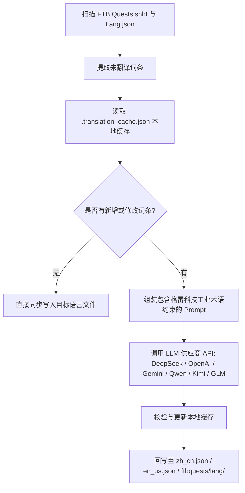

# AI 国际化翻译引擎 (`opencode_translate.py`)

GTE 工程设计并实现了基于现代大语言模型（LLM）的跨模组全自动国际化翻译系统（位于 `scripts/opencode_translate.py`）。

---

## 🤖 翻译引擎架构

传统的社区汉化依赖人工手动维护繁杂的 JSON 与 SNBT 文本，更新滞后且极易产生错漏。

GTE 的 AI 翻译引擎通过标准化 OpenAI 兼容 API，实现了 FTB Quests 任务书与核心 Mod 语言文件的**自动化增量提取、术语对齐与并发翻译**：



---

## 🔑 支持的 LLM 供应商与环境变量

脚本支持通过环境变量无缝切换不同的 AI 模型提供商：

| 供应商名称 | API Key 环境变量 | Base URL 环境变量 | 默认模型 |
| :--- | :--- | :--- | :--- |
| **DeepSeek** | `DEEPSEEK_API_KEY` | `DEEPSEEK_BASE_URL` | `deepseek-chat` |
| **OpenAI** | `OPENAI_API_KEY` | `OPENAI_BASE_URL` | `gpt-4o-mini` |
| **Google Gemini** | `GEMINI_API_KEY` | `GEMINI_BASE_URL` | `gemini-3.5-flash` |
| **通义千问 (DashScope)** | `DASHSCOPE_API_KEY` | `DASHSCOPE_BASE_URL` | `qwen-plus` |
| **月之暗面 (Moonshot)** | `MOONSHOT_API_KEY` | `MOONSHOT_BASE_URL` | `moonshot-v1-8k` |
| **智谱清言 (Zhipu GLM)** | `ZHIPU_API_KEY` | `ZHIPU_BASE_URL` | `glm-4-flash` |
| **OpenCode 平台** | `OPENCODE_API_KEY` | `OPENCODE_BASE_URL` | `deepseek-v4-flash` |
| **通用聚合代理** | `LLM_API_KEY` | `LLM_BASE_URL` | `LLM_MODEL` (自定义) |

---

## 🎯 工业级 Prompt 约束原则

在调用 API 进行翻译时，系统内置了严格的 Minecraft 与 GregTech 术语规则：
1. **格式符绝对保留**：完整保留 Minecraft 原生颜色格式化代码（如 `§a`, `§c`, `§6`）与占位符（`%s`, `%d`, `{0}`）。
2. **科技术语规范统一**：严格锁定科技专有名词翻译（如 `UHV`, `EU/t`, `Amps`, `Voltage`, `Overclock`, `Subtick` 等）。
3. **哈希增量缓存**：所有已翻译条目自动持久化记录在 `.translation_cache.json` 中，只有新增或变更文本会发起网络请求，极大节省 Token 开销与 CI 耗时。

---

## 💻 本地运行指令

在本地开发环境中一键触发全量翻译：

```powershell
# 设置任意一个有效 API Key 后执行
$env:DEEPSEEK_API_KEY="sk-..."
python scripts/opencode_translate.py
```
