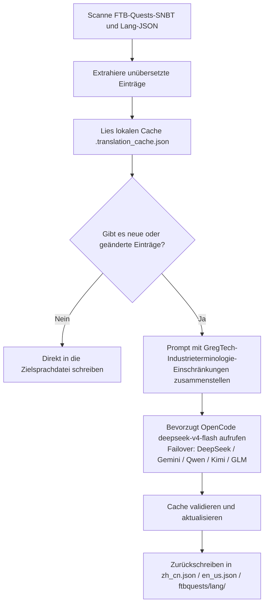

# KI-Übersetzungs-Engine für Internationalisierung (`opencode_translate.py`)

Das GTE-Projekt implementiert ein industrielles, mehrsprachiges Internationalisierungs-Übersetzungssystem, das von einem einheitlichen Skript gesteuert wird und die drei Bereiche Mod-Assets, FTB-Questbücher und Markdown-Dokumentation abdeckt.

---

## 🔒 Fünf eiserne Regeln der Übersetzung

Die Übersetzungsarbeit dieses Projekts folgt den folgenden **5 unverletzlichen eisernen Regeln**:

1. **Einziges Skript**: Alle Übersetzungen werden ausschließlich von `scripts/opencode_translate.py` gesteuert, das das Modell `deepseek-v4-flash` von OpenCode Zen verwendet. Es ist verboten, ein zweites Übersetzungsskript einzuführen oder API-Aufrufe manuell zusammenzustellen.
2. **Cloud-Ausführung**: Alle vollständigen Übersetzungen müssen in GitHub Actions CI ausgeführt werden (`translate.yml` / `docs-deploy.yml` / `sync-build.yml`). Es ist strengstens verboten, lokal manuelle Massenausführungen durchzuführen.
3. **Einzige Bereitstellung**: Die gesamte Website wird einheitlich unter `https://takanashisatou.github.io/GregtechEasy/` (Branch `gh-pages`) bereitgestellt. Es gibt keine zweite Dokumentationsseite und keine wiederholte Bereitstellung.
4. **Englisch-Regeln**:
   - Dokumentationssystem (`docs/en/`): Englisch muss vollständig von KI aus `docs/zh/` übersetzt werden; manuelle Überschreibungen sind verboten;
   - Mod-Projekt: Nur die `en_us.json` von `gtecore` bleibt manuell gepflegt; das Skript enthält Schutzlogik und überschreibt niemals maschinell.
5. **Tiefe Lokalisierung**: Navigationsmenü (`nav_translations`), Mermaid-Flussdiagrammtexte, Code-Kommentare und Tabellenbeschriftungen müssen zu 100% in der jeweiligen Sprache lokalisiert sein.

---

## 🤖 Architektur der Übersetzungs-Engine

Traditionelle Community-Lokalisierung basiert auf manueller Pflege komplexer JSON- und SNBT-Texte, was zu Verzögerungen bei Updates und leicht zu Fehlern führt.

Die KI-Übersetzungs-Engine von GTE nutzt eine standardisierte OpenAI-kompatible API und realisiert **automatische inkrementelle Extraktion, Terminologie-Abgleich und parallele Übersetzung** für FTB-Quests-Questbücher und Kern-Mod-Sprachdateien:

---

## 🔑 Unterstützte LLM-Anbieter und Umgebungsvariablen

Das Skript wählt automatisch den ersten verfügbaren API-Key nach folgender Priorität aus, ohne dass ein Anbieter manuell angegeben werden muss:

| Priorität | Anbietername | API-Key-Umgebungsvariable | Base-URL-Umgebungsvariable | Standardmodell |
| :---: | :--- | :--- | :--- | :--- |
| **1 (bevorzugt)** | **OpenCode Zen** | `OPENCODE_API_KEY` | `OPENCODE_BASE_URL` | **`deepseek-v4-flash`** |
| 2 | DeepSeek | `DEEPSEEK_API_KEY` | `DEEPSEEK_BASE_URL` | `deepseek-chat` |
| 3 | Google Gemini | `GEMINI_API_KEY` | `GEMINI_BASE_URL` | `gemini-3.6-flash` |
| 4 | Qwen (DashScope) | `DASHSCOPE_API_KEY` | `DASHSCOPE_BASE_URL` | `qwen-plus` |
| 5 | Moonshot | `MOONSHOT_API_KEY` | `MOONSHOT_BASE_URL` | `moonshot-v1-8k` |
| 6 | Zhipu GLM | `ZHIPU_API_KEY` | `ZHIPU_BASE_URL` | `glm-4-flash` |
| 7 | OpenAI | `OPENAI_API_KEY` | `OPENAI_BASE_URL` | `gpt-4o-mini` |
| 8 | Allgemeiner Aggregations-Proxy | `LLM_API_KEY` | `LLM_BASE_URL` | `LLM_MODEL` (benutzerdefiniert) |

> **Hinweis**: Es genügt, `OPENCODE_API_KEY` in den GitHub Secrets zu konfigurieren, damit die CI vollständig läuft. Die anderen sind Backup-Failover.

---

## 🎯 Industrielle Prompt-Einschränkungsprinzipien

Beim Aufruf der API für Übersetzungen sind strenge Regeln für Minecraft- und GregTech-Terminologie integriert:

1. **Formatcodes absolut beibehalten**: Minecraft-native Farbformatcodes (z. B. `§a`, `§c`, `§6`) und Platzhalter (`%s`, `%d`, `{0}`) werden vollständig beibehalten.
2. **Einheitliche wissenschaftlich-technische Terminologie**: Übersetzungen für technische Fachbegriffe werden strikt festgelegt (z. B. `UHV`, `EU/t`, `Amps`, `Voltage`, `Overclock`, `Subtick` usw.).
3. **Hash-basierter inkrementeller Cache**: Alle übersetzten Einträge werden automatisch dauerhaft in `.translation_cache.json` gespeichert. Nur neue oder geänderte Texte lösen Netzwerkanfragen aus, was Token-Kosten und CI-Zeit erheblich spart.
4. **Lokalisierung von Mermaid-Diagrammtexten**: Flussdiagramm-Knotenbeschriftungen (z. B. `A[Label]`) werden in die Zielsprache übersetzt, während Syntaxschlüsselwörter wie `graph TD`, `-->`, `subgraph` unverändert bleiben.
5. **Code-Kommentare und Tabellenbeschriftungen**: Kommentare in Codeblöcken (`//` / `#`) und Tabellenspaltenüberschriften werden vollständig lokalisiert.

---

## 🏗️ Geschützte Dateien (nicht maschinell übersetzen)

| Pfad | Schutzgrund | Schutzmechanismus |
| :--- | :--- | :--- |
| `modules/gtecore/src/main/resources/assets/gtecore/lang/en_us.json` | Die englische Übersetzung von gtecore wird manuell vom Autor gepflegt. | Das Skript erkennt das `is_gtecore`-Flag und überspringt das Überschreiben für die Sprache `en_us`. |

---

## 💻 CI-Trigger (Cloud-Ausführung, Regel 2)

| Szenario | Workflow | Auslösemethode |
| :--- | :--- | :--- |
| Automatischer vollständiger Build + Übersetzung nach Code-Push | `sync-build.yml` | Automatisch bei Push auf `main`/`master` |
| Automatische Übersetzung + Bereitstellung nach Dokumentänderung | `docs-deploy.yml` | Wird bei Änderungen an `docs/` oder `mkdocs.yml` ausgelöst |
| Manuelle vollständige Mod-Asset-Übersetzung | `translate.yml` | Manuell über die Actions-Seite auslösbar, Provider und Sprache wählbar |
| Manuelle vollständige Dokumentübersetzung | `translate.yml` | Eingabefeld `translate_docs` aktivieren |

> [!CAUTION]
> Es ist verboten, `python scripts/opencode_translate.py` lokal manuell für umfangreiche vollständige Übersetzungen auszuführen. Lokale Ausführung ist nur zum Debuggen einzelner Dateien oder zur Überprüfung der API-Key-Konnektivität erlaubt.