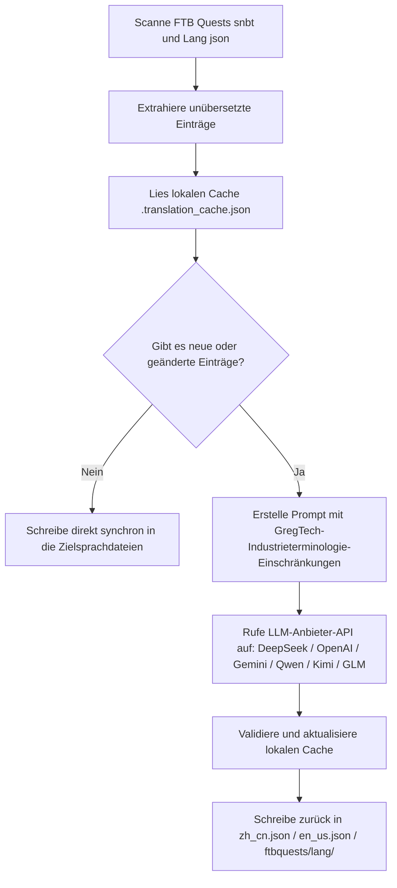

# KI-Übersetzungs-Engine für Internationalisierung (`opencode_translate.py`)

GTE hat ein modulübergreifendes, vollautomatisches KI-Übersetzungssystem für Internationalisierung auf Basis moderner großer Sprachmodelle (LLM) entworfen und implementiert (unter `scripts/opencode_translate.py`).

---

## 🤖 Architektur der Übersetzungs-Engine

Traditionelle Community-Übersetzungen basieren auf manueller Pflege komplexer JSON- und SNBT-Texte, was zu Verzögerungen bei Updates und einer hohen Fehleranfälligkeit führt.

Die KI-Übersetzungs-Engine von GTE nutzt standardisierte, OpenAI-kompatible APIs, um eine **automatisierte, inkrementelle Extraktion, Terminologie-Abgleich und parallele Übersetzung** von FTB-Quests-Aufgabenbüchern und Sprachdateien der Kern-Mods zu ermöglichen:



---

## 🔑 Unterstützte LLM-Anbieter und Umgebungsvariablen

Das Skript unterstützt den nahtlosen Wechsel zwischen verschiedenen KI-Modellanbietern über Umgebungsvariablen:

| Anbietername | API-Key-Umgebungsvariable | Base-URL-Umgebungsvariable | Standardmodell |
| :--- | :--- | :--- | :--- |
| **DeepSeek** | `DEEPSEEK_API_KEY` | `DEEPSEEK_BASE_URL` | `deepseek-chat` |
| **OpenAI** | `OPENAI_API_KEY` | `OPENAI_BASE_URL` | `gpt-4o-mini` |
| **Google Gemini** | `GEMINI_API_KEY` | `GEMINI_BASE_URL` | `gemini-3.5-flash` |
| **Tongyi Qianwen (DashScope)** | `DASHSCOPE_API_KEY` | `DASHSCOPE_BASE_URL` | `qwen-plus` |
| **Moonshot AI** | `MOONSHOT_API_KEY` | `MOONSHOT_BASE_URL` | `moonshot-v1-8k` |
| **Zhipu GLM** | `ZHIPU_API_KEY` | `ZHIPU_BASE_URL` | `glm-4-flash` |
| **OpenCode-Plattform** | `OPENCODE_API_KEY` | `OPENCODE_BASE_URL` | `deepseek-v4-flash` |
| **Universeller Aggregations-Proxy** | `LLM_API_KEY` | `LLM_BASE_URL` | `LLM_MODEL` (benutzerdefiniert) |

---

## 🎯 Industrielle Prompt-Einschränkungsprinzipien

Beim Aufruf der API für Übersetzungen enthält das System strenge Regeln für Minecraft- und GregTech-Terminologie:
1. **Formatcodes absolut beibehalten**: Vollständige Beibehaltung der nativen Minecraft-Farbformatierungscodes (z. B. `§a`, `§c`, `§6`) und Platzhalter (`%s`, `%d`, `{0}`).
2. **Einheitliche wissenschaftlich-technische Terminologie**: Strikte Festlegung der Übersetzungen für technische Fachbegriffe (z. B. `UHV`, `EU/t`, `Amps`, `Voltage`, `Overclock`, `Subtick` usw.).
3. **Inkrementeller Hash-Cache**: Alle übersetzten Einträge werden automatisch dauerhaft in `.translation_cache.json` gespeichert. Nur neue oder geänderte Texte lösen Netzwerkanfragen aus, was Token-Kosten und CI-Zeit erheblich spart.

---

## 💻 Lokale Ausführungsbefehle

Löst die vollständige Übersetzung mit einem einzigen Befehl in der lokalen Entwicklungsumgebung aus:

```powershell
# Legen Sie einen gültigen API-Key fest und führen Sie dann aus
$env:DEEPSEEK_API_KEY="sk-..."
python scripts/opencode_translate.py
```