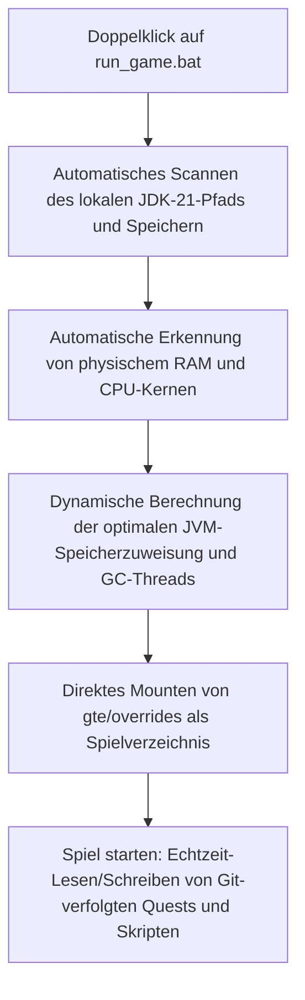

# Lokales Hot-Debugging und schneller Start ohne Launcher

GTE hat ein äußerst benutzerfreundliches, nahtloses Debugging-System für Modpack-Planer, Quest-Autoren und Mod-Programmierer entwickelt.

---

## ⚡ 1. Schnellstart-Skript ohne Launcher (`run_game.bat` / `run_game.sh`)

Für Quest-Autoren (FTB Quests) und KubeJS-Rezeptplaner: **Kein Öffnen von IntelliJ IDEA und keine Installation eines Drittanbieter-Launchers erforderlich** – einfach **`run_game.bat`** im Projektstammverzeichnis doppelklicken, um das Spiel blitzschnell zu starten!



### Kernfunktionen
1. **Automatische JDK-21-Erkennung**: Sucht automatisch nach installiertem Java 21 in `.jdks`, `Adoptium`, `Zulu` und `Program Files` und speichert den Pfad in `.jdk_path`.
2. **Hardwareadaptive Optimierung**: Weist automatisch die JVM-Heap-Größe basierend auf dem gesamten RAM des Computers im optimalen Verhältnis (50–60 % des verfügbaren physischen Speichers) zu und konfiguriert automatisch parallele GC-Threads.
3. **Null-Bewegungs-Workflow**: Änderungen an Quests im Spiel (`/ftbquests editing_mode true`) und Speichern werden direkt in Echtzeit im entsprechenden `config/ftbquests/`-Ordner des Git-Repositorys gespeichert. Öffnen Sie GitHub Desktop und committen Sie mit einem Klick!

---

## 🔗 2. Zero-Copy-Mapping-Tool für externe Launcher (`link_to_launcher.bat`)

Wenn Sie einen Launcher mit eigenen Skins und Tastenbelegungen verwenden (z. B. PCL2 / HMCL / Prism Launcher):

1. Doppelklicken Sie auf **`link_to_launcher.bat`** im Stammverzeichnis.
2. Ziehen Sie das Spielverzeichnis Ihres Launchers (z. B. `D:\PCL2\.minecraft\versions\GTE-Dev\.minecraft\`) gemäß den Anweisungen in die Konsole und drücken Sie Enter.
3. Das Skript erstellt automatisch Windows-Verzeichnis-Junctions:
   - `config` ➜ `gte/overrides/config`
   - `kubejs` ➜ `gte/overrides/kubejs`
   - `ftbquests` ➜ `gte/overrides/config/ftbquests`
   - `defaultconfigs` ➜ `gte/overrides/defaultconfigs`
4. Egal, wie Sie Quests oder Rezepte im Launcher ändern, **die physischen Daten werden in Echtzeit im Haupt-Git-Repository synchronisiert**!

---

## ☕ 3. Hot-Compile-Schattenumgebung für Mod-Code (`gte-dev-runtime`)

Für Java/Kotlin-Programmierer ist `modules/gte-dev-runtime` ein dediziertes Schatten-Debugging-Modul:

### Funktionsweise und Designüberlegungen
- **Zweck**: Reine lokale Hot-Compile-Debugging-Sandbox, **nicht für Veröffentlichung gedacht und erscheint in keinem Spieler-Build**.
- **ModDevGradle dynamisches Remapping**: Kompiliert automatisch den neuesten Quellcode von `gtm-reborn` und `gtecore` und hängt ihn in den Mojang-Deobfuscation-Namespace ein.
- **Startmethode**:
  - Wählen Sie in IDEA die Run-Konfiguration **`Run GTE Full Pack (Client - Hot Debug)`**.
  - Oder führen Sie in der Befehlszeile aus:
    ```powershell
    .\gradlew.bat :modules:gte-dev-runtime:runClient
    ```