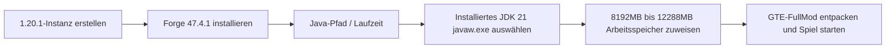

# Anleitung zum Modpack-Download und zum Komplett-Mod-Client-Paket

GTE (GregTech Easy) bietet Spielern und Serverbetreibern mit unterschiedlichem technischem Hintergrund drei Lieferformen:

1. **CurseForge-Standardpaket (`GTE-CurseForge-*.zip`)** : Das übliche Importformat für Launcher. Es enthält eine `manifest.json`, die Mods liegen unter `overrides/mods/`, und der Launcher installiert Forge automatisch. **Für die meisten Spieler ist dies die empfohlene Variante.**
2. **Komplett-Mod-Client-Paket (`GTE-FullMod-*.zip`)** : Ein flaches Archiv, das ausschließlich Spielinhalte auf oberster Ebene enthält – für Spieler, die ihre Instanz selbst einrichten.
3. **Server-Paket (`GTE-Server-*.zip`)** : Ein Forge-Dedicated-Server-Paket, bei dem `mods/` auf oberster Ebene des Archivs liegt, für den Mehrspielerbetrieb.

---

## 📦 Komplett-Mod-Client-Paket

### Aufbau des Archivs

```text
README_安装必看.txt
mods/            (17 Jars)
config/
defaultconfigs/
kubejs/
```

Es gibt kein verschachteltes `.minecraft/`-Verzeichnis, keinen mitgelieferten Launcher und keine `run_game.bat`. Minecraft selbst und Forge werden von Ihrem Launcher installiert – dieses Paket setzt also voraus, dass **Sie bereits wissen, wie man eine Launcher-Instanz anlegt**.

### Verbindliche Umgebungsanforderungen

| Punkt | Version | Hinweis |
| :--- | :--- | :--- |
| **Minecraft** | `1.20.1` | Keine andere Version wird akzeptiert |
| **Forge** | `47.4.1` | Muss genau diese Version sein |
| **Java** | `21` | Verwenden Sie niemals Java 17 oder Java 8 |

> [!CAUTION]
> **Forge muss 47.4.1 sein – nicht „47.4.1 oder irgendein neuerer Build“.**
> - Der Mod `gtmthings` verlangt Forge `[47.4.1,)`, alles darunter wird nicht geladen;
> - Forge 47.4.10 bringt jedoch ASM 9.8 + coremods 5.2.4 mit, was die Mixins von `appliedenergistics2` 15.4.9 zerstört, sodass das Spiel das Hauptmenü nie erreicht.
>
> 47.4.1 ist die einzige funktionierende Version.

### Installationsschritte

=== "Methode 1: Instanz selbst einrichten (dieses Paket)"

    1. Erstellen Sie in Ihrem Launcher (PCL2 / HMCL / Prism / MultiMC / offizieller Launcher – alle funktionieren) eine Minecraft-**1.20.1**-Instanz und installieren Sie **Forge 47.4.1**.
    2. Starten Sie sie einmal und prüfen Sie, ob Sie das Hauptmenü erreichen (damit sind Launcher- und Java-Probleme ausgeschlossen).
    3. Öffnen Sie das Spielverzeichnis dieser Instanz (den `.minecraft`-Ordner; Launcher haben dafür meist eine Schaltfläche „Ordner öffnen“).
    4. Entpacken Sie den Inhalt von `GTE-FullMod-<Versionsnummer>.zip` vollständig hinein und führen Sie ihn mit bereits vorhandenen gleichnamigen Ordnern zusammen.
    5. Legen Sie in den Instanzeinstellungen Java auf **Java 21** fest und weisen Sie **8 GB bis 12 GB** Arbeitsspeicher zu.
    6. Starten Sie das Spiel. Der erste Start erzeugt die Konfigurationen und dauert länger als gewohnt.

=== "Methode 2: Import per Klick im Launcher (empfohlen)"

    Verwenden Sie stattdessen `GTE-CurseForge-<Versionsnummer>.zip` und wählen Sie in CurseForge App / PCL2 / HMCL / Prism Launcher / MultiMC **Modpack importieren**. Dieses Paket enthält eine `manifest.json`, der Launcher installiert Forge automatisch, und es ist keine manuelle Einrichtung nötig.

=== "Methode 3: Server betreiben"

    Verwenden Sie stattdessen `GTE-Server-<Versionsnummer>.zip`; dort liegt `mods/` auf oberster Ebene des Archivs. Entpacken Sie es in das Serververzeichnis, führen Sie `java -jar forge-*-installer.jar --installServer` aus und starten Sie anschließend mit `@libraries/net/minecraftforge/forge/1.20.1-47.4.1/unix_args.txt nogui`.

> [!WARNING]
> Jars, deren Namen auf `-slim.jar` oder `-dev-slim.jar` enden, sind Artefakte für Maven-Nutzer und bündeln absichtlich keine Jar-in-Jar-Abhängigkeiten. Sie dürfen **niemals** in `mods/` liegen. Forge würde sonst einen `gtceu`-Build ohne gebündeltes `ldlib` wählen und mit `Missing or unsupported mandatory dependencies: Mod ID: 'ldlib' ... [MISSING]` abbrechen. Keines der drei ausgelieferten Pakete enthält solche Dateien.

---

## ⚠️ Java 21 Laufzeitumgebungs-Anforderungen (äußerst wichtig)

> [!CAUTION]
> **Dieses Integrationspaket erfordert zwingend Java 21 (JDK 21) als Laufzeitumgebung!**
> Verwenden Sie keinesfalls **Java 17** oder **Java 8**, da das Spiel sonst sofort abstürzt oder den Start verweigert!

### Warum ist Java 21 erforderlich?
- Die Kernmods von GTE (`gtecore`, `gtm-reborn`, `gt--`) nutzen umfassend **moderne Java-21-Sprachfeatures** (wie Record Patterns, Virtual Threads, erweitertes Switch-Matching).
- Die Gradle-Build-Skripte konfigurieren global `JavaLanguageVersion.of(21)` zur erzwungenen Toolchain-Prüfung.

### Empfohlene JDK-21-Download-Adressen

| Distribution | Download-Link | Empfehlungsgrund |
| :--- | :--- | :--- |
| **Azul Zulu 21 (LTS)** | [Zur Azul-Website](https://www.azul.com/downloads/?version=java-21-lts) | Hervorragende Leistung, optimiert für groß angelegte Multithreading in Minecraft |
| **Eclipse Temurin 21 (LTS)** | [Zur Adoptium-Website](https://adoptium.net/temurin/releases/?version=21) | Offiziell empfohlen, hohe Kompatibilität und Stabilität |
| **Microsoft OpenJDK 21** | [Zur Microsoft-Website](https://learn.microsoft.com/zh-cn/java/openjdk/download) | Gute native Anpassung für Windows-Plattform |

### Java 21 im Launcher konfigurieren



---

## 🎮 In-Game-Tastenkürzel und häufige Befehle

| Befehl / Tastenkürzel | Funktionsbeschreibung | Berechtigungsanforderung |
| :--- | :--- | :--- |
| `/ftbquests editing_mode true` | Aktiviert den visuellen Bearbeitungsmodus für Questbuch (Autorenmodus) | OP-Berechtigung |
| `/ftbquests reload` | Lädt die FTB-Quests-Konfigurationsdateien heiß neu | Alle |
| `/kubejs reload server_scripts` | Lädt serverseitige Modifikationsskripte und Rezepte heiß neu | OP-Berechtigung |
| `/kubejs reload client_scripts` | Lädt clientseitige Modifikationsskripte und Anzeigelogik heiß neu | Keine Berechtigung erforderlich |
| `/dumpmultiblock` | Exportiert nach Auswahl mit der Holzaxt den Multi-Block-Strukturcode mit einem Klick | OP-Berechtigung |
| <kbd>U</kbd> / <kbd>R</kbd> | Zeigt Verwendung (Usage) / Rezept (Recipe) des Elements unter dem Cursor an | EMI / JEI-Tastenkürzel |
| <kbd>F7</kbd> | Zeigt die Umgebungslichtstufe an (rotes Kreuz markiert Spawn-Bereiche) | Client-Tastenkürzel |
