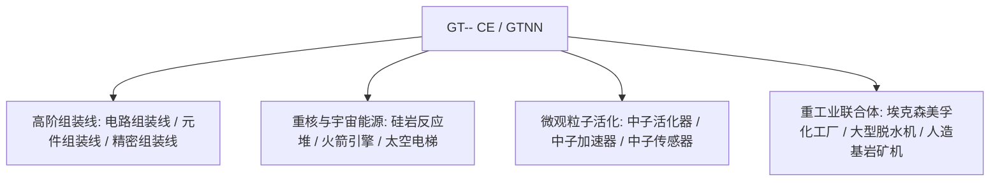

# GT-- Community Edition (GTNN)

`modules/gt--` (包名 `dev.arbor.gtnn`) 是基于 **Kotlin + Java** 混合架构构建的 GT-- Community Edition 官方社区版模组（开发分支为 `kotlin`）。

---

## 🏗️ 架构与技术栈

- **开发语言**：Kotlin 2.0.21 + Java 21。
- **定位**：引入了经典 GT 5.09 及现代扩展中深受玩家喜爱的巨型组装线、重核反应堆、脱水机体系与太空探索工业。



---

## 🏭 核心多方块机器与设施

### 1. 组装流水线阵列
- **电路组装线 (`circuit_assembly_line`)**：专门用于高效量产中高阶芯片与复合电路，支持多级精密机壳。
- **元件组装线 (`component_assembly_line`)**：根据电压等级（LV 到 MAX）采用对应阶级的机壳，批量装配核心电机与传感器。
- **精密组装线 (`precision_assembly_line`)**：生产最高精度的纳米光刻掩模与超算总线。

### 2. 粒子加速与中子活化系统
- **中子活化器 (`neutron_activator`)** 与 **中子加速器 (`neutron_accelerator`)**：
  - 模拟高能对撞机与快中子俘获反应，将普通稳定同位素活化为放射性重核材料或超重超导元素。
- **中子传感器 (`neutron_sensor`)**：实时检测反应腔体内的中子动能通量，提供红石或电脑信号反馈。

### 3. 重核能源与航天工业
- **大型硅岩反应堆 (`large_naquadah_reactor`)**：以硅岩合金与富集燃料为动力，提供平稳、高密度的 EU 能源输出。
- **火箭引擎 (`rocket_engine`)**：消耗高级火箭燃料，为高载荷设备提供脉冲动力。
- **太空电梯 (`space_elevator`)**：贯通近地轨道，实现天基矿物采集与微重力工业制造。

### 4. 化工与矿业联合设施
- **埃克森美孚化工厂 (`exxonmobil_chemical_plant`)**：超大型石油深加工联合装置，单机完成裂解、重整、芳构化与聚合全工序。
- **大型脱水机 (`large_dehydrator`)**：高效脱除流体或化学矿物中的结晶水与游离水分。
- **人造基岩矿机 (`homemade_bedrock_ore_machine`)**：在基岩层部署人造钻头，源源不断提取深层无限矿脉。

---

## 🌿 子模块 Git 工作流规范

`modules/gt--` 对应独立 Git 仓库 `takanashisatou/GT---Community-Edition`，开发分支为 `kotlin`：

```bash
# 独立在子模块中开发与提交
cd modules/gt--
git checkout kotlin
git add .
git commit -m "feat: add precision assembly line recipes"
git push origin kotlin

# 回到主工程更新 submodule 指针
cd ../..
git add modules/gt--
git commit -m "chore: bump gt-- submodule pointer"
```
