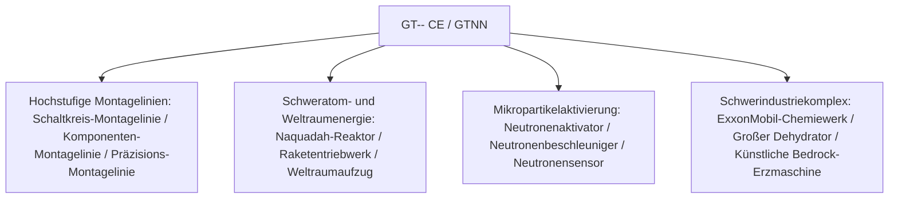

# GT-- Community Edition (GTNN)

`modules/gt--` (Paketname `dev.arbor.gtnn`) ist ein offizielles Community-Edition-Mod von GT--, das auf einer **Kotlin + Java** Hybridarchitektur basiert (Entwicklungszweig `kotlin`).

---

## 🏗️ Architektur und Technologie-Stack

- **Entwicklungssprache**: Kotlin 2.0.21 + Java 21.
- **Positionierung**: Einführung der bei Spielern beliebten riesigen Montagelinien, Schwerreaktor-, Dehydrator-Systeme und der Weltraum-Explorationsindustrie aus klassischem GT 5.09 und modernen Erweiterungen.



---

## 🏭 Kern-Multiblock-Maschinen und -Anlagen

### 1. Montagelinien-Array
- **Schaltkreis-Montagelinie (`circuit_assembly_line`)**: Speziell für die effiziente Massenproduktion von mittleren und höheren Chips und Verbundschaltungen, unterstützt mehrstufige Präzisionsgehäuse.
- **Komponenten-Montagelinie (`component_assembly_line`)**: Verwendet je nach Spannungsstufe (LV bis MAX) entsprechende Gehäuse, um Kernmotoren und Sensoren in Serie zu montieren.
- **Präzisions-Montagelinie (`precision_assembly_line`)**: Produziert hochpräzise Nano-Lithographiemasken und Supercomputer-Busse.

### 2. Teilchenbeschleunigungs- und Neutronenaktivierungssysteme
- **Neutronenaktivator (`neutron_activator`)** und **Neutronenbeschleuniger (`neutron_accelerator`)**:
  - Simuliert Hochenergie-Kollisionen und schnelle Neutroneneinfangreaktionen, um stabile Isotope in radioaktive Schweratom-Materialien oder superschwere supraleitende Elemente zu aktivieren.
- **Neutronensensor (`neutron_sensor`)**: Erkennt in Echtzeit den Neutronenkinetikfluss im Reaktionsraum und liefert Redstone- oder Computer-Signalrückmeldungen.

### 3. Schweratom-Energie und Raumfahrtindustrie
- **Großer Naquadah-Reaktor (`large_naquadah_reactor`)**: Angetrieben durch Naquadah-Legierungen und angereicherten Brennstoff, liefert er eine stabile, hochdichte EU-Energieausgabe.
- **Raketentriebwerk (`rocket_engine`)**: Verbraucht fortschrittlichen Raketentreibstoff und liefert Impulsenergie für Geräte mit hoher Last.
- **Weltraumaufzug (`space_elevator`)**: Verbindet die erdnahe Umlaufbahn und ermöglicht weltraumgestützte Mineralgewinnung und Fertigung in Mikrogravitation.

### 4. Chemie- und Bergbau-Verbundanlagen
- **ExxonMobil-Chemiewerk (`exxonmobil_chemical_plant`)**: Eine riesige Erdöl-Tiefverarbeitungsanlage, die in einer einzigen Maschine die gesamten Prozesse Cracken, Reformieren, Aromatisierung und Polymerisation durchführt.
- **Großer Dehydrator (`large_dehydrator`)**: Entfernt effizient Kristall- und freies Wasser aus Flüssigkeiten oder chemischen Mineralien.
- **Künstliche Bedrock-Erzmaschine (`homemade_bedrock_ore_machine`)**: Setzt künstliche Bohrer in der Bedrock-Schicht ein, um kontinuierlich unendliche Erzadern aus der Tiefe zu fördern.

---

## 🌿 Submodul-Git-Workflow-Richtlinien

`modules/gt--` entspricht dem unabhängigen Git-Repository `takanashisatou/GT---Community-Edition`, der Entwicklungszweig ist `kotlin`:

```bash
# Unabhängig im Submodul entwickeln und committen
cd modules/gt--
git checkout kotlin
git add .
git commit -m "feat: add precision assembly line recipes"
git push origin kotlin

# Zurück zum Hauptprojekt und Submodul-Zeiger aktualisieren
cd ../..
git add modules/gt--
git commit -m "chore: bump gt-- submodule pointer"
```