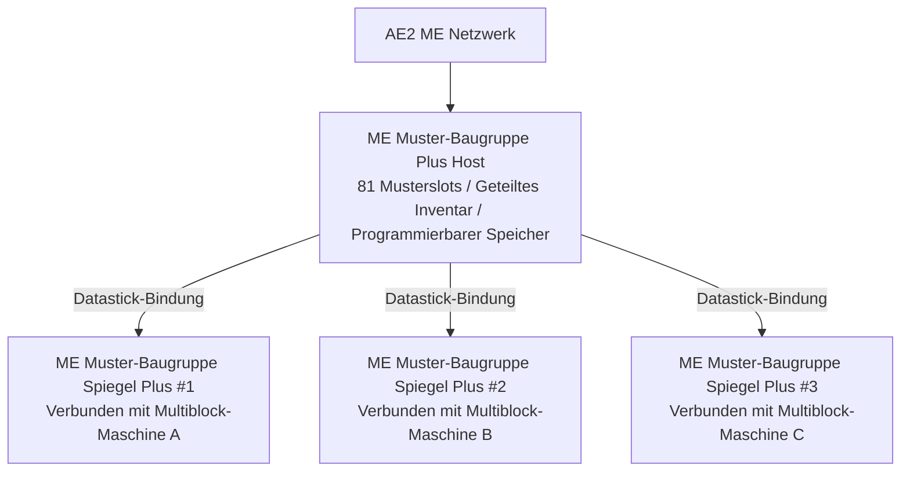

# AE2 Tiefenintegration und Muster-Baugruppe Plus System

GTECore baut eine äußerst leistungsfähige direkte Datenverbindung zwischen Applied Energistics 2 (AE2) und den GregTech-Multiblockstrukturen auf.

---

## 🧩 ME Muster-Baugruppe Plus (`me_pattern_buffer_plus`)

In traditionellen Tech-Mods ist es oft problematisch, AE2-Muster-Lieferanten mit Multiblock-Maschinen zu verbinden, da es an **Slots mangelt, Flüssigkeiten und Gegenstände nicht gemischt ausgegeben werden können und Muster schwer über mehrere Maschinen geteilt werden können**.

Die von GTECore entwickelte **ME Muster-Baugruppe Plus** löst dieses Problem vollständig:

### Kernfunktionen
1. **Große Musterkapazität**: Ein einzelner Baugruppen-Host verfügt über **81 Musterslots** (entspricht der Summe von 9 Standard-AE2-Muster-Lieferanten).
2. **Allround-Hatch-Fähigkeiten**: Unterstützt gleichzeitig `IMPORT_ITEMS`, `IMPORT_FLUIDS`, `EXPORT_ITEMS` und `EXPORT_FLUIDS` für gemischte Interaktion von Flüssigkeiten und Gegenständen im selben Hatch.
3. **Unterstützung für programmierbaren Speicher**: Integriert den Programmable-Storage-Mechanismus für präzise Zuführung und Caching komplexer Rezepte.

---

## 🪞 ME Muster-Baugruppe Spiegel Plus (`me_pattern_buffer_proxy_plus`)

**ME Muster-Baugruppe Spiegel Plus** ist ein revolutionäres verteiltes Automatisierungsstrukturteil:

### Funktionsweise und maschinenübergreifende Freigabe
- Installieren Sie die Spiegel-Baugruppe an einer Hatch-Position einer beliebigen Multiblock-Maschine.
- Halten Sie einen **Datastick** in der Hand, klicken Sie mit der rechten Maustaste auf die Haupt-**ME Muster-Baugruppe Plus**, um die Koordinaten zu lesen, und klicken Sie dann mit der rechten Maustaste auf die **Muster-Baugruppe Spiegel Plus**, um sie zu binden.
- **Alle gebundenen Spiegel teilen in Echtzeit alle 81 Muster, die in der Haupt-Baugruppe platziert sind**!
- Wenn das AE2-Netzwerk eine automatisierte Herstellungsaufgabe startet, verteilt das Netzwerk die Last automatisch auf alle freien Spiegel-Maschinen, die parallel arbeiten!

### Jade-Schwebestatusanzeige
- Haupt-Baugruppe: `Anzahl verbundener Spiegel: X`
- Spiegel-Teil: `Gebunden an - X: ..., Y: ..., Z: ...`

---

## 💨 ME Dampf-Hatch (`me_steam_hatch`)

- **Funktion**: Verbindet das AE2-Flüssigkeitsnetzwerk direkt mit Dampf-Multiblockstrukturen.
- **Wirkung**: Dampf-Multiblockstrukturen benötigen keine komplexen Hochgeschwindigkeits-Dampfrohre und -tanks, sondern können Dampf direkt mit maximalem Durchsatz aus dem ME-Netzwerk beziehen, um Engpässe in der Rohrleitung zu vermeiden.