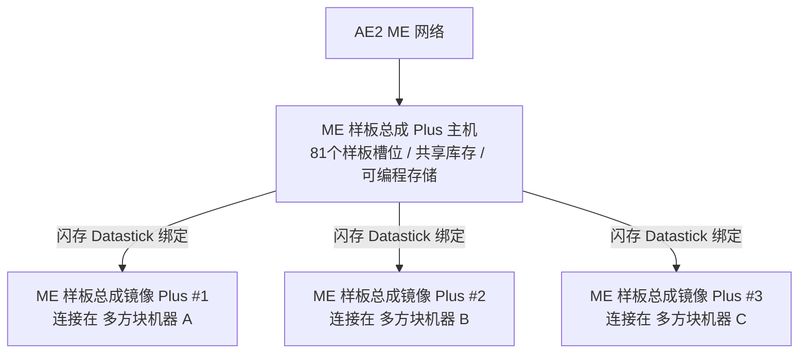

# AE2 深度集成与样板总成 Plus 系统

GTECore 为应用能源 2 (Applied Energistics 2) 与 GregTech 多方块结构之间搭建了极其强大的直接数据互联桥梁。

---

## 🧩 ME 样板总成 Plus (`me_pattern_buffer_plus`)

在传统科技模组中，将 AE2 样板供应器连接到多方块机器通常面临**槽位不足、流体与物品无法混合输出、样板难以多机共享**的痛点。

GTECore 研发的 **ME 样板总成 Plus** 彻底解决了这一问题：

### 核心特性
1. **海量样板容量**：单个总成主机拥有 **81 个样板槽位**（相当于 9 个标准 AE2 样板供应器的总和）。
2. **全能仓室能力**：同时具备 `IMPORT_ITEMS`、`IMPORT_FLUIDS`、`EXPORT_ITEMS`、`EXPORT_FLUIDS` 能力，支持流体与物品同仓混合交互。
3. **可编程存储支持**：内部集成 Programmable Storage 机制，支持复杂配方精准投料与缓存。

---

## 🪞 ME 样板总成镜像 Plus (`me_pattern_buffer_proxy_plus`)

**样板总成镜像 Plus** 是一种革命性的分布式自动化结构部件：

### 工作原理与跨机器共享
- 将镜像总成安装在任意多方块机器的仓室位置。
- 手持 **闪存 (Datastick)** 右键主 **ME 样板总成 Plus** 读取坐标，然后右键 **样板总成镜像 Plus** 进行绑定。
- **所有绑定的镜像将实时共享主总成内放置的所有 81 个样板**！
- 当 AE2 网络发起自动化合成任务时，网络会自动负载均衡分配给所有空闲的镜像机器并行开工！

### Jade 悬浮状态显示
对准样板总成或镜像时，Jade 会自动显示：
- 主总成：`已连接镜像数量: X`
- 镜像部件：`已绑定至 - X: ..., Y: ..., Z: ...`

---

## 💨 ME 蒸汽仓 (`me_steam_hatch`)

- **功能**：直接连接 AE2 流体网络与蒸汽多方块结构。
- **作用**：蒸汽多方块结构无需外挂复杂的高速蒸汽管道与储罐，直接以最高吞吐量从 ME 网络中即时抽取蒸汽供能，杜绝管道传输瓶颈。
