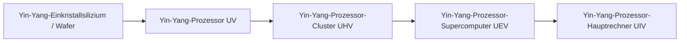

# Superstring- und Yin-Yang-Hochschaltkreis- und Materialsysteme

GTECore erweitert zwei Hochschaltkreis-Zweige über den gesamten Zyklus von ZPM bis MAX – das **Superstring-Schaltkreissystem** und das **Yin-Yang-Taiji-Schaltkreissystem** – und realisiert zusammen mit dem Erzverarbeitungszentrum einen automatisierten Materialkreislauf.

---

## 🌌 Superstring-Schaltkreissystem (Super String Circuitry)

Superstring-Schaltkreise beziehen überlichtschnelle Rechenleistung aus hochdimensionalen oszillierenden Saiten und decken hauptsächlich den Spannungsbereich **ZPM ➜ UEV** ab:

### Superstring-Materialien und Saiten-Substanzen
- **Ursprungsstring (`item.gtecore.original_string`)**：Ursprung der hochdimensionalen Universumsoszillation.
- **α-Saite / β-Saite / γ-Saite (`alpha_string`, `beta_string`, `gamma_string`)**：Superstring-Polymere mit unterschiedlichen Energieniveaus und Polarisationszuständen.
- **Superstring-Mischer (`super_string_mixer`)**、**Schöpfungsstring (`string_of_creation`)** und **Superstring-Oszillator-Array (`super_string_oscillator_array`)**：für die Spaltung, Abstimmung und Hochfestigung von Superstring-Materialien.

---

## ☯️ Yin-Yang-Taiji-Schaltkreissystem (Yin-Yang Circuitry)

Das Yin-Yang-Schaltkreissystem folgt der Philosophie des zyklischen Erzeugens und Überwindens – **„Yin erzeugt Yang, Yang erzeugt Yin, endlos“** – und deckt **UV ➜ UIV** und darüber hinaus ab:

### Acht Trigramme und Fünf-Elemente-Talismane
- **Fünf-Elemente**：Metall-Element (`jinyuansu`), Holz-Element (`muyuansu`), Wasser-Element (`shuiyuansu`), Feuer-Element (`huo`), Erde-Element (`tuyuansu`).
- **Fünf-Elemente-Talismane**：Metall-Talisman, Holz-Talisman, Wasser-Talisman, Feuer-Talisman, Erde-Talisman.
- **Acht Trigramme und Chips**：Die acht Trigramm-Symbole und Kernchips: Qian, Kun, Zhen, Xun, Kan, Li, Gen, Dui.
- **Drei-Reinheiten-Körnchen (`god_nugget`)**：Ein hochwertiges Synthesemedium, das die Essenz von Himmel und Erde kondensiert.

---

## 💎 Rezeptmodi des Erzverarbeitungszentrums

Das **Erzverarbeitungszentrum (`ore_process_center`)** verfügt über 7 standardisierte Schaltkreismodi, die durch Einstellen der programmierten Schaltkreisnummer in der Maschine umgeschaltet werden können:

| Schaltkreis-Nr. | Prozessroute | Geeignete Erztypen und Produktmerkmale | Ausbeutefaktor |
| :---: | :--- | :--- | :---: |
| **Schaltkreis 1** | Zerkleinern ➜ Zerkleinern ➜ Waschen | Schnelle Massenproduktion von Basismetallerzen (Eisen, Kupfer, Zinn usw.) | 5-faches Hauptprodukt + Nebenprodukte |
| **Schaltkreis 2** | Zerkleinern ➜ Zerkleinern ➜ Zentrifugieren | Begleitende hochwertige seltene Leichtmetallerze | 5-faches Hauptprodukt + zentrifugierte reine Nebenprodukte |
| **Schaltkreis 3** | Zerkleinern ➜ Waschen ➜ Thermisches Trennen ➜ Zerkleinern | Hochtemperaturfeuerfeste Erze, Edelmetallerze (Platingruppe, Gold, Silber usw.) | 5–6-fach + reines Metallpulver |
| **Schaltkreis 4** | Zerkleinern ➜ Thermisches Trennen ➜ Zerkleinern | Sulfide und stark komplex verwachsene Erze | 5-fach + spezielle thermische Trennnebenprodukte |
| **Schaltkreis 5** | Zerkleinern ➜ Waschen ➜ Zerkleinern ➜ Waschen | Seltene Erden und mehrstufige lösliche Salzerze | 6-fach + doppelte Waschnebenprodukte |
| **Schaltkreis 6** | Zerkleinern ➜ Waschen ➜ Zerkleinern ➜ Zentrifugieren | Radioaktive Schwermetallerze (Uran, Thorium, Plutonium) und seltene Erden | 6-fach + fein zentrifugierte Schwermetalle |
| **Schaltkreis 8** | Zerkleinern ➜ Waschen ➜ Zerkleinern ➜ Elektromagnetische Aufbereitung | Ferromagnetische und paramagnetische Mineralien (Magnetit, Chrom, Titan usw.) | 6–8-fach + elektromagnetisch reines Pulver |