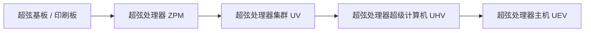
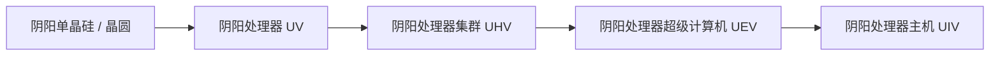

# 超弦与阴阳高阶电路及材料系统

GTECore 拓展了横跨 ZPM 到 MAX 全周期的两大高阶电路分支 —— **超弦电路体系** 与 **阴阳太极电路体系**，并配合以矿石综合处理中心实现自动化材料大循环。

---

## 🌌 超弦电路体系 (Super String Circuitry)

超弦电路从高维震荡弦中获取超光速算力，主要覆盖 **ZPM ➜ UEV** 电压梯度：

### 超弦材料与弦系物质
- **起源之弦 (`item.gtecore.original_string`)**：高维宇宙震荡本源。
- **α弦 / β弦 / γ弦 (`alpha_string`, `beta_string`, `gamma_string`)**：不同能级与偏振态的超弦聚合物。
- **超弦混合机 (`super_string_mixer`)**、**创世之弦 (`string_of_creation`)** 与 **超弦震荡阵列 (`super_string_oscillator_array`)**：用于超弦物质的分裂、调谐与高阶固化。

---

## ☯️ 阴阳太极电路体系 (Yin-Yang Circuitry)

阴阳电路体系遵循 **“阴生阳，阳生阴，生生不息”** 的循环生克哲学，覆盖 **UV ➜ UIV** 乃至更高极限：

### 八卦与五行专属符篆
- **五行元素**：金元素 (`jinyuansu`)、木元素 (`muyuansu`)、水元素 (`shuiyuansu`)、火元素 (`huo`)、土元素 (`tuyuansu`)。
- **五行符篆**：金之符篆、木之符篆、水之符篆、火之符篆、土之符篆。
- **八卦象与芯片**：乾、坤、震、巽、坎、离、艮、兑八大卦象符石与核心芯片。
- **三清之粒 (`god_nugget`)**：凝聚天地玄黄之气的顶级合成媒介。

---

## 💎 矿石综合处理中心配方模式

**矿石综合处理中心 (`ore_process_center`)** 预设了 7 大标准化电路模式，可通过在机器内设置编程电路编号切换：

| 电路编号 | 工艺路线 | 适用矿物类型与产物特色 | 产出倍率 |
| :---: | :--- | :--- | :---: |
| **电路 1** | 粉碎 ➜ 粉碎 ➜ 洗矿 | 基础金属矿石（铁、铜、锡等）快速量产 | 5 倍主产物 + 副产物 |
| **电路 2** | 粉碎 ➜ 粉碎 ➜ 离心 | 伴生高价值稀有轻金属矿石 | 5 倍主产物 + 离心精纯副产物 |
| **电路 3** | 粉碎 ➜ 洗矿 ➜ 热离 ➜ 粉碎 | 高温耐火矿石、贵金属矿（铂系、金银等） | 5~6 倍 + 纯净金属粉 |
| **电路 4** | 粉碎 ➜ 热离 ➜ 粉碎 | 硫化物与重度复杂嵌布矿 | 5 倍 + 特殊热离副产物 |
| **电路 5** | 粉碎 ➜ 洗矿 ➜ 粉碎 ➜ 洗矿 | 稀土矿石与多阶段可溶性盐矿 | 6 倍 + 双重洗矿副产物 |
| **电路 6** | 粉碎 ➜ 洗矿 ➜ 粉碎 ➜ 离心 | 放射性重矿（铀、钍、钚系）与稀土 | 6 倍 + 精细离心重金属 |
| **电路 8** | 粉碎 ➜ 洗矿 ➜ 粉碎 ➜ 电磁选矿 | 强磁性与顺磁性矿物（磁铁矿、铬、钛等） | 6~8 倍 + 电磁纯净粉 |
