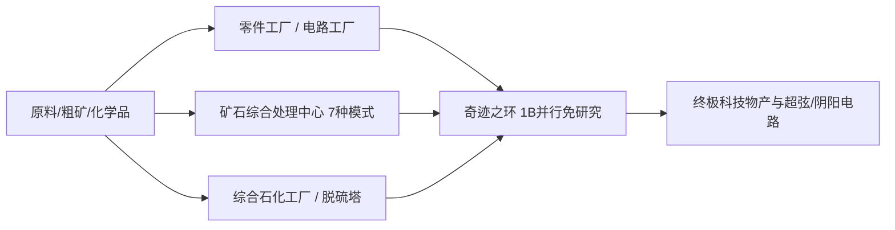

# GTECore 多方块机器图鉴

GTECore 针对科技线中后期繁琐的流水线堆叠，设计了大量兼具**超高并行能力**与**聚合生产逻辑**的多方块机器。

---

## 🏭 蒸汽时代大型多方块

为解决蒸汽时代单机产能低下、占地冗余的问题，GTECore 引入了一系列大型蒸汽多方块，全部支持跨配方并行与大容量蒸汽吞吐：

| 机器名称 (Block ID) | 核心功能与配方类型 | 特性与优势 |
| :--- | :--- | :--- |
| **大型蒸汽合金炉** (`gtceu:big_alloy`) | 合金冶炼 (`alloy_smelter`) | 早期高倍率合金生产，支持高压蒸汽 |
| **大型蒸汽压缩机** (`gtceu:big_compressor`) | 压缩处理 (`compressor`) | 批量压制致密金属板与块 |
| **大型蒸汽锻造锤** (`gtceu:big_forge_hammer`) | 锻造锤打粉/板 (`forge_hammer`) | 自动化板材与粗矿快速破碎 |
| **大型蒸汽提取机** (`gtceu:big_steam_extractor`) | 橡胶/流体提取 (`extractor`) | 大规模提取树胶与工业流体 |
| **简易蒸汽磨粉机** (`gtceu:steam_grinder_easy`) | 矿石磨粉 (`macerator`) | 早期矿物多倍处理 |
| **简易蒸汽熔炼炉** (`gtceu:steam_oven_easy`) | 热解熔炼 (`pyrochlore_oven`) | 焦炭与木炭工业化大批量烧制 |
| **蒸汽矿物处理厂** (`gtecore:steam_op`) | 综合矿石粉碎与精炼 | **10 亿 (1B) 并行**，所有配方 **1 tick** 执行完毕！支持任意输入输出仓室 |

---

## ⚡ 超级电气工业多方块

进入电力时代后，GTECore 提供了多合一与高阶加工中心：

### 1. 核心生产工厂

- **§6零件工厂 (`gtceu:component_factory`)**：
  - **定位**：一步到位生产马达、泵、活塞、机械臂、传送带、发光二极管等各类常用基础元件。
  - **特性**：直接跳过繁琐的中间子工序，极速产出指定电压等级的标准工业配件。
- **§6电路工厂 (`gtceu:circuit_factory`)**：
  - **定位**：集成电路基板、芯片蚀刻、集成封装于一体。
  - **特性**：支持跨配方并行仓，全面加速 ULV 到 MAX 全电压梯度的电路板生产。
- **§6奇迹之环 (`gtceu:miracle_ring`)**：
  - **定位**：工业奇迹终极装配设施。
  - **特性**：拥有 **10 亿 (1B) 并行** 与 **1t Subtick 超频**，**无需进行任何科研/装配线研究**即可直接运行装配线配方！
- **化学终结者 (`gtecore:chemistry_terminator`)**：
  - **定位**：“颠覆了化学与物理的存在，代表着化学的终结”。
  - **特性**：将繁复的十几步长链化学反应一键聚合，极速合成各种终极聚合物与酸类介质。
- **十合一通用处理工厂 (`gtecore:ten_in_one`)**：
  - **定位**：融合离心、电解、化学浸矿、聚合、高压反应等 10 大基础工序的万能集成箱。

### 2. 矿石与流体精炼体系

- **§6矿石综合处理中心 (`gtecore:ore_process_center`)**：
  - 支持 **7 种编程电路模式**，实现不同产物导向的矿物 5~8 倍精炼（粉碎、洗矿、热离、离心、电磁选矿全集成），支持 1t Subtick 超频。
- **综合石化工厂 (`gtecore:integrated_petrochemical_plant`)**：
  - 整合原油分馏、催化裂化、重整、脱硫全链条，单机产出全部烃类轻质气与芳香烃。
- **脱硫机 (`gtceu:desulfurization`)**：
  - 快速净化各类重质含硫燃油，回收高纯度硫粉副产物。
- **简易/进阶流体钻机 (`gtecore:easy_fluid_drilling_rig` / `not_hard_fluid_drilling_rig`)**：
  - 自动抽汲基岩流体矿脉，永不枯竭，无需复杂管道勘探。

### 3. 高端与超导线缆加工

- **§6导线工厂 (`gtecore:wiremill_factory`)**：一键生产所有金属单股、双股、四股、八股、十六股导线及超导线缆。
- **§6晶核中枢 (`gtecore:crystal_center`)**：规模化自动培育单晶硅柱、绿宝石、蓝宝石、充能赛克斯泰尔晶体。
- **§6量子线擎 (`gtecore:quantum_cable_assembler`)**：专门用于高速制造量子光纤与超维能量传输线缆。
- **§3星刃蚀刻仪 (`gtecore:starblade_etching_machine`)**：利用高能光束在极紫外/X射线波段刻蚀星系级微纳芯片。

---

## 🔋 能源与发电机系统

| 机器名称 | 能源输出/等级 | 核心机制与特性 |
| :--- | :--- | :--- |
| **§6通用燃料引擎** (`gtceu:general_fuel_engine`) | 动态自适应 (最高 MAX) | **支持世界上所有类型的燃料**（柴油、生物质、天然气、火箭燃油等），拥有 **20 亿 (2B) 并行**，瞬息之间释放天量能量！ |
| **大型通用发电机** (`gtecore:large_general_generator`) | 多级电压可选 | 适配常规燃气、蒸汽与等离子发电机转子 |
| **超级聚变反应堆** (`gtecore:super_fusion_reactor`) | 聚变等离子体输出 | 彻底消除普通聚变漫长的升温等待，**完美支持 1T Subtick 超频**，瞬时输出高温聚变产物 |
| **上限压超级电池箱** (`gtecore:max_super_battery_buffer_1x`) | **MAX (2,147,483,647 V)** | 容纳超海量 EU 缓存，支持零损耗跨维无线充能接口 |
