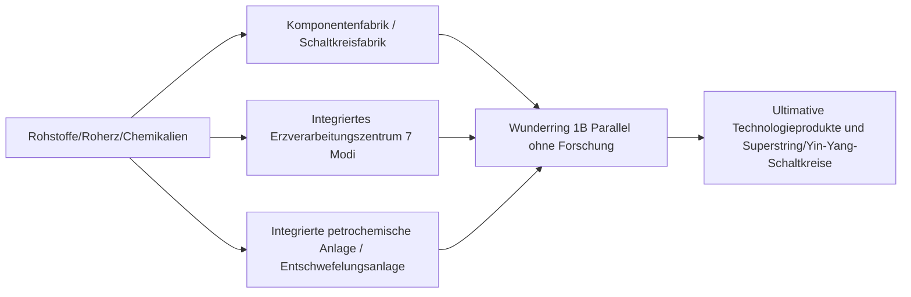

# GTECore Mehrblock-Maschinen-Enzyklopädie

GTECore wurde entwickelt, um die komplexen Pipeline-Stapel in der mittleren bis späten Technologiephase zu bewältigen, und bietet eine Vielzahl von Mehrblock-Maschinen mit **extrem hoher Parallelverarbeitung** und **aggregierter Produktionslogik**.

---

## 🏭 Große Mehrblock-Maschinen der Dampfära

Um die Probleme der geringen Produktionskapazität und des übermäßigen Platzbedarfs einzelner Maschinen in der Dampfära zu lösen, führt GTECore eine Reihe großer Dampf-Mehrblock-Maschinen ein, die alle Cross-Recipe-Parallelverarbeitung und hohe Dampfdurchsatzraten unterstützen:

| Maschinenname (Block-ID) | Kernfunktion und Rezepttypen | Eigenschaften und Vorteile |
| :--- | :--- | :--- |
| **Großer Dampf-Legierungsschmelzofen** (`gtceu:big_alloy`) | Legierungsschmelzen (`alloy_smelter`) | Frühe Hochleistungs-Legierungsproduktion, unterstützt Hochdruckdampf |
| **Großer Dampf-Kompressor** (`gtceu:big_compressor`) | Komprimierung (`compressor`) | Massenproduktion von dichten Metallplatten und -blöcken |
| **Großer Dampf-Schmiedehammer** (`gtceu:big_forge_hammer`) | Schmieden/Pulverisieren/Plattieren (`forge_hammer`) | Automatisierte Plattenherstellung und schnelles Zerkleinern von Roherz |
| **Großer Dampf-Extraktor** (`gtceu:big_steam_extractor`) | Gummi-/Flüssigkeitsextraktion (`extractor`) | Massenextraktion von Baumharz und Industrieflüssigkeiten |
| **Einfacher Dampf-Mazerator** (`gtceu:steam_grinder_easy`) | Erzmahlen (`macerator`) | Frühe Mehrfachverarbeitung von Mineralien |
| **Einfacher Dampf-Brennofen** (`gtceu:steam_oven_easy`) | Pyrolyse-Schmelzen (`pyrochlore_oven`) | Industrielle Massenproduktion von Koks und Holzkohle |
| **Dampf-Erzverarbeitungsanlage** (`gtecore:steam_op`) | Integrierte Erzzerkleinerung und -raffination | **1 Milliarde (1B) Parallelverarbeitung**, alle Rezepte werden in **1 Tick** ausgeführt! Unterstützt beliebige Ein-/Ausgabefächer |

---

## ⚡ Super-Elektro-Industrie-Mehrblock-Maschinen

Nach dem Eintritt in das elektrische Zeitalter bietet GTECore All-in-One- und fortschrittliche Verarbeitungszentren:

### 1. Kernproduktionsfabriken

- **§6 Komponentenfabrik (`gtceu:component_factory`)**:
  - **Zweck**: Produktion von Motoren, Pumpen, Kolben, Roboterarmen, Förderbändern, Leuchtdioden und anderen gängigen Basiskomponenten in einem Schritt.
  - **Eigenschaften**: Überspringt direkt die mühsamen Zwischenschritte und produziert blitzschnell Standard-Industriekomponenten der gewünschten Spannungsebene.
- **§6 Schaltkreisfabrik (`gtceu:circuit_factory`)**:
  - **Zweck**: Integrierte Schaltkreis-Substrate, Chip-Ätzung und Integrationsverpackung in einem.
  - **Eigenschaften**: Unterstützt Cross-Recipe-Parallelfächer und beschleunigt die Produktion von Schaltkreisen über die gesamte Spannungsleiter von ULV bis MAX.
- **§6 Wunderring (`gtceu:miracle_ring`)**:
  - **Zweck**: Ultimative industrielle Montageanlage.
  - **Eigenschaften**: Bietet **1 Milliarde (1B) Parallelverarbeitung** und **1t Subtick-Übertaktung**, **keine Forschung/Montagelinien-Forschung erforderlich** – Montagelinien-Rezepte können direkt ausgeführt werden!
- **Chemie-Terminator (`gtecore:chemistry_terminator`)**:
  - **Zweck**: "Stellt die Existenz von Chemie und Physik auf den Kopf und repräsentiert das Ende der Chemie".
  - **Eigenschaften**: Aggregiert komplexe mehrstufige chemische Reaktionsketten in einem Schritt und synthetisiert blitzschnell ultimative Polymere und Säuremedien.
- **Zehn-in-Eins-Universal-Verarbeitungsfabrik (`gtecore:ten_in_one`)**:
  - **Zweck**: Universelle Integrationsbox, die 10 grundlegende Prozesse vereint: Zentrifugieren, Elektrolyse, chemische Laugung, Polymerisation, Hochdruckreaktion usw.

### 2. Erz- und Flüssigkeitsraffinationssysteme

- **§6 Integriertes Erzverarbeitungszentrum (`gtecore:ore_process_center`)**:
  - Unterstützt **7 programmierbare Schaltkreismodi** für verschiedene Produktausrichtungen mit 5–8-facher Erzraffination (Zerkleinern, Waschen, thermische Trennung, Zentrifugieren, elektromagnetische Trennung vollständig integriert), unterstützt 1t Subtick-Übertaktung.
- **Integrierte petrochemische Anlage (`gtecore:integrated_petrochemical_plant`)**:
  - Integriert Rohölfraktionierung, katalytisches Cracken, Reformierung und Entschwefelung in einer Kette; produziert alle leichten Kohlenwasserstoffgase und Aromaten in einer Maschine.
- **Entschwefelungsanlage (`gtceu:desulfurization`)**:
  - Schnelle Reinigung verschiedener schwerer schwefelhaltiger Brennstoffe, Gewinnung von hochreinem Schwefelpulver als Nebenprodukt.
- **Einfacher/Fortgeschrittener Flüssigkeitsbohrturm (`gtecore:easy_fluid_drilling_rig` / `not_hard_fluid_drilling_rig`)**:
  - Automatisches Abpumpen von Grundgesteins-Flüssigkeitsadern, unerschöpflich, keine komplexe Rohrleitungserkundung erforderlich.

### 3. Hochwertige und supraleitende Kabelverarbeitung

- **§6 Drahtfabrik (`gtecore:wiremill_factory`)**: Produziert alle Metall-Einzel-, Doppel-, Vier-, Acht- und Sechzehnfachdrähte sowie supraleitende Kabel in einem Schritt.
- **§6 Kristallkern (`gtecore:crystal_center`)**: Automatisierte Massenzüchtung von monokristallinen Siliziumstäben, Smaragden, Saphiren und geladenen Sixtel-Kristallen.
- **§6 Quantenkabel-Assembler (`gtecore:quantum_cable_assembler`)**: Spezialisiert auf die schnelle Herstellung von Quantenfasern und überdimensionale Energietransportkabel.
- **§3 Sternklingen-Ätzmaschine (`gtecore:starblade_etching_machine`)**: Ätzt mit hochenergetischen Strahlen im EUV/Röntgenbereich galaktische Mikro-/Nano-Chips.

---

## 🔋 Energie- und Generatorsysteme

| Maschinenname | Energieausgang/Stufe | Kernmechanik und Eigenschaften |
| :--- | :--- | :--- |
| **§6 Universeller Kraftstoffmotor** (`gtceu:general_fuel_engine`) | Dynamisch adaptiv (max. MAX) | **Unterstützt alle Kraftstofftypen der Welt** (Diesel, Biomasse, Erdgas, Raketentreibstoff usw.), hat **2 Milliarden (2B) Parallelverarbeitung** und setzt in Sekundenschnelle enorme Energiemengen frei! |
| **Großer Universeller Generator** (`gtecore:large_general_generator`) | Mehrstufige Spannung wählbar | Kompatibel mit herkömmlichen Gas-, Dampf- und Plasma-Generatorrotoren |
| **Super-Fusionsreaktor** (`gtecore:super_fusion_reactor`) | Fusionsplasma-Ausgang | Eliminiert die lange Aufheizzeit normaler Fusion vollständig, **unterstützt perfekt 1T Subtick-Übertaktung**, liefert sofort Hochtemperatur-Fusionsprodukte |
| **Max-Super-Akkupuffer** (`gtecore:max_super_battery_buffer_1x`) | **MAX (2.147.483.647 V)** | Enthält enorme EU-Puffer, unterstützt verlustfreie drahtlose Energieübertragung über Dimensionen |