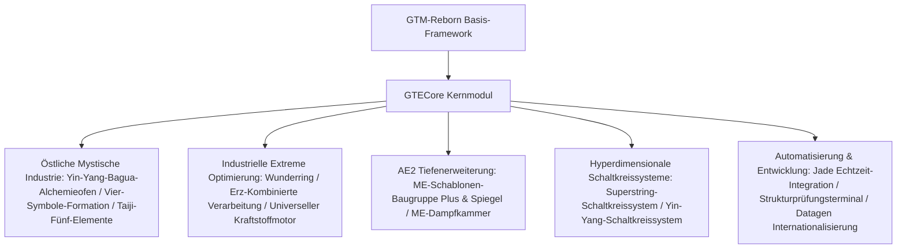

# GTECore Kernmodul Übersicht

**GTECore** ist das maßgeschneiderte Java-Kernmodul des GregTech Easy Projekts. Es basiert direkt auf dem `gtm-reborn` Quellcode und erweitert großflächige multiblockindustrielle Strukturen, hochstufige Formationstechnologie, tiefe AE2-Interaktionen sowie das Super-Schaltkreis-Herstellungssystem.

---

## 🏛️ Modularchitektur und Designausrichtung

---

## 📦 Kreativmodus-Inventar und Kategorien

GTECore registriert im Spiel einen eigenen Kreativmodus-Tab:

1. **GregTech Easy Maschinen (`itemGroup.gtecore.gtecore_machines`)**:
   - Enthält alle GTE-originalen Multiblock-Hauptblöcke (Yin-Yang-Bagua-Hochofen, Wunderring, Erzverarbeitungszentrum, Chemie-Terminator usw.).
   - Enthält mehrstufige Super-Akkuboxen (Max Super Battery Buffer), ME-Dampfkammern, ME-Schablonen-Baugruppe Plus und Spiegel.
2. **GregTech Easy Gegenstände (`itemGroup.gtecore.gtecore_items`)**:
   - Enthält die Superstring- und Yin-Yang-Schaltkreis-Serie (Prozessoren, Cluster, Supercomputer, Hosts).
   - Enthält spezielle Gegenstände wie Fünf-Elemente-Talismane, Bagua-Chips, Sanqing-Partikel, Strukturprüfungsterminal usw.

---

## ⚙️ Globale Modulkonfiguration (`GTEConfig`)

GTECore bietet umfangreiche Konfigurationsoptionen im Spiel und in Dateien (unter `config/gtecore-common.toml` oder im Spielkonfigurationsmenü):

| Konfigurationsoption | Standardwert | Detaillierte Beschreibung |
| :--- | :--- | :--- |
| `superPeace` (Super-Friedensmodus) | `false` | Wenn aktiviert, wird die Erzeugung feindlicher Kreaturen vollständig deaktiviert, um eine absolut reine Umgebung für den Technologiebau zu schaffen |
| `durationMultiplier` (Rezeptzeit-Multiplikator) | `1.0` | Passt global die Zeitdauer der benutzerdefinierten GTECore-Rezepte an |

---

## 🔍 Jade / TOP Native Integration

GTECore enthält eingebauten **`GTEJadePlugin`**-Plugin-Support:
- **ME-Schablonen-Baugruppe Plus Status**: Zeigt in Echtzeit die Anzahl der gebundenen Schablonen sowie die Fluid- und Item-Ausgabemodi an.
- **ME-Schablonen-Baugruppe Spiegel Plus Bindungsinformationen**: Zeigt beim Überfahren direkt die Koordinaten `(X, Y, Z)` der gebundenen Haupt-Baugruppe sowie den Netzwerkverbindungsstatus an.
- **Formationsaktivierungsanzeige**: Zeigt am Yin-Yang-Bagua-Alchemieofen in Echtzeit den Bereitschaftsstatus der Vier-Symbole-Formationen (Azurdrache, Weißer Tiger, Purpurvogel, Schwarze Schildkröte) an.

---

## 🛠️ Strukturprüfungsterminal (`Structure Testing Terminal`)

GTECore bietet ein spezielles Handwerkzeug – das **Strukturprüfungsterminal** (`item.gtecore.check_structure_terminal`):
- **Rechtsklick auf Multiblock-Controller**: Scannt in Echtzeit die strukturelle Integrität.
- **Fehlerdiagnosehinweise**: Wenn die Struktur nicht geformt ist, zeigt das Terminal im Chat und im Tooltip präzise die **fehlerhaften Blockkoordinaten und unzulässigen Positionen** an, was den Bau und die Fehlersuche großer Multiblöcke erheblich beschleunigt.