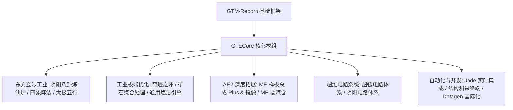

# GTECore 核心模组概览

**GTECore** 是 GregTech Easy 项目的定制化 Java 核心模组。它直接依赖 `gtm-reborn` 源码，拓展了大规模多方块工业结构、高阶阵法科技、AE2 深层交互以及超级电路制造体系。

---

## 🏛️ 模组架构与设计定位

---

## 📦 创造模式物品栏与分类

GTECore 在游戏内注册了独立的创造模式标签页：

1. **格雷科技Easy机器 (`itemGroup.gtecore.gtecore_machines`)**：
   - 包含所有 GTE 原创多方块主方块（阴阳八卦高炉、奇迹之环、矿石处理中心、化学终结者等）。
   - 包含多级超级电池箱（Max Super Battery Buffer）、ME 蒸汽仓、ME 样板总成 Plus 及镜像。
2. **格雷科技Easy物品 (`itemGroup.gtecore.gtecore_items`)**：
   - 包含超弦与阴阳电路系列物品（处理器、集群、超算、主机）。
   - 包含五行元素符篆、八卦芯片、三清之粒、结构测试终端等专用道具。

---

## ⚙️ 模组全局配置 (`GTEConfig`)

GTECore 提供了丰富的游戏内与文件配置项（位于 `config/gtecore-common.toml` 或游戏内配置菜单）：

| 配置项 | 默认值 | 详细说明 |
| :--- | :--- | :--- |
| `superPeace` (超级和平模式) | `false` | 开启后全面禁用恶性敌对生物生成，为科技建造提供绝对纯净环境 |
| `durationMultiplier` (配方时间倍率) | `1.0` | 全局调整 GTECore 自定义配方的耗时倍率 |

---

## 🔍 Jade / TOP 原生集成

GTECore 内置了 **`GTEJadePlugin`** 插件支持：
- **ME 样板总成 Plus 状态**：实时显示当前总成绑定的样板数、流体与物品输出模式。
- **ME 样板总成镜像 Plus 绑定信息**：悬浮直接显示绑定的主总成坐标 `(X, Y, Z)` 以及网络连通状态。
- **阵法激活指示**：在阴阳八卦炼仙炉上实时显示青龙、白虎、朱雀、玄武四象阵法的就绪状态。

---

## 🛠️ 结构检测终端 (`Structure Testing Terminal`)

GTECore 提供了专属的手持工具 —— **结构检测终端** (`item.gtecore.check_structure_terminal`)：
- **右键多方块控制器**：实时扫描结构完整性。
- **错误诊断提示**：若结构未成型，终端会在聊天栏和悬浮提示中精准指出**错误方块坐标及不应放置的位置**，极大加速大型多方块建造与排错。
