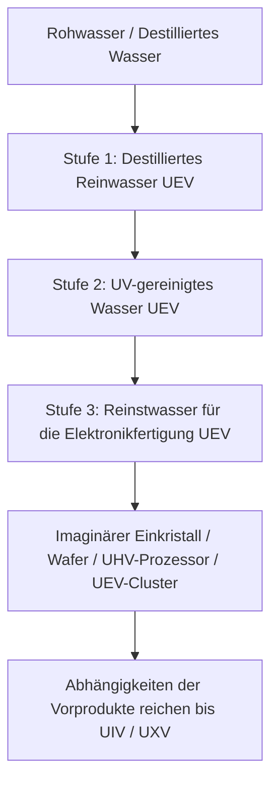

# Dreistufige Wasseraufbereitung und industrieller Wasserkreislauf

Das **gesamte dreistufige Wasseraufbereitungssystem von GTECore gehört zur UEV-Stufe**. Die Stufen beschreiben aufeinanderfolgende Aufbereitungsverfahren und Wasserqualitäten, keine unterschiedlichen Spannungszeitalter. Die Zentrale, alle drei Aufbereitungseinheiten und ihre Steuerungsluken verwenden UEV-Komponenten, UEV-Schaltkreise und UEV-Montagespannung. Alle drei Aufbereitungsstufen und die EDI-Regeneration arbeiten mit UEV.

Die Anlage besteht aus **einer Zentrale und drei Aufbereitungseinheiten**. Die Einheiten besitzen keine Energieluken: Verbinde sie mit einem Datenstick mit der Zentrale, damit sie Energie und eine Obergrenze für parallele Rezepte erhalten.

## 💧 Eigenschaften der drei Wasserqualitäten

| Registrierte Flüssigkeit | Materialname | Technologiestufe |
| :--- | :--- | :---: |
| `distilled_purified_water` | Destilliertes Reinwasser | UEV |
| `uv_purified_water` | UV-gereinigtes Wasser | UEV |
| `ultrapure_water` | Reinstwasser für die Elektronikfertigung | UEV |

Die Beschreibungen industrieller Wasserqualitäten dienen als Hintergrund; das tatsächliche Spielverhalten bestimmen Rezepte, thermische Stabilität, UV-Dosis und EDI-Belastung.

## 🏭 Vier Multiblock-Maschinen

| Maschine | Registrierungs-ID | Technologiestufe |
| :--- | :--- | :---: |
| Zentrale Wasseraufbereitungsanlage | `central_water_purification_plant` | UEV |
| Klär- und Aufbereitungseinheit der Stufe 1 | `t1_clarifier_purification_unit` | UEV |
| UV-Oxidations- und Aufbereitungseinheit der Stufe 2 | `t2_uv_oxidation_purification_unit` | UEV |
| EDI-Reinstwasser-Aufbereitungseinheit der Stufe 3 | `t3_edi_ultrapure_purification_unit` | UEV |

Die alte `ultrapure_water_refinery` bleibt aus Kompatibilitätsgründen registriert, ist aber deaktiviert. Sie kann die vollständige Aufbereitungskette nicht mehr ausführen; steige auf die Zentrale und die drei Einheiten um.

### 1. Zentrale Wasseraufbereitungsanlage

Die Zentrale führt selbst keine Aufbereitungsrezepte aus. Sie speichert Verbindungen, verteilt Energie an verbundene, vollständig aufgebaute Einheiten, zeigt die tatsächliche Leistungsabgabe in EU/s an und übermittelt ihre eingestellte Obergrenze für parallele Rezepte. Ohne eine verbundene und vollständig aufgebaute Zentrale kann eine Einheit nicht arbeiten.

### 2. Stufe 1: Klärung und thermische Behandlung (UEV)

Die erste Stufe trennt Verunreinigungen vom zugeführten Wasser. Die Nennwerte der Rezepte sind:

- Wasser 1000 mB + Verbundflockungsmittel 50 mB + 1 modifizierte Kohlenstoffmikrokugel → Destilliertes Reinwasser 900 mB / 60 Ticks, mit einer Chance auf Salzstaub und Seltenerdstaub.
- Destilliertes Wasser 1000 mB + Verbundflockungsmittel 25 mB + 1 modifizierte Kohlenstoffmikrokugel → Destilliertes Reinwasser 1000 mB / 30 Ticks, mit einer Chance auf Salzstaub.

Die tatsächliche Wasserausbeute hängt auch von der thermischen Stabilität ab. Diese Stufe bildet den Einstieg in die UEV-Aufbereitungskette.

### 3. Stufe 2: Oxidation mit tiefem Ultraviolett (UEV)

UV-Bestrahlung und Oxidationsmittel zersetzen organische Verunreinigungen. Die Nennwerte der Rezepte sind:

- Destilliertes Reinwasser 800 mB + Ozon 50 mB → UV-gereinigtes Wasser 800 mB + Sauerstoff 25 mB / 40 Ticks.
- Destilliertes Reinwasser 800 mB + Wasserstoffperoxid 50 mB → UV-gereinigtes Wasser 800 mB + Sauerstoff 25 mB / 20 Ticks.

Bei beiden Verfahren muss vor dem Abschluss zusätzlich die erforderliche UV-Dosis erreicht werden.

### 4. Stufe 3: Elektrodeionisation und Feinreinigung (UEV)

Die EDI-Stufe entfernt verbleibende Ionen. Im Spiel werden dafür Reagenz und Harz benötigt; ein separates Regenerationsrezept beseitigt die angesammelte Ionenbelastung:

- UV-gereinigtes Wasser 800 mB + Säure-Base-Reagenz für die Elektronikfertigung 20 mB + 1 Mischbettharzperle → Reinstwasser für die Elektronikfertigung 800 mB / 30 Ticks.
- EDI-Regeneration: UV-gereinigtes Wasser 100 mB + Säure-Base-Reagenz für die Elektronikfertigung 1 mB / 2 Ticks. Dabei wird die Ionenbelastung beseitigt, aber kein Wasser erzeugt.

## 🔌 Anlage verbinden und betreiben

1. Klicke mit einem GT-Datenstick bei gedrückter Schleichtaste mit der rechten Maustaste auf die Zentrale, um ihre Koordinaten zu kopieren.
2. Klicke mit diesem Stick mit der rechten Maustaste auf eine Aufbereitungseinheit, um sie zu verbinden. Auch die umgekehrte Reihenfolge funktioniert: Kopiere die Koordinaten der Einheit und klicke anschließend mit der rechten Maustaste auf die Zentrale.
3. Versorge die Zentrale über Energieluken (1–4; Lasereingang wird unterstützt). Sie leitet die Energie an die verbundenen Einheiten weiter.
4. Stelle in der Bedienoberfläche der Zentrale die Obergrenze für parallele Rezepte zwischen 1 und 65536 ein.
5. Prüfe in der Bedienoberfläche jeder Einheit die Koordinaten ihrer verbundenen Zentrale, die Parallelgrenze und den internen Energiepuffer.

Jede Einheit verbraucht die Rezeptleistung multipliziert mit der tatsächlichen Anzahl paralleler Rezepte. Alle drei Einheiten haben dieselbe Leistungsobergrenze von `UEV-Spannung × 256 A`. Die Stufen 1, 2 und 3 bezeichnen Aufbereitungsverfahren, keine unterschiedlichen Betriebsspannungen oder Freischaltstufen. Die tatsächlich mögliche Parallelverarbeitung hängt außerdem von verfügbaren Zutaten und der Ausgabekapazität ab. Eine höhere Obergrenze an der Zentrale allein garantiert daher keinen höheren Durchsatz.

## 🔄 Imaginäre Produktion und Reihenfolge des Aufbaus

Die folgenden Rezepte des Baums des Imaginären verbrauchen direkt `ultrapure_water` aus der dritten Stufe. Die Mengen gelten jeweils pro Rezeptdurchlauf:

| Produkt | Ausgabemenge pro Durchlauf | Wasser für die Elektronikfertigung |
| :--- | ---: | ---: |
| Imaginärer Einkristall | 4 | 4000 mB |
| Normaler imaginärer Wafer | 16 | 1000 mB |
| Imaginärer UHV-Prozessor | 4 | 1000 mB |
| Imaginärer UEV-Prozessor-Cluster | 2 | 2000 mB |

Der imaginäre UIV-Supercomputer und der imaginäre UXV-Hauptrechner verbrauchen direkt kein zusätzliches Wasser. Ihre Wasserabhängigkeit ergibt sich aus den benötigten Prozessor-Clustern und Computern. Die Schaltkreisstufe eines Produkts und seine Rezeptspannung ändern nichts daran, dass das Aufbereitungssystem erst auf UEV zugänglich ist.

Die Reihenfolge lautet **UHV-Komponenten + Yin-Yang-Produktion → acht UEV-Komponenten → UEV-Aufbereitungsanlagen → Wasser der dritten Stufe für die Elektronikfertigung → wichtige imaginäre Produkte**. Das Modpack ergänzt Rezepte für die acht UEV-Komponenten. Die Yin-Yang-Rezepte und diese Komponentenrezepte benötigen unmittelbar kein Wasser für die Elektronikfertigung. So entsteht kein Abhängigkeitskreis, bei dem zum Bau der Aufbereitungsanlagen bereits deren eigenes Produkt nötig wäre.

Imaginäre Baumaterialien, der Weg zum ersten Baum und die Herstellung von Einkristallen sowie normalen Wafern bilden eine zusammenhängende Produktionskette; siehe [Imaginäre Materialien und der erste Baum](circuits-and-materials.md). Der Tao-Kern der roten Sonne verbraucht 4000 mB Wasser für die Elektronikfertigung, um pro Durchlauf 32 Wachstumsmedien herzustellen. Blattmatrizen bleiben Strukturblöcke, während die Einkristallproduktion fortlaufend Wachstumsmedium verbraucht.

Das **imaginäre Immersionslithografiezentrum** verbraucht Wasser der dritten Stufe für die Elektronikfertigung und verarbeitet normale imaginäre Wafer mit seinen eigenen Rezepten. Für CPU-Wafer, Rohchips, gravierte Chips, Schaltkreischips und CPU-Chips bestehen nun zusammenhängende Produktionswege, alle auf UEV. Ihr direkter Wasserverbrauch pro Durchlauf beträgt in dieser Reihenfolge **2000, 1000, 500, 1000 und 500 mB**. Belichtung und Gravur nutzen eine wiederverwendbare Yin-Yang-Glaslinse, die nicht verbraucht wird. Beide Verarbeitungszweige und die vollständigen Zutatenmengen sind unter [Imaginäres Immersionslithografiezentrum](circuits-and-materials.md) beschrieben. Sein Controller lässt sich aus Yin-Yang-UIV-Schaltkreisen und normalen imaginären Wafern herstellen, ohne bereits die eigenen Chipprodukte zu benötigen.

### Imaginäre Schaltkreisfabrik

Für den Aufbau der [imaginären Schaltkreisfabrik](circuits-and-materials.md) werden CPU-Chips und Schaltkreischips aus dem Lithografiezentrum, UIV-Schaltkreise der vorherigen Generation und UEV-Komponenten benötigt. Ihre eigenen Platinen oder SoCs sind für den Einstieg nicht erforderlich. Alle drei Verfahren nutzen UEV:

| Prozessprodukt | Ausgabemenge pro Durchlauf | Direkter Verbrauch an Wasser für die Elektronikfertigung | Grunddauer |
| :--- | ---: | ---: | ---: |
| Schaltkreisplatine des imaginären Baums | 4 | 2000 mB | 30 s |
| Gedruckte Leiterplatte des imaginären Baums | 1 | 1000 mB | 20 s |
| SoC des imaginären Baums | 2 | 2000 mB | 30 s |

Die Rezeptkette verbindet jetzt Platinen, gedruckte Leiterplatten, SoCs und alle vier Stufen fertiger Schaltkreise. Der Baum des Imaginären stellt die vier fertigen Schaltkreise weiterhin mit **UEV-Fertigungsspannung** her, mit Ausgabemengen von **4 / 2 / 1 / 1** pro Durchlauf. Ihre **Schaltkreis-Tags UHV / UEV / UIV / UXV** bleiben unverändert. UIV und UXV übernehmen den Wasserverbrauch über ihre Vorprodukte.

Die Rückgewinnung von Wasser niedrigerer Qualität in der Sternklingen-Ätzmaschine und der Schaltkreisfabrik, zusätzliche Erzausbeuten und ein Kreislauf mit 90% Rückgewinnung sind weiterhin nicht umgesetzte Vorschläge und keine verfügbaren Funktionen.
