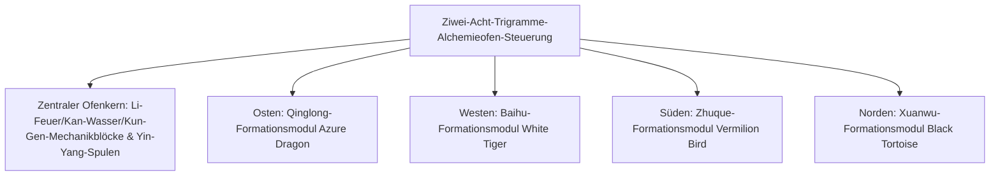

# Yin-Yang-Acht-Trigramme-Alchemieofen und Vier-Symbole-Formationssystem

GTECore hat ein einzigartiges **„Taiji-Acht-Trigramme- und Vier-Symbole-Formationssystem“** entwickelt, das östliche daoistische Philosophie mit moderner Schwerindustrie-Technik verbindet. Dieses System bildet den zentralen Knotenpunkt für Metallurgie, Synthese supraleitender Materialien und den technologischen Sprung der daoistischen Wissenschaft in der mittleren bis späten Spielphase.

---

## 🌌 Yin-Yang-Acht-Trigramme-Alchemieofen (`yin_yang_eight_trigmas_blast_furnace`)

**Der Ziwei-Acht-Trigramme-Alchemieofen** ist eine der größten und präzisesten Multiblock-Strukturen in der Tech-Mod-Community (über 55×55 Blöcke):



### 🧭 Feng-Shui-Ausrichtungsregeln (Schlüsselmechanik)
> [!IMPORTANT]
> **Feng-Shui-Richtungsgesetz**: Aufgrund von Feng-Shui- und Magnetfeldbeschränkungen muss die **Hauptsteuerung des Alchemieofens nach Süden ausgerichtet** sein, um mit der Yin-Yang-Energie von Himmel und Erde zu kommunizieren und normal zu funktionieren!

### Grundlegende Ofenfähigkeiten
- **Rezeptbibliothek**: Nativ kompatibel mit Standard-Hochofenrezepten (`blast_recipes`), Schmelzofenrezepten (`furnace_recipes`), Legierungsofenrezepten (`alloy_smelter_recipes`), GCYM-Riesenlegierungshochofenrezepten (`alloy_blast_recipes`) sowie exklusiven **Yin-Yang-Acht-Trigramme-Rezepten (`yin_yang_eight_trigmas_blast`)**.
- **Übertaktung**: Volle Unterstützung für **1T-Subtick-Sofortübertaktung** und **Stapelverarbeitungsmodus (Batch Mode)**.

---

## 🐉 Vier-Symbole-Formations-Submodule und dynamische Bedingungserkennung

Rund um den Alchemieofen können die vier großen Formationsflügel **Ost-Qinglong, West-Baihu, Süd-Zhuque, Nord-Xuanwu** erweitert werden:

| Formationsmodul | Formationsposition | Formationsblock | Rezeptbedingung (`RecipeCondition`) | Aktivierter Bonus und Effekt |
| :--- | :--- | :--- | :--- | :--- |
| **Qinglong-Formation** (`Qing Long`) | **Osten (East)** | `qinglong_module` | `QING_LONG_CONDITION` | Aktiviert die Holz-zu-Feuer-Kraft, reduziert drastisch den Energieverbrauch bei Ultrahochtemperatur-Schmelzen, entsperrt hochstufige Katalyse-Rezepte |
| **Baihu-Formation** (`Bai Hu`) | **Westen (West)** | `baihu_module` | `BAI_HU_CONDITION` | Metall-Killer-Prinzip, entsperrt Rezepte für hochharte Göttermetalle, superschwere Kernspaltung und Quantenmetall-Transmutation |
| **Zhuque-Formation** (`Zhu Que`) | **Süden (South)** | `zhuque_module` | `ZHU_QUE_CONDITION` | Südliches Ming-Feuer, bietet unbegrenzte maximale Ofentemperatur, entsperrt Sternen-Plasmaschmelzen und Götterpillen-Alchemie |
| **Xuanwu-Formation** (`Xuan Wu`) | **Norden (North)** | `xuanwu_module` | `XUAN_WU_CONDITION` | Kan-Wasser-Wächter, extrem schnelles Abkühlen von Ultrahochtemperatur-Produkten, entsperrt Sofortverfestigung und Antimaterie-Stabilisierung |

### Dynamische Erkennung und Statusrückmeldung
- Der Controller ruft bei jedem Strukturscan und Rezeptabgleich automatisch `checkModule()` auf, um zu berechnen, ob die Formationsblöcke an den vier Himmelsrichtungs-Offset-Koordinaten bereit sind.
- Mit **Jade** über dem Controller schwebend kann der Aktivierungsstatus der vier Formationen direkt eingesehen werden (Grün = aktiv, Rot = nicht bereit).

---

## 🔮 Abgeleitete daoistische Kerne und Sternenmatrix

Auf Basis des Acht-Trigramme-Alchemieofens erweitert GTECore die Serie um weitere Himmels-Dao-Multiblock-Strukturen:

```
GTE-Hochstufen-Array-Industriegruppe
├── Taiji-Fünf-Elemente-Trennungs-Array (Tai Chi Five Elements Separation Array)
├── Kun-Gen-Sternnabe (Kun Gen Star Hub)
├── Qian-Qiong-Triebwerk (Qian Qiong Engine)
├── Rote-Sonne-Dao-Kern (Red Sun Tao Core)
└── Asche-Stern-Fusions-Array (Ashing Star Fusion Array)
```

1. **Taiji-Fünf-Elemente-Trennungs-Array (`taichi_five_elements_separation_array`)**:
   - Trennt und analysiert jedes Mineral und jede chemische Substanz aus Realität und Fantasie in reine **Metall, Holz, Wasser, Feuer, Erde** Fünf-Elemente-Urstoffe.
2. **Kun-Gen-Sternnabe (`kun_gen_star_hub`)**:
   - Verbindet Erd- und Stern-Gravitationswellen, um mikroskopische Gravitonen zu sammeln und Mikro-Schwarze Löcher zu konstruieren.
3. **Qian-Qiong-Triebwerk (`qian_qiong_engine`)**:
   - Vakuum-Energie-Triebwerk, extrahiert grenzenlose Vakuumenergie aus Quantenfluktuationen des Nichts.
4. **Rote-Sonne-Dao-Kern (`red_sun_tao_core`)**:
   - Künstlicher mikroskopischer Sternkern, simuliert extreme physikalische Bedingungen von Billionen Grad in der Sternkorona.
5. **Asche-Stern-Fusions-Array (`ashing_star_fusion_array`)**:
   - Supernova-Überrest-Annihilations-Fusionsmatrix zur Rekonstruktion des Gleichgewichts zwischen Dunkler Materie und Antimaterie.