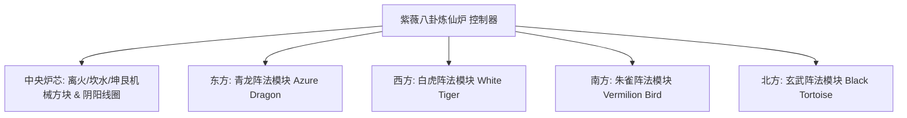

# 阴阳八卦炼仙炉与四象阵法系统

GTECore 独创了结合东方道家哲学与现代重工业工程的 **“太极八卦与四象阵法体系”**。这一体系构成了游戏中后期冶金、超导物质合成与仙道科技跃迁的核心枢纽。

---

## 🌌 阴阳八卦炼仙炉 (`yin_yang_eight_trigmas_blast_furnace`)

**紫薇八卦炼仙炉** 是目前科技模组界规模最宏大、机制最精密的多方块结构之一（占地超过 55×55 方块）：



### 🧭 风水朝向法则（关键机制）
> [!IMPORTANT]
> **风水方位律**：由于风水与磁场约束原因，**炼仙炉主控制器必须正面朝南放置**，才能与天地阴阳之气贯通并正常成型运转！

### 炉体基础能力
- **支持配方库**：原生兼容常规高炉配方 (`blast_recipes`)、熔炼炉配方 (`furnace_recipes`)、合金炉配方 (`alloy_smelter_recipes`)、GCYM 巨型合金高炉配方 (`alloy_blast_recipes`) 以及专属的 **阴阳八卦配方 (`yin_yang_eight_trigmas_blast`)**。
- **超频特性**：完美支持 **1T Subtick 瞬时超频** 与 **批处理模式 (Batch Mode)**。

---

## 🐉 四象阵法子模块与动态条件检测

炼仙炉四周可分别延伸搭建出 **东青龙、西白虎、南朱雀、北玄武** 四大阵法翼：

| 阵法模块 | 阵法方位 | 阵法方块 | 配方条件 (`RecipeCondition`) | 开启后的增益与作用 |
| :--- | :--- | :--- | :--- | :--- |
| **青龙阵法** (`Qing Long`) | **东方 (East)** | `qinglong_module` | `QING_LONG_CONDITION` | 激活木生火之势，大幅度降低超高温冶炼能耗，解锁生生不息的高阶催化配方 |
| **白虎阵法** (`Bai Hu`) | **西方 (West)** | `baihu_module` | `BAI_HU_CONDITION` | 金煞主伐，解锁高硬度神金、超密重核元素裂解与量子金属蜕变配方 |
| **朱雀阵法** (`Zhu Que`) | **南方 (South)** | `zhuque_module` | `ZHU_QUE_CONDITION` | 南明离火，提供无上限极限炉温，解锁恒星级等离子熔铸与神丹炼制配方 |
| **玄武阵法** (`Xuan Wu`) | **北方 (North)** | `xuanwu_module` | `XUAN_WU_CONDITION` | 坎水镇守，极速冷却超高温产物，解锁瞬时固化与反物质稳定化配方 |

### 动态检测与状态反馈
- 控制器在每次扫描结构与配方匹配时，会自动调用 `checkModule()` 计算四方偏移坐标上的阵法方块是否就绪。
- 使用 **Jade** 悬浮对准控制器，可直观查看当前四个阵法的激活状态（绿色表示激活，红色表示未就绪）。

---

## 🔮 衍生道道核心与群星矩阵

在八卦炼仙炉的基础上，GTECore 进一步延伸出系列星天道法多方块：

```
GTE 高阶阵列工业群
├── 太极五行剥离阵列 (Tai Chi Five Elements Separation Array)
├── 坤艮星枢 (Kun Gen Star Hub)
├── 谦穹引擎 (Qian Qiong Engine)
├── 赤阳道核 (Red Sun Tao Core)
└── 烬星聚变阵 (Ashing Star Fusion Array)
```

1. **太极五行剥离阵列 (`taichi_five_elements_separation_array`)**：
   - 将现实与幻想中的任何矿物和化学物质剥离解析为纯粹的 **金、木、水、火、土** 五行本源元素。
2. **坤艮星枢 (`kun_gen_star_hub`)**：
   - 勾连大地与星辰重力波，用于汇聚微观引力子与构筑微型黑洞。
3. **谦穹引擎 (`qian_qiong_engine`)**：
   - 虚空取能引擎，从虚无量子涨落中提取浩瀚无际的虚空能量。
4. **赤阳道核 (`red_sun_tao_core`)**：
   - 人造超微型恒星核心，模拟恒星日冕层万亿度极端物理条件。
5. **烬星聚变阵 (`ashing_star_fusion_array`)**：
   - 超新星遗迹湮灭聚变矩阵，用于重构暗物质与反物质平衡态。
