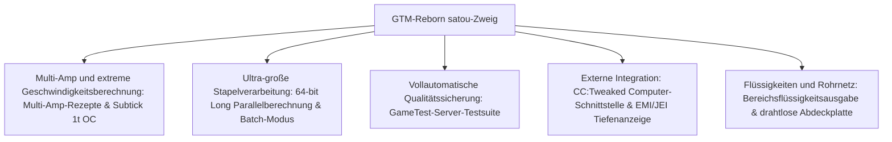

# GregTech Modern Reborn (GTM Reborn)

`modules/gtm-reborn` ist ein unabhängiger Zweig von GregTech Modern, der von GTE-Multi tief angepasst wurde (Zweigname: `satou`).

---

## 🚀 Kernverbesserungen des `satou`-Zweigs

Im Vergleich zum ursprünglichen Upstream hat GTM-Reborn in der modernen Minecraft-Version 1.20.1 mehrere revolutionäre technische Fortschritte und industrielle Erfahrungsverbesserungen umgesetzt:



### 1. 64-Bit-Long-Parallelverarbeitung und Stapelverarbeitungsmodus (Batch-Modus)
- **Überwindung der 32-Bit-Ganzzahlgrenze**: Die Parallelberechnung verwendet durchgängig den Datentyp `long`, wodurch Probleme mit Zahlenüberlauf oder Berechnungsabbrüchen bei extrem hoher Parallelität in sehr großen Industrieanlagen vollständig gelöst werden.
- **Intelligenter Stapelverarbeitungsmodus**: Wenn Rohstoffe sehr reichlich vorhanden sind, kann die Maschine Hunderte oder Tausende winziger Rezepte zu einem einzigen Zyklus bündeln, wodurch die Server-Tick-Last erheblich reduziert wird.

### 2. 1T Subtick Sofort-Übertaktung (OC_PERFECT_SUBTICK)
- Die Ausführungspipeline der Maschinen-Rezeptlogik wurde optimiert, sodass bestimmte fortschrittliche Maschinen mehrere Rezeptiterationen innerhalb eines Ticks durchführen können und so die reine industrielle Produktionsgrenze freigesetzt wird.

### 3. Multi-Amp-Eingang und Rezeptunterstützung (Multi-Amp)
- Maschinenrezepte unterstützen den Verbrauch/die Ausgabe von mehreren Ampere (Amperes) pro Rezept und ermöglichen eine intuitive Darstellung der Multi-Amp-Werte und Hinweise zur Drahtspezifikation in der EMI/JEI-Oberfläche.

### 4. Bereichsflüssigkeitsausgabe (Ranged Fluid Outputs)
- Ermöglicht fortschrittlichen Destillationskolonnen und chemischen Reaktoren, Flüssigkeitsprodukte mit schwankenden Bereichen basierend auf unterschiedlichen Temperatur- und Druckbedingungen auszugeben.

### 5. CC:Tweaked (ComputerCraft) Moderne Peripherieintegration
- Alle Standardmaschinen stellen ComputerCraft Peripherieschnittstellen zur Verfügung:
  - Echtzeitabfrage von Rezeptfortschritt, verbleibender Zeit und aktuellem EU/t-Verbrauch.
  - Dynamisches Starten, Pausieren von Maschinen oder Umschalten des Arbeitsmodus über Lua-Skripte.

---

## 🧪 Automatisierte Tests und GameTest-Verifizierung

GTM-Reborn enthält eine vollständige Suite automatisierter Tests mit dem nativen Minecraft-GameTest (befindet sich in `src/test`):

```powershell
# Führe automatisierte GameTest-Servertests aus
$env:JAVA_HOME='C:\Users\Ex_Je\.jdks\ms-21.0.11'
.\gradlew.bat :modules:gtm-reborn:runGameTestServer
```

### Testabdeckung
- **Cover-System**: Testet den Durchsatz und die Leckverhinderungslogik von Flüssigkeitspumpenplatten, Item-Transportplatten und Energie-Leitplatten.
- **Maschinen-Rezeptlogik**: Testet Multi-Amp, Stapelverarbeitung, Parallelverarbeitung über Rezepte hinweg und Übertaktungsberechnung.
- **Multiblock-Formung und -Rotation**: Testet die Strukturvalidierung verschiedener Gehäuse und Kammern in unterschiedlichen Ausrichtungen.

---

## 🌿 Git-Workflow-Regeln für Untermodule

`modules/gtm-reborn` entspricht dem unabhängigen Git-Repository `takanashisatou/GregTech-Modern-Reborn`, der Standard-Entwicklungszweig ist `satou`:

```bash
# Entwickeln und committen Sie unabhängig im Untermodul
cd modules/gtm-reborn
git checkout satou
git add .
git commit -m "feat: optimize multiblock recipe logic"
git push origin satou

# Zurück zum Hauptprojekt, um den Submodul-Zeiger zu aktualisieren
cd ../..
git add modules/gtm-reborn
git commit -m "chore: bump gtm-reborn submodule pointer"
```