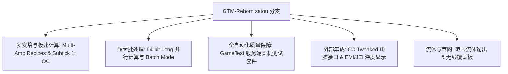

# GregTech Modern Reborn (GTM Reborn)

`modules/gtm-reborn` 是 GTE-Multi 深度定制的 GregTech Modern 独立分支（分支名为 `satou`）。

---

## 🚀 `satou` 分支核心增强特性

相比上游原版，GTM-Reborn 在现代高版本 Minecraft 1.20.1 上实现了多项革命性技术演进与工业体验升级：



### 1. 64 位长整型并行与批处理模式 (Batch Mode)
- **突破 32 位整型上限**：并行计算全面采用 `long` 数据类型，彻底解决超大型工业群在极高并行下数值溢出或计算截断问题。
- **智能批处理模式**：当原料极其充沛时，机器可将成百上千次微小配方打包为单个周期执行，极大降低服务器 Tick 负载。

### 2. 1T Subtick 瞬时超频 (OC_PERFECT_SUBTICK)
- 优化了机器 Recipe Logic 执行流水线，允许指定高级机器在 1 个 Tick 内完成多次配方迭代，释放纯粹的工业生产极限。

### 3. 多安培输入与配方支持 (Multi-Amp)
- 机器配方支持单配方消耗/输出多安培（Amperes）电流，支持 EMI/JEI 界面直观渲染多安培数值与导线规格提示。

### 4. 范围流体输出 (Ranged Fluid Outputs)
- 允许高阶蒸馏塔与化学反应器根据不同温度与压力工况输出带有范围浮动的流体产物。

### 5. CC:Tweaked (ComputerCraft) 现代外设集成
- 所有标准机器均向 ComputerCraft 开放外设接口：
  - 实时查询配方进度、剩余时间、当前 EU/t 消耗。
  - 通过 Lua 脚本动态开启、暂停机器或切换工作模式。

---

## 🧪 自动化测试与 GameTest 验证

GTM-Reborn 包含完整的 Minecraft 原生 GameTest 自动化测试套件（位于 `src/test`）：

```powershell
# 运行 GameTest 自动化服务端测试
$env:JAVA_HOME='C:\Users\Ex_Je\.jdks\ms-21.0.11'
.\gradlew.bat :modules:gtm-reborn:runGameTestServer
```

### 测试覆盖范围
- **Cover 系统**：测试流体泵板、物品传送板、能量导流板的吞吐与防漏逻辑。
- **机器 Recipe Logic**：测试多安培、批处理、跨配方并行与超频计算。
- **多方块成型与旋转**：测试各类机壳、仓室在不同朝向下的结构验证。

---

## 🌿 子模块 Git 工作流规范

`modules/gtm-reborn` 对应独立 Git 仓库 `takanashisatou/GregTech-Modern-Reborn`，默认开发分支为 `satou`：

```bash
# 独立在子模块中开发与提交
cd modules/gtm-reborn
git checkout satou
git add .
git commit -m "feat: optimize multiblock recipe logic"
git push origin satou

# 回到主工程更新 submodule 指针
cd ../..
git add modules/gtm-reborn
git commit -m "chore: bump gtm-reborn submodule pointer"
```
