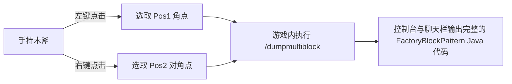

# KubeJS 工具集与多方块导出器 (`/dumpmultiblock`)

GTE 在 KubeJS 服务端脚本中内置了开发者专用的多方块自动化构建与结构提取工具，彻底解放多方块结构设计流程。

---

## 🪓 多方块可视化导出器 (`/dumpmultiblock`)

在开发自定义多方块（无论是 Java 代码还是 KubeJS 脚本）时，手动编写由数十层字符组成的 `FactoryBlockPattern.aisle(...)` 极其耗时且极易出错。

GTE 内置了 **`/dumpmultiblock` 木斧框选导出器** (`server_scripts/easymultiblock.js`)：



### 使用步骤

1. 进入游戏创造模式，手持一把 **木斧 (`minecraft:wooden_axe`)**。
2. 按照构想在世界中直接搭建好完整的多方块物理结构（包括机壳、仓室、线圈、主控制器）。
3. 使用木斧 **左键点击** 结构的一个底角方块（聊天栏提示 `已设置 Pos1: x, y, z`）。
4. 使用木斧 **右键点击** 结构的对角线顶角方块（聊天栏提示 `已设置 Pos2: x, y, z`）。
5. 在聊天框输入指令：
   ```mcfunction
   /dumpmultiblock
   ```
6. 脚本会自动扫描三维包围盒内的所有方块类型，分配字符映射（`.` 为空气，`A-Z/a-z/0-9` 为具体方块），并在后台日志与客户端直接生成结构代码：

```java
// 自动导出的 FactoryBlockPattern 模板
.pattern(definition -> FactoryBlockPattern.start()
    .aisle("BBB", "BBB", "BBB")
    .aisle("BBB", "BAB", "BBB")
    .aisle("BBB", "B#B", "BBB")
    .where('A', Predicates.blocks("minecraft:air"))
    .where('#', Predicates.controller(Predicates.blocks(definition.getBlock())))
    .where('B', Predicates.blocks("gtceu:steam_machine_casing").or(Predicates.autoAbilities(definition.getRecipeTypes())))
    .build()
)
```

---

## 🌌 维度气体与流体矿脉配置

GTE 通过 KubeJS 对全维度流体与气体收集进行了扩展：

### 1. 全维度气体抽取 (`dimension_gas.js`)
使用大型集气室 (`gas_collector`) 配合不同电路编号，可在任意维度抽取该维度专属大气：
- **主世界空气**：`circuit(4)` ➜ 输出 `gtceu:air 10000`
- **下界地狱之气**：`circuit(5)` ➜ 输出 `gtceu:nether_air 10000`
- **末地虚空之气**：`circuit(6)` ➜ 输出 `gtceu:ender_air 10000`

### 2. 万能电路转换器 (`universal_circuit.js`)
为解决跨模组与各等级电路板繁杂的配方堆叠，GTE 引入了 **通用电路 (`universal_circuit`)** 系统：
- 允许在打包机 (`packer`) 中将任意同电压等级的电路（ULV 至 MAX）以 **1 EU / 1 tick** 无损转换为统一的通用电路物品。
