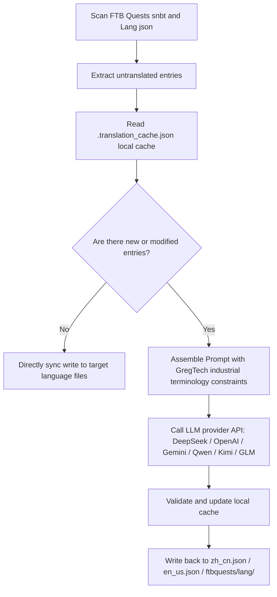

# AI Internationalization Translation Engine (`opencode_translate.py`)

GTE has designed and implemented a cross-mod fully automated internationalization translation system based on modern Large Language Models (LLMs) (located at `scripts/opencode_translate.py`).

---

## 🤖 Translation Engine Architecture

Traditional community localization relies on manually maintaining complex JSON and SNBT text files, which leads to delayed updates and is highly prone to errors and omissions.

GTE's AI translation engine leverages a standardized OpenAI-compatible API to achieve **automated incremental extraction, terminology alignment, and concurrent translation** for FTB Quests quest books and core Mod language files:



---

## 🔑 Supported LLM Providers and Environment Variables

The script supports seamless switching between different AI model providers via environment variables:

| Provider Name | API Key Environment Variable | Base URL Environment Variable | Default Model |
| :--- | :--- | :--- | :--- |
| **DeepSeek** | `DEEPSEEK_API_KEY` | `DEEPSEEK_BASE_URL` | `deepseek-chat` |
| **OpenAI** | `OPENAI_API_KEY` | `OPENAI_BASE_URL` | `gpt-4o-mini` |
| **Google Gemini** | `GEMINI_API_KEY` | `GEMINI_BASE_URL` | `gemini-3.5-flash` |
| **Tongyi Qianwen (DashScope)** | `DASHSCOPE_API_KEY` | `DASHSCOPE_BASE_URL` | `qwen-plus` |
| **Moonshot AI** | `MOONSHOT_API_KEY` | `MOONSHOT_BASE_URL` | `moonshot-v1-8k` |
| **Zhipu GLM** | `ZHIPU_API_KEY` | `ZHIPU_BASE_URL` | `glm-4-flash` |
| **OpenCode Platform** | `OPENCODE_API_KEY` | `OPENCODE_BASE_URL` | `deepseek-v4-flash` |
| **Universal Aggregation Proxy** | `LLM_API_KEY` | `LLM_BASE_URL` | `LLM_MODEL` (Custom) |

---

## 🎯 Industrial-Grade Prompt Constraint Principles

When calling the API for translation, the system enforces strict Minecraft and GregTech terminology rules:
1. **Absolute Preservation of Format Codes**: Fully preserve Minecraft native color formatting codes (e.g., `§a`, `§c`, `§6`) and placeholders (`%s`, `%d`, `{0}`).
2. **Standardized Technical Terminology**: Strictly lock down translations for technical proper nouns (e.g., `UHV`, `EU/t`, `Amps`, `Voltage`, `Overclock`, `Subtick`, etc.).
3. **Hash-Based Incremental Caching**: All translated entries are automatically persisted in `.translation_cache.json`. Only new or changed texts trigger network requests, significantly saving Token costs and CI time.

---

## 💻 Local Execution Commands

Trigger a full translation run with a single command in your local development environment:

```powershell
# Set any valid API Key before executing
$env:DEEPSEEK_API_KEY="sk-..."
python scripts/opencode_translate.py
```