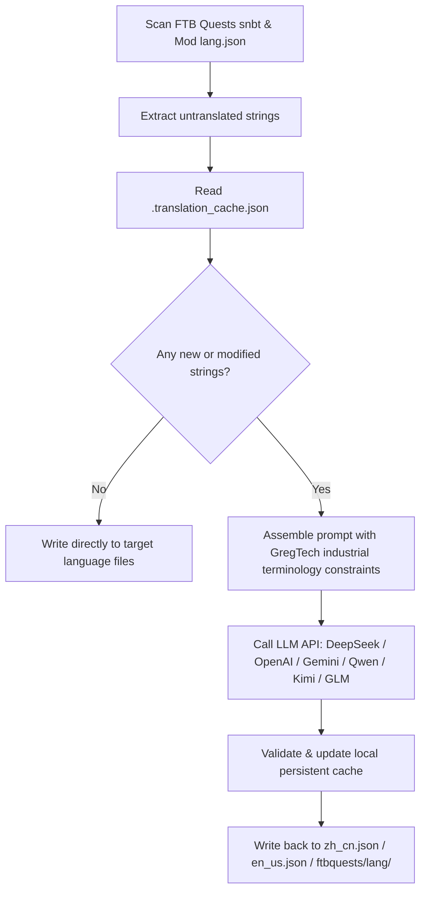

# AI Internationalization Engine (`opencode_translate.py`)

The GTE project implements an automated, LLM-powered multi-lingual localization engine (located in `scripts/opencode_translate.py`).

---

## 🤖 Translation Engine Architecture

Manual modpack translation is labor-intensive and prone to desynchronization.

GTE's AI translation system leverages OpenAI-compatible APIs to enable **incremental string extraction, GregTech terminology alignment, and concurrent multi-language translation** for FTB Quests and mod language files:



---

## 🔑 Supported Providers & Environment Variables

The script dynamically selects the translation backend based on available environment keys:

| Provider | API Key Env | Base URL Env | Default Model |
| :--- | :--- | :--- | :--- |
| **DeepSeek** | `DEEPSEEK_API_KEY` | `DEEPSEEK_BASE_URL` | `deepseek-chat` |
| **OpenAI** | `OPENAI_API_KEY` | `OPENAI_BASE_URL` | `gpt-4o-mini` |
| **Google Gemini** | `GEMINI_API_KEY` | `GEMINI_BASE_URL` | `gemini-3.5-flash` |
| **DashScope (Qwen)** | `DASHSCOPE_API_KEY` | `DASHSCOPE_BASE_URL` | `qwen-plus` |
| **Moonshot (Kimi)** | `MOONSHOT_API_KEY` | `MOONSHOT_BASE_URL` | `moonshot-v1-8k` |
| **Zhipu GLM** | `ZHIPU_API_KEY` | `ZHIPU_BASE_URL` | `glm-4-flash` |
| **OpenCode** | `OPENCODE_API_KEY` | `OPENCODE_BASE_URL` | `deepseek-v4-flash` |
| **Generic Provider** | `LLM_API_KEY` | `LLM_BASE_URL` | `LLM_MODEL` (Custom) |

---

## 🎯 Industrial Terminology Constraints

When querying LLMs, the system enforces strict formatting and tech terminology rules:
1. **Formatting Code Preservation**: Retains Minecraft color codes (`§a`, `§c`, `§6`) and variable placeholders (`%s`, `%d`, `{0}`).
2. **Terminology Consistency**: Enforces canonical translations for specialized GT terms (`UHV`, `EU/t`, `Amps`, `Voltage`, `Overclock`, `Subtick`).
3. **Hash-Based Incremental Cache**: Persists all translations in `.translation_cache.json`. Unchanged strings are served from cache, minimizing API latency and token consumption.

---

## 💻 Local Execution

To trigger translation in local environments:

```powershell
# Run with any supported API key
$env:DEEPSEEK_API_KEY="sk-..."
python scripts/opencode_translate.py
```
