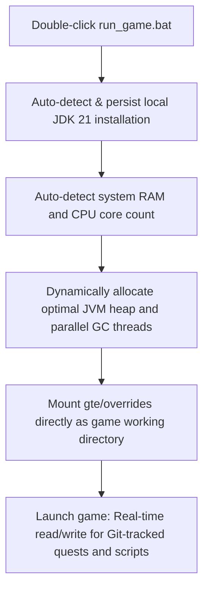

# Local Hot Debugging & Launcher-Free Runtimes

GTE provides an integrated developer ecosystem tailored for quest writers, gameplay designers, and mod developers.

---

## ⚡ 1. Launcher-Free Instant Start (`run_game.bat` / `run_game.sh`)

For quest designers (FTB Quests) and KubeJS gameplay authors, **there is no need to launch IntelliJ IDEA or configure third-party launchers**. Double-click **`run_game.bat`** at the project root to launch the full modpack immediately!



### Key Advantages
1. **Zero-Configuration JDK 21 Discovery**: Automatically scans `.jdks`, `Adoptium`, `Zulu`, and `Program Files`, caching the validated JDK path in `.jdk_path`.
2. **Hardware Adaptive Tuning**: Allocates 50%~60% of available physical memory to JVM heap and configures parallel garbage collection threads automatically.
3. **Zero-Copy Git Workflow**: In-game quest changes (`/ftbquests editing_mode true`) write directly into the Git repository's `config/ftbquests/` folder. Open GitHub Desktop and commit in one click!

---

## 🔗 2. Launcher Zero-Copy Junction Linker (`link_to_launcher.bat`)

If you prefer using your custom launcher instance (PCL2, HMCL, Prism Launcher, or CurseForge App):

1. Run **`link_to_launcher.bat`**.
2. Drag and drop your launcher's instance `.minecraft` path into the prompt and press Enter.
3. The script creates Windows Directory Junctions (`mklink /J`):
   - `config` ➜ `gte/overrides/config`
   - `kubejs` ➜ `gte/overrides/kubejs`
   - `ftbquests` ➜ `gte/overrides/config/ftbquests`
   - `defaultconfigs` ➜ `gte/overrides/defaultconfigs`
4. All in-game modifications made in your launcher instance are saved directly into the main Git repository.

---

## ☕ 3. Shadow Hot-Debug Runtime (`gte-dev-runtime`)

For Java and Kotlin programmers, `modules/gte-dev-runtime` provides a dedicated hot-debug runner:

### Mechanics & Design
- **Role**: Pure local deobfuscated debug sandbox. **Never packaged into release distributions**.
- **ModDevGradle Dynamic Remapping**: Combines the live source trees of `gtm-reborn`, `gt--`, and `gtecore` into the Mojang mapping namespace.
- **How to Launch**:
  - In IDEA, run **`Run GTE Full Pack (Client - Hot Debug)`**.
  - Or via terminal:
    ```powershell
    .\gradlew.bat :modules:gte-dev-runtime:runClient
    ```
