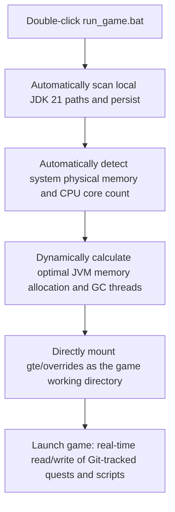

# Local Hot Debugging and Launcher-Free Quick Run

GTE has designed a seamless debugging system that is extremely friendly to modpack planners, quest writers, and mod programmers.

---

## ⚡ 1. Launcher-Free Ultra-Fast Startup Script (`run_game.bat` / `run_game.sh`)

For quest book authors (FTB Quests) and KubeJS recipe planners, **there is no need to open IntelliJ IDEA or install any third-party launcher**. Simply double-click **`run_game.bat`** in the project root directory to enter the game at lightning speed!



### Core Features
1. **Fully Automatic JDK 21 Detection**: Automatically searches for installed Java 21 in `.jdks`, `Adoptium`, `Zulu`, and `Program Files`, and automatically remembers it in `.jdk_path`.
2. **Hardware Adaptive Optimization**: Automatically allocates JVM heap size based on the optimal ratio (50%~60% of available physical memory) according to the current computer's total RAM, and automatically configures parallel GC threads.
3. **Zero-Move Workflow**: Modify quests in-game (`/ftbquests editing_mode true`) and save. Changes are saved in real-time directly to the corresponding `config/ftbquests/` directory in the Git repository. Open GitHub Desktop and commit with one click!

---

## 🔗 2. External Launcher Zero-Copy Mapping Tool (`link_to_launcher.bat`)

If you prefer using a launcher with your own configured skins and key bindings (such as PCL2 / HMCL / Prism Launcher):

1. Double-click **`link_to_launcher.bat`** in the root directory.
2. Follow the prompts to drag your launcher's game directory (e.g., `D:\PCL2\.minecraft\versions\GTE-Dev\.minecraft\`) into the console and press Enter.
3. The script will automatically create Windows directory junctions:
   - `config` ➜ `gte/overrides/config`
   - `kubejs` ➜ `gte/overrides/kubejs`
   - `ftbquests` ➜ `gte/overrides/config/ftbquests`
   - `defaultconfigs` ➜ `gte/overrides/defaultconfigs`
4. No matter how you modify quests or recipes in the launcher, **physical data is synchronized in real-time and saved in the main Git repository**!

---

## ☕ 3. Mod Code Hot-Compile Shadow Environment (`gte-dev-runtime`)

For Java/Kotlin programmers, `modules/gte-dev-runtime` is a dedicated shadow debugging module:

### Working Principle and Design Considerations
- **Positioning**: A purely local hot-compile debugging sandbox. **Packaging and publishing are prohibited; it will not appear in any player artifacts**.
- **ModDevGradle Dynamic Remapping**: Automatically hot-compiles the latest source code of `gtm-reborn` and `gtecore` and mounts them into the Mojang deobfuscated namespace.
- **Startup Methods**:
  - In IDEA, select the run configuration **`Run GTE Full Pack (Client - Hot Debug)`**.
  - Or execute from the command line:
    ```powershell
    .\gradlew.bat :modules:gte-dev-runtime:runClient
    ```

<<<<<FILE_END: development/runtime-and-launchers.md>>>>