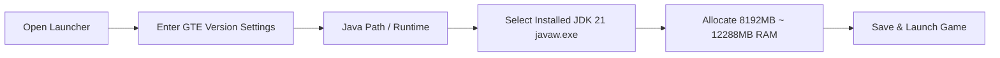

# Modpack Download & Player Lazy Pack Guide

GTE (GregTech Easy) provides three ready-to-use distribution packages tailored for players, modpack developers, and server administrators:

1. **Player Zero-Compile Lazy Pack (`GTE-LazyPack-*.zip`)**: Contains all pre-compiled mod jars, configurations, KubeJS scripts, and the complete `.minecraft` directory structure. **Drag and drop into your launcher to play immediately**.
2. **CurseForge Standard Pack (`GTE-CurseForge-*.zip`)**: Standard CurseForge format ready for one-click import into PCL2, HMCL, CurseForge App, and Prism Launcher.
3. **Server Deployment Pack (`GTE-Server-*.zip`)**: Dedicated server pack containing clean server configuration, mods, and launch scripts for multiplayer hosting.

---

## 🚀 Player Lazy Pack (Recommended)

### Key Benefits
- **Zero Compilation Dependency**: No need to install JDK compilation toolchains, IntelliJ IDEA, or Git.
- **Fully Bundled**: The latest release jars of `gtecore`, `gtm-reborn`, `gt--`, and all required companion addons are pre-synced into `mods/`.
- **Drag & Drop Ready**: Supports seamless window drag-and-drop import in PCL2 and HMCL.

### Import & Startup Instructions

=== "Option 1: Launcher Drag & Drop (Recommended)"

    1. Open **PCL2 (Plain Craft Launcher 2)** or **HMCL (Hello Minecraft! Launcher)**.
    2. Left-click and drag the downloaded `GTE-LazyPack-<version>.zip` directly into the launcher window.
    3. The launcher will automatically extract the version into your game version list.
    4. Navigate to the **Version Settings**, and ensure the Java runtime is set to **Java 21**.
    5. Allocate **8GB ~ 12GB** of RAM, and launch the game!

=== "Option 2: Manual Directory Extraction"

    1. Extract the zip archive into any directory without special characters or spaces (e.g. `D:\Games\GTE\`).
    2. The extracted contents contain a complete `.minecraft` folder with `mods/`, `config/`, and `kubejs/`.
    3. In your launcher, add a game version and set the game directory path to the extracted `.minecraft` folder.
    4. Select **Java 21** as the runtime and launch.

---

## ⚠️ Java 21 Runtime Requirement (CRITICAL)

> [!CAUTION]
> **This modpack strictly requires Java 21 (JDK 21) as its runtime environment!**
> Do NOT use **Java 17** or **Java 8**, otherwise the game will immediately crash on startup!

### Why Java 21 is Mandatory
- GTE's core mods (`gtecore`, `gtm-reborn`, `gt--`) utilize modern **Java 21 language features** such as Record Patterns, Virtual Threads, and enhanced switch pattern matching.
- Gradle build scripts enforce `JavaLanguageVersion.of(21)` across all modules.

### Recommended JDK 21 Downloads

| Distribution | Download Link | Notes |
| :--- | :--- | :--- |
| **Azul Zulu 21 (LTS)** | [Azul Official Site](https://www.azul.com/downloads/?version=java-21-lts) | Outstanding multithreading optimization for Minecraft |
| **Eclipse Temurin 21 (LTS)** | [Adoptium Official Site](https://adoptium.net/temurin/releases/?version=21) | Highly recommended for compatibility and stability |
| **Microsoft OpenJDK 21** | [Microsoft Official Site](https://learn.microsoft.com/en-us/java/openjdk/download) | Excellent native Windows integration |

### Setting Java 21 in Launcher

---

## 🎮 In-Game Keybindings & Commands

| Command / Key | Function | Permission |
| :--- | :--- | :--- |
| `/ftbquests editing_mode true` | Enable FTB Quests in-game visual editor | OP Permission |
| `/ftbquests reload` | Reload quest book configurations | Everyone |
| `/kubejs reload server_scripts` | Hot reload server scripts and custom recipes | OP Permission |
| `/kubejs reload client_scripts` | Hot reload client scripts and UI logic | Everyone |
| `/dumpmultiblock` | Export multiblock pattern code from wooden axe selection | OP Permission |
| <kbd>U</kbd> / <kbd>R</kbd> | View item Usage / Recipe | EMI / JEI |
| <kbd>F7</kbd> | Toggle light level overlay (red X marks monster spawn areas) | Client |
