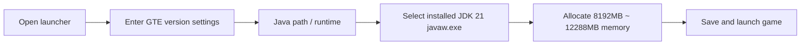

# Modpack Download and Player Lazy Pack Guide

GTE (GregTech Easy) provides three ready-to-use delivery formats for players and server owners with different technical backgrounds:

1. **Player No-Compile Complete Lazy Pack (`GTE-LazyPack-*.zip`)**: Contains all pre-compiled mods, configurations, tweak scripts, and the complete `.minecraft` directory structure. **Double-click or drag into a launcher to play**.
2. **CurseForge Standard Pack (`GTE-CurseForge-*.zip`)**: Standard CurseForge format, can be imported with one click in PCL2 / HMCL / CurseForge App / Prism Launcher.
3. **Server Modpack (`GTE-Server-*.zip`)**: Contains clean server configuration, mods, and startup scripts for hosting multiplayer servers.

---

## 🚀 Player Lazy Pack (Recommended)

### Features and Advantages
- **0 Compilation Dependencies**: No need to install a JDK compilation environment, IntelliJ IDEA, or Git.
- **Full Packaging**: The latest release Jars of `gtecore`, `gtm-reborn`, `gt--` and prerequisite extension mods are all pre-included in the `mods/` directory.
- **Drag-and-Play**: Supports one-click import by dragging into PCL2 / HMCL windows.

### Import and Startup Steps

=== "Method 1: Launcher One-Click Drag-and-Drop (Recommended)"

    1. Open **PCL2 (Plain Craft Launcher 2)** or **HMCL (Hello Minecraft! Launcher)**.
    2. Directly **left-click and drag** the downloaded `GTE-LazyPack-<version>.zip` into the launcher's main window.
    3. The launcher will automatically recognize and extract it to the game version list.
    4. Go to the **version settings** for that version and set the Java runtime to **Java 21**.
    5. Allocate **8GB ~ 12GB** of memory and click launch!

=== "Method 2: Manual Extraction Mode"

    1. Extract the archive to any path without Chinese characters or spaces (e.g., `D:\Games\GTE\`).
    2. After extraction, you will obtain a `.minecraft` directory containing `mods/`, `config/`, and `kubejs/`.
    3. Add a game version in the launcher and select the extracted `.minecraft` folder as the game root directory.
    4. Ensure **Java 21** is selected as the core and launch.

---

## ⚠️ Java 21 Runtime Environment Requirements (Extremely Important)

> [!CAUTION]
> **This modpack strictly requires Java 21 (JDK 21) as the runtime environment!**
> Do NOT use **Java 17** or **Java 8**, otherwise the game will crash directly or refuse to start!

### Why Must Java 21 Be Used?
- GTE's core mods (`gtecore`, `gtm-reborn`, `gt--`) fully adopt **modern Java 21 language features** (such as Record Patterns, Virtual Threads, and enhanced Switch matching).
- The Gradle build scripts globally configure `JavaLanguageVersion.of(21)` to enforce toolchain checks.

### Recommended JDK 21 Download Links

| Distribution | Download Link | Recommendation Reason |
| :--- | :--- | :--- |
| **Azul Zulu 21 (LTS)** | [Click to visit Azul website](https://www.azul.com/downloads/?version=java-21-lts) | Excellent performance, ideal for Minecraft large-scale multi-threading optimization |
| **Eclipse Temurin 21 (LTS)** | [Click to visit Adoptium website](https://adoptium.net/temurin/releases/?version=21) | Officially recommended, high compatibility and stability |
| **Microsoft OpenJDK 21** | [Click to visit Microsoft website](https://learn.microsoft.com/zh-cn/java/openjdk/download) | Good native adaptation on Windows platforms |

### Configuring Java 21 in the Launcher

---

## 🎮 In-Game Shortcuts and Common Commands

| Command / Shortcut | Function Description | Permission Requirement |
| :--- | :--- | :--- |
| `/ftbquests editing_mode true` | Enable quest book visual editing mode (author mode) | OP permission |
| `/ftbquests reload` | Hot reload FTB Quests quest book configuration files | Everyone |
| `/kubejs reload server_scripts` | Hot reload server-side tweak scripts and recipes | OP permission |
| `/kubejs reload client_scripts` | Hot reload client-side tweak scripts and display logic | No permission required |
| `/dumpmultiblock` | One-click export of multiblock structure code after selecting an area with a wooden axe | OP permission |
| <kbd>U</kbd> / <kbd>R</kbd> | View usage (Usage) / recipe (Recipe) of the item under the cursor | EMI / JEI shortcut |
| <kbd>F7</kbd> | View surrounding light levels (red X marks mob spawn areas) | Client-side shortcut |

<<<<<FILE_END: download-and-play/lazy-pack.md>>>>