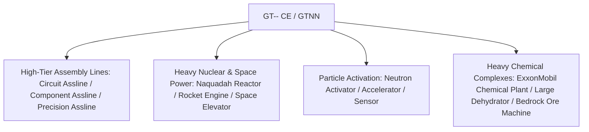

# GT-- Community Edition (GTNN)

`modules/gt--` (package `dev.arbor.gtnn`) is the official GT-- Community Edition addon built with a modern **Kotlin + Java** architecture on branch `kotlin`.

---

## 🏗️ Architecture & Tech Stack

- **Languages**: Kotlin 2.0.21 + Java 21.
- **Positioning**: Re-implements beloved endgame infrastructure from classic GT 5.09 and modern addons, including assembly line arrays, naquadah reactors, dehydrators, and orbital space facilities.



---

## 🏭 Core Multiblock Machinery

### 1. Advanced Assembly Lines
- **Circuit Assembly Line (`circuit_assembly_line`)**: Specialized in mass-producing complex microchips and integrated circuits using tiered casings.
- **Component Assembly Line (`component_assembly_line`)**: Utilizes tier-specific casings (LV through MAX) to mass-assemble precision motors, pumps, and field generators.
- **Precision Assembly Line (`precision_assembly_line`)**: High-accuracy fabrication of sub-nanometer lithography masks and mainframe buses.

### 2. Particle Acceleration & Neutron Activation
- **Neutron Activator (`neutron_activator`)** & **Neutron Accelerator (`neutron_accelerator`)**:
  - Replicates fast neutron capture dynamics, transmuting stable isotopes into radioactive heavy nuclei and exotic superconductors.
- **Neutron Sensor (`neutron_sensor`)**: Monitors internal neutron kinetic flux and provides redstone/computer telemetry.

### 3. Nuclear Energy & Space Logistics
- **Large Naquadah Reactor (`large_naquadah_reactor`)**: Generates stable, ultra-dense EU output from enriched naquadah fuels.
- **Rocket Engine (`rocket_engine`)**: High-thrust pulse engine for spacefaring logistical platforms.
- **Space Elevator (`space_elevator`)**: Links planetary ground operations to orbital asteroid mining and zero-gravity manufacturing.

### 4. Chemical & Bedrock Extraction Complexes
- **ExxonMobil Chemical Plant (`exxonmobil_chemical_plant`)**: Heavy petrochemical megaplant handling catalytic cracking, reforming, and polymer synthesis.
- **Large Dehydrator (`large_dehydrator`)**: Eliminates hydration and crystal moisture from complex mineral solutions.
- **Homemade Bedrock Ore Machine (`homemade_bedrock_ore_machine`)**: Deploys deep-bore artificial drill heads to tap into limitless bedrock mineral beds.

---

## 🌿 Submodule Git Workflow

`modules/gt--` is tracked in `takanashisatou/GT---Community-Edition` on branch `kotlin`:

```bash
# Work inside the submodule
cd modules/gt--
git checkout kotlin
git add .
git commit -m "feat: add precision assembly line recipes"
git push origin kotlin

# Return to root repository and update pointer
cd ../..
git add modules/gt--
git commit -m "chore: bump gt-- submodule pointer"
```
