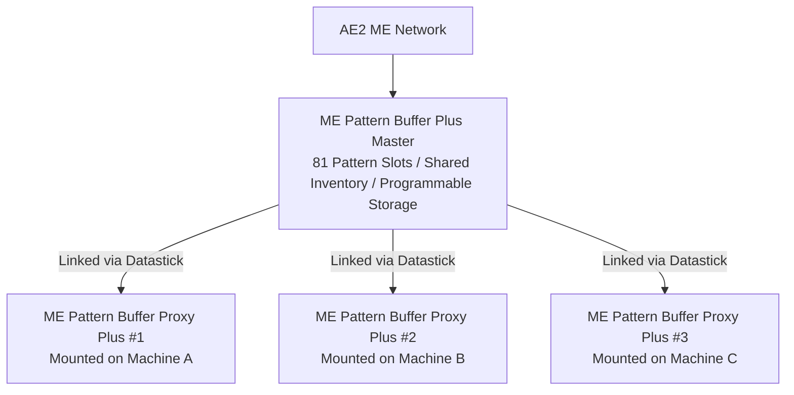

# AE2 Deep Integration & Pattern Buffer Plus

GTECore constructs a high-throughput direct interconnect between Applied Energistics 2 (AE2) and GregTech multiblock machines.

---

## 🧩 ME Pattern Buffer Plus (`me_pattern_buffer_plus`)

In traditional tech setups, connecting AE2 pattern providers to multiblock machines often faces bottlenecks such as **limited pattern slots, inability to mix item and fluid inputs, and lack of pattern sharing across machines**.

GTECore's **ME Pattern Buffer Plus** resolves all these pain points:

### Core Features
1. **Massive Pattern Capacity**: Each buffer block contains **81 pattern slots** (equivalent to 9 standard AE2 pattern providers combined).
2. **Unified Omnipotent Ability**: Possesses `IMPORT_ITEMS`, `IMPORT_FLUIDS`, `EXPORT_ITEMS`, and `EXPORT_FLUIDS` simultaneously, enabling seamless hybrid fluid/item automation.
3. **Programmable Storage**: Integrated smart inventory widgets prevent ingredient jamming and handle complex recipe batching.

---

## 🪞 ME Pattern Buffer Proxy Plus (`me_pattern_buffer_proxy_plus`)

The **Pattern Buffer Proxy Plus** is a distributed automation component:

### Linking & Multi-Machine Pattern Sharing
- Mount proxy buffers onto any number of identical multiblock machines.
- Right-click the master **ME Pattern Buffer Plus** with a **Datastick**, then right-click the **Pattern Buffer Proxy Plus** to link them.
- **All connected proxies immediately share and execute all 81 patterns inside the master buffer**!
- Auto-crafting jobs dispatched from ME terminals will load-balance across all available proxy machines.

### Real-Time Jade Information
Aiming at buffer components displays:
- Master Buffer: `Buffer Proxies Plus Bound: X`
- Proxy Buffer: `Bound To - X: ..., Y: ..., Z: ...`

---

## 💨 ME Steam Hatch (`me_steam_hatch`)

- **Function**: Direct bridge between AE2 fluid storage networks and steam multiblocks.
- **Advantage**: Bypasses physical steam pipe bandwidth caps, extracting high-pressure steam directly from ME storage with zero transfer latency.
