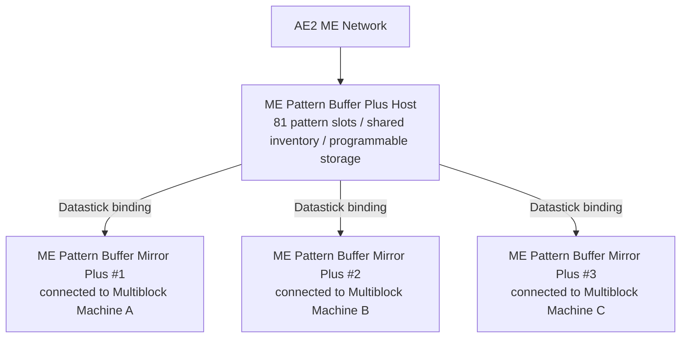

# AE2 Deep Integration and Pattern Buffer Plus System

GTECore builds an extremely powerful direct data interconnection bridge between Applied Energistics 2 (AE2) and GregTech multiblock structures.

---

## 🧩 ME Pattern Buffer Plus (`me_pattern_buffer_plus`)

In traditional tech mods, connecting AE2 pattern providers to multiblock machines typically faces pain points such as **insufficient slots, inability to mix fluid and item output, and difficulty sharing patterns across multiple machines**.

The **ME Pattern Buffer Plus** developed by GTECore completely solves this problem:

### Core Features
1. **Massive Pattern Capacity**: A single buffer host has **81 pattern slots** (equivalent to the total of 9 standard AE2 pattern providers).
2. **Omnipotent Hatch Capability**: Simultaneously possesses `IMPORT_ITEMS`, `IMPORT_FLUIDS`, `EXPORT_ITEMS`, and `EXPORT_FLUIDS` capabilities, supporting mixed fluid and item interaction in the same hatch.
3. **Programmable Storage Support**: Internally integrates the Programmable Storage mechanism, supporting precise material feeding and caching for complex recipes.

---

## 🪞 ME Pattern Buffer Mirror Plus (`me_pattern_buffer_proxy_plus`)

**Pattern Buffer Mirror Plus** is a revolutionary distributed automation structural component:

### Working Principle and Cross-Machine Sharing
- Install the mirror buffer at the hatch position of any multiblock machine.
- Hold a **Datastick** and right-click the main **ME Pattern Buffer Plus** to read its coordinates, then right-click the **Pattern Buffer Mirror Plus** to bind.
- **All bound mirrors will share all 81 patterns placed in the main buffer in real-time**!
- When the AE2 network initiates an automated crafting task, the network automatically load-balances and assigns it to all idle mirror machines for parallel operation!

### Jade Hover Status Display
When aiming at a pattern buffer or mirror, Jade will automatically display:
- Main buffer: `Connected mirror count: X`
- Mirror component: `Bound to - X: ..., Y: ..., Z: ...`

---

## 💨 ME Steam Hatch (`me_steam_hatch`)

- **Function**: Directly connects the AE2 fluid network with steam multiblock structures.
- **Effect**: Steam multiblock structures no longer require external complex high-speed steam pipes and tanks. They can directly extract steam from the ME network at maximum throughput for power supply, eliminating pipeline transmission bottlenecks.