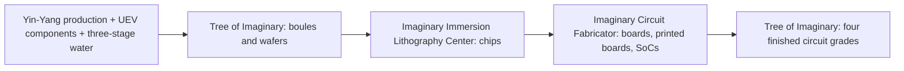

# Super String and Yin-Yang High-Tier Circuits and Materials System

GTECore expands two high-tier circuit branches spanning the full cycle from ZPM to MAX — the **Super String Circuitry System** and the **Yin-Yang Taiji Circuitry System** — complemented by an Ore Comprehensive Processing Center for automated material recycling.

---

## 🌌 Super String Circuitry System

Super String circuits derive superluminal computing power from high-dimensional oscillating strings, primarily covering the **ZPM ➜ UEV** voltage gradient:

### Super String Materials and String-Based Substances
- **Original String (`item.gtecore.original_string`)**: The oscillating origin of the high-dimensional universe.
- **Alpha String / Beta String / Gamma String (`alpha_string`, `beta_string`, `gamma_string`)**: Super string polymers of different energy levels and polarization states.
- **Super String Mixer (`super_string_mixer`)**, **String of Creation (`string_of_creation`)**, and **Super String Oscillator Array (`super_string_oscillator_array`)**: Used for splitting, tuning, and high-tier solidification of super string matter.

---

## ☯️ Yin-Yang Taiji Circuitry System

The Yin-Yang circuit system follows the cyclical philosophy of **"Yin gives birth to Yang, Yang gives birth to Yin, endless generation"**, covering **UV ➜ UIV** and beyond:

### Eight Trigrams and Five Elements Exclusive Talismans
- **Five Elements**: Metal Element (`jinyuansu`), Wood Element (`muyuansu`), Water Element (`shuiyuansu`), Fire Element (`huo`), Earth Element (`tuyuansu`).
- **Five Elements Talismans**: Metal Talisman, Wood Talisman, Water Talisman, Fire Talisman, Earth Talisman.
- **Eight Trigrams Symbols and Chips**: Qian, Kun, Zhen, Xun, Kan, Li, Gen, Dui — eight trigram symbol stones and core chips.
- **Three Pure Particles (`god_nugget`)**: The ultimate synthesis medium condensing the primordial essence of heaven and earth.

---

## 🌳 Imaginary Materials and the First Tree of Imaginary

Imaginary construction materials, the controller, boules, and wafers are manufactured or processed at **UEV voltage**. Start with Yin-Yang production, UEV components, and the [three-stage purification line](water-purification-system.md). Then use the Assembly Line, Red Sun Tao Core, and Kun Gen Star Hub to make the structure before assembling your first Tree of Imaginary.

| Structural Block | Production Machine | Output per Batch |
| :--- | :--- | ---: |
| Imaginary Casing | Assembly Line | 32 |
| Imaginary Branch Casing | Assembly Line | 32 |
| Imaginary Containment Casing | Assembly Line | 16 |
| Imaginary Energy Conduit | Assembly Line | 16 |
| Imaginary Core Casing | Kun Gen Star Hub | 4 |
| Imaginary Glass | Red Sun Tao Core | 32 |
| Imaginary Coil Block | Kun Gen Star Hub | 8 |
| Imaginary Leaf Matrix | Assembly Line | 64 |

Existing **Yin-Yang UIV circuits** can bootstrap the first tree. Core casings require Yin-Yang Processor Mainframes; the controller requires UIV circuits and scanner research on an Imaginary Core Casing. UIV describes the required circuit tier, while manufacturing and research still use UEV voltage. You do not need to produce Imaginary circuits before building the tree.

**Leaf matrices are permanent structural blocks; Imaginary Growth Medium is the recurring production consumable.** The Red Sun Tao Core makes growth medium outside the tree, consuming 4000 mB of third-stage electronic-grade water per batch of 32. The Assembly Line makes 64 leaf matrices from 4 Imaginary Glass, 4 Branch Casings, 8 Growth Medium, 4 Xun and 4 Zhen rune stones, plus 4000 mB electronic-grade water and 1000 mB Naquadria. Use these matrices to build the canopy.

Once formed, the Tree of Imaginary processes:

- **Boules**: 64 Silicon dust + 4 Growth Medium + 4000 mB electronic-grade water + 1000 mB Naquadria → 4 Imaginary Boules at UEV, in 30 seconds.
- **Regular wafers**: 1 Imaginary Boule + 1000 mB Lubricant + 1000 mB electronic-grade water → 16 Imaginary Wafers at UEV, in 15 seconds.

Boule production consumes growth medium without consuming the canopy's leaf matrices. Construction materials, the first-tree route, and boule/regular-wafer production are connected. Continue with the dedicated lithography center to make chips.

### Imaginary Immersion Lithography Center

The **Imaginary Immersion Lithography Center** processes regular Imaginary Wafers from the Tree of Imaginary and runs only its dedicated Imaginary Immersion Lithography recipes. Build its controller in the Assembly Line using established Imaginary structural blocks, UEV components, 4 UIV circuits (Yin-Yang Processor Mainframes qualify), and 4 regular Imaginary Wafers. First research a regular Imaginary Wafer in the Scanner. Research and assembly both use **UEV voltage**; building the first center does not require its own CPU Wafers or chips.

All five processes below run at **UEV voltage**. Water amounts are the direct consumption of **third-stage electronic-grade water** per batch. The **Yin-Yang Glass Lens is reusable and is not consumed** during exposure or engraving.

| Branch / Process | Item Inputs per Batch | Electronic-Grade Water | Other Fluids | Output per Batch | Base Duration |
| :--- | :--- | ---: | :--- | :--- | ---: |
| Circuit: immersion exposure | 1 regular Imaginary Wafer + reusable Yin-Yang Glass Lens | 2000 mB | Hydrogen Peroxide 250 mB | 1 Imaginary Tree CPU Wafer | 30 s |
| Circuit: wafer dicing | 1 Imaginary Tree CPU Wafer | 1000 mB | Lubricant 250 mB | 16 Imaginary Tree Circuit Chips | 10 s |
| CPU: blank dicing | 1 regular Imaginary Wafer | 1000 mB | Lubricant 250 mB | 4 Raw Imaginary Tree Chips | 15 s |
| CPU: precision engraving | 1 Raw Imaginary Tree Chip + reusable Yin-Yang Glass Lens | 500 mB | Hydrofluoric Acid 100 mB | 1 Engraved Imaginary Tree Chip | 20 s |
| CPU: interconnect packaging | 1 Engraved Imaginary Tree Chip + 4 Fine Europium Wires | 500 mB | Soldering Alloy 144 mB | 1 Imaginary Tree CPU Chip | 20 s |

The two branches are **regular wafer → CPU wafer → circuit chips** and **regular wafer → raw chips → engraved chips → CPU chips**. Send these chips to the fabricator to complete board, printed-board, and SoC production.

### Imaginary Circuit Fabricator

The **Imaginary Circuit Fabricator** is a dedicated multiblock measuring **13 × 9 × 13 (width × height × depth)**. First research an Imaginary Tree CPU Chip in the Scanner, then assemble the controller in the Assembly Line using established Imaginary structural blocks, 4 each of UEV Robot Arms/Pistons/Pumps, 4 previous-generation UIV circuits (Yin-Yang Processor Mainframes qualify), 4 Imaginary Tree CPU Chips, and 8 Imaginary Tree Circuit Chips. It also consumes 5760 mB Soldering Alloy, 1152 mB Polybenzimidazole, and 4000 mB electronic-grade water. Research and assembly both use **UEV**. The controller requires none of its own boards, printed boards, or SoCs, avoiding a bootstrap dependency cycle.

All three dedicated processes run at **UEV**. Water amounts are the direct consumption of third-stage electronic-grade water per batch:

| Process | Item Inputs per Batch | Electronic-Grade Water | Other Fluids | Output per Batch | Base Duration |
| :--- | :--- | ---: | :--- | :--- | ---: |
| Board lamination | 4 Reinforced Epoxy Resin Plates + 2 Imaginary Growth Medium + 16 Europium Foils | 2000 mB | Polybenzimidazole 576 mB | 4 Imaginary Tree Circuit Boards | 30 s |
| Printed-board etching | 1 Imaginary Tree Circuit Board + 8 Europium Foils + 8 Gold Foils | 1000 mB | Iron(III) Chloride 250 mB | 1 Imaginary Tree Printed Circuit Board | 20 s |
| SoC packaging | 2 Imaginary Tree CPU Chips + 4 Imaginary Tree Circuit Chips + 1 Imaginary Tree Printed Circuit Board + 8 Fine Europium Wires | 2000 mB | Soldering Alloy 288 mB | 2 Imaginary Tree SoCs | 30 s |

### Return to the Tree for Four Circuit Grades

All four finished circuits are still manufactured in the **Tree of Imaginary**, and **all four recipes use UEV voltage**. UHV / UEV / UIV / UXV describe the output circuit tags. The UHV Processor recipe uses **16 Fine Tritanium Wires**. Water amounts below exclude water consumed in prerequisite materials:

| Output Circuit Grade | Output per Batch | Base Duration | Direct Electronic-Grade Water |
| :--- | ---: | ---: | ---: |
| UHV Imaginary Processor | 4 | 20 s | 1000 mB |
| UEV Imaginary Processor Assembly | 2 | 30 s | 2000 mB |
| UIV Imaginary Supercomputer | 1 | 45 s | 0 mB |
| UXV Imaginary Mainframe | 1 | 60 s | 0 mB |

UIV and UXV indirectly consume purified water through their prerequisite circuits. The recipe chain now connects boards, printed boards, SoCs, and all four finished circuit grades.

---

## 💎 Ore Comprehensive Processing Center Recipe Modes

The **Ore Comprehensive Processing Center (`ore_process_center`)** comes with 7 standardized circuit modes, switchable by setting the programming circuit number inside the machine:

| Circuit Number | Process Route | Applicable Mineral Types & Product Features | Output Multiplier |
| :---: | :--- | :--- | :---: |
| **Circuit 1** | Crush ➜ Crush ➜ Wash | Basic metal ores (iron, copper, tin, etc.) rapid mass production | 5x main product + byproducts |
| **Circuit 2** | Crush ➜ Crush ➜ Centrifuge | Associated high-value rare light metal ores | 5x main product + centrifuged purified byproducts |
| **Circuit 3** | Crush ➜ Wash ➜ Thermal Centrifuge ➜ Crush | High-temperature refractory ores, precious metal ores (platinum group, gold, silver, etc.) | 5~6x + pure metal dust |
| **Circuit 4** | Crush ➜ Thermal Centrifuge ➜ Crush | Sulfides and heavily complex intergrown ores | 5x + special thermal centrifuge byproducts |
| **Circuit 5** | Crush ➜ Wash ➜ Crush ➜ Wash | Rare earth ores and multi-stage soluble salt ores | 6x + double wash byproducts |
| **Circuit 6** | Crush ➜ Wash ➜ Crush ➜ Centrifuge | Radioactive heavy ores (uranium, thorium, plutonium series) and rare earths | 6x + fine centrifuged heavy metals |
| **Circuit 8** | Crush ➜ Wash ➜ Crush ➜ Electromagnetic Separation | Ferromagnetic and paramagnetic minerals (magnetite, chromium, titanium, etc.) | 6~8x + electromagnetic purified dust |
