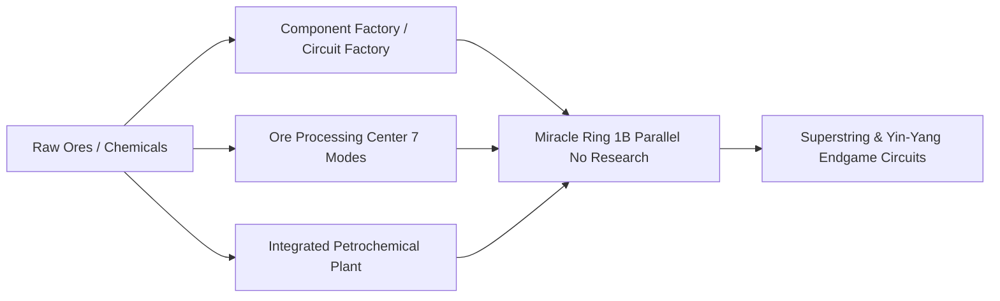

# GTECore Multiblock Machine Compendium

GTECore is designed to eliminate tedious mid-to-late game machine duplication by introducing high-performance multiblock architectures featuring **extreme parallelism** and **composite production workflows**.

---

## 🏭 Steam Age Large Multiblocks

To address the low throughput and footprint issues of early-game single-block steam machines, GTECore introduces full-scale steam multiblocks with multiparallel capabilities:

| Machine (Block ID) | Recipes & Capabilities | Key Features |
| :--- | :--- | :--- |
| **Large Steam Alloy Smelter** (`gtceu:big_alloy`) | Alloy Smelting (`alloy_smelter`) | High-throughput early-game alloy crafting |
| **Large Steam Compressor** (`gtceu:big_compressor`) | Compressing (`compressor`) | Mass production of dense metal plates and blocks |
| **Large Steam Forge Hammer** (`gtceu:big_forge_hammer`) | Hammering & Crushing (`forge_hammer`) | Rapid raw ore shattering and plate forging |
| **Large Steam Extractor** (`gtceu:big_steam_extractor`) | Fluid Extraction (`extractor`) | Large-scale rubber and liquid extraction |
| **Steam Grinder Easy** (`gtceu:steam_grinder_easy`) | Ore Grinding (`macerator`) | Early-game ore multiplication |
| **Steam Oven Easy** (`gtceu:steam_oven_easy`) | Pyrolyse Smelting (`pyrochlore_oven`) | Mass charcoal and coke oven baking |
| **Steam Ore Processing Factory** (`gtecore:steam_op`) | Composite Ore Refining | **1 Billion (1B) Parallels**, all recipes finish in **1 tick**! Accepts all hatch types |

---

## ⚡ Electric Industrial Processing Multiblocks

In the electric era, GTECore provides all-in-one manufacturing centers and extreme scaling infrastructure:

### 1. Core Manufacturing Facilities

- **§6Component Factory (`gtceu:component_factory`)**:
  - **Purpose**: Direct one-step fabrication of electric motors, pumps, pistons, robot arms, conveyor belts, and emitter diodes across all voltage tiers.
  - **Advantage**: Skips intermediate micro-assembly recipes, outputting finished components instantly.
- **§6Circuit Factory (`gtceu:circuit_factory`)**:
  - **Purpose**: Integrates circuit substrates, wafer etching, and assembly packaging into a single controller.
  - **Advantage**: Supports Multi-Parallel Hatches to accelerate ULV to MAX tier circuit synthesis.
- **§6Miracle Ring (`gtceu:miracle_ring`)**:
  - **Purpose**: The pinnacle of automated assembly line engineering.
  - **Advantage**: Boasts **1 Billion (1B) Parallels** and **1t Subtick Overclocking**; executes any assembly line recipe **without requiring research items**!
- **Chemistry Terminator (`gtecore:chemistry_terminator`)**:
  - **Purpose**: "Overturns the laws of chemistry and physics, marking the end of tedious multi-step chemistry."
  - **Advantage**: Collapses complex 15-step organic synthesis chains into instant single-step recipes.
- **Ten-in-One General Processing Factory (`gtecore:ten_in_one`)**:
  - **Purpose**: Integrates centrifugation, electrolysis, chemical bathing, polymerization, and autoclave processing.

### 2. Ore Refining & Petrochemical Systems

- **§6Ore Processing Center (`gtecore:ore_process_center`)**:
  - Features **7 Programmed Circuit Modes** for ore quintupling/octupling (crushing, washing, thermal separation, centrifugation, electromagnetic separation), with 1t subtick overclock support.
- **Integrated Petrochemical Plant (`gtecore:integrated_petrochemical_plant`)**:
  - Combines oil distillation, catalytic cracking, reforming, and desulfurization into one continuous high-speed loop.
- **Desulfurization Plant (`gtceu:desulfurization`)**:
  - Purifies heavy oils and recovers high-purity sulfur dust byproduct.
- **Easy & Not-Hard Fluid Drilling Rigs (`gtecore:easy_fluid_drilling_rig` / `not_hard_fluid_drilling_rig`)**:
  - Infinite bedrock fluid extraction without vein depletion or complex pipe searching.

### 3. Advanced Metallurgy & Superconductors

- **§6Wiremill Factory (`gtecore:wiremill_factory`)**: Mass-produces 1x, 2x, 4x, 8x, 16x cables and superconducting wires.
- **§6Crystal Center (`gtecore:crystal_center`)**: Automated cultivation of silicon boules, emeralds, sapphires, and Certus Quartz.
- **§6Quantum Cable Assembler (`gtecore:quantum_cable_assembler`)**: Specialized in ultra-high-bandwidth quantum and energy cables.
- **§3Starblade Etching Machine (`gtecore:starblade_etching_machine`)**: Sub-nanometer laser wafer patterning for celestial grade computation chips.

---

## 🔋 Power Generation & Buffers

| Machine | Power Class | Mechanics |
| :--- | :--- | :--- |
| **§6General Fuel Engine** (`gtceu:general_fuel_engine`) | Dynamic Adaptive (up to MAX) | **Burns all fuel types in Minecraft** (Diesel, Biomass, Natural Gas, Rocket Fuel) with **2 Billion (2B) Parallels**! |
| **Large General Generator** (`gtecore:large_general_generator`) | Multi-Tier Output | Compatible with gas, steam, and plasma turbine rotors |
| **Super Fusion Reactor** (`gtecore:super_fusion_reactor`) | Fusion Plasma Output | Eliminates warm-up delays, **supports 1T Subtick Overclock**, generating instant high-temperature plasma |
| **Maximum Voltage Super Battery Buffer** (`gtecore:max_super_battery_buffer_1x`) | **MAX (2,147,483,647 V)** | Infinite buffer capacity with zero transfer impedance |
