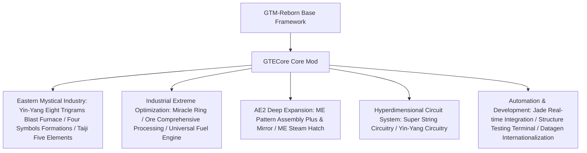

# GTECore Core Mod Overview

**GTECore** is the customized Java core mod of the GregTech Easy project. It directly depends on the `gtm-reborn` source code, expanding large-scale multiblock industrial structures, high-tier formation technology, deep AE2 interaction, and super circuit manufacturing systems.

---

## 🏛️ Mod Architecture and Design Positioning

---

## 📦 Creative Mode Tabs and Categories

GTECore registers independent creative mode tabs in-game:

1. **GregTech Easy Machines (`itemGroup.gtecore.gtecore_machines`)**:
   - Contains all GTE original multiblock controllers (Yin-Yang Eight Trigrams Blast Furnace, Miracle Ring, Ore Processing Center, Chemistry Terminator, etc.).
   - Contains multi-tier super battery buffers (Max Super Battery Buffer), ME Steam Hatches, ME Pattern Assembly Plus and Mirror.
2. **GregTech Easy Items (`itemGroup.gtecore.gtecore_items`)**:
   - Contains Super String and Yin-Yang circuit series items (processors, clusters, supercomputers, mainframes).
   - Contains Five Elements talismans, Eight Trigrams chips, Three Pure Particles, Structure Testing Terminal, and other specialized tools.

---

## ⚙️ Mod Global Configuration (`GTEConfig`)

GTECore provides rich in-game and file configuration options (located at `config/gtecore-common.toml` or via the in-game config menu):

| Configuration Option | Default Value | Detailed Description |
| :--- | :--- | :--- |
| `superPeace` (Super Peace Mode) | `false` | When enabled, fully disables hostile mob spawning, providing an absolutely pure environment for tech building |
| `durationMultiplier` (Recipe Time Multiplier) | `1.0` | Globally adjusts the duration multiplier for GTECore custom recipes |

---

## 🔍 Jade / TOP Native Integration

GTECore includes built-in **`GTEJadePlugin`** plugin support:
- **ME Pattern Assembly Plus Status**: Real-time display of the number of patterns bound to the current assembly, fluid and item output modes.
- **ME Pattern Assembly Mirror Plus Binding Info**: Hover display directly shows the bound main assembly coordinates `(X, Y, Z)` and network connectivity status.
- **Formation Activation Indicator**: Real-time display of the readiness status of the Azure Dragon, White Tiger, Vermilion Bird, and Black Tortoise Four Symbols formations on the Yin-Yang Eight Trigrams Blast Furnace.

---

## 🛠️ Structure Testing Terminal

GTECore provides a dedicated handheld tool — the **Structure Testing Terminal** (`item.gtecore.check_structure_terminal`):
- **Right-click a multiblock controller**: Real-time scanning of structural integrity.
- **Error diagnostic prompts**: If the structure is not formed, the terminal will precisely indicate the **error block coordinates and positions that should not be placed** in the chat and hover tooltip, greatly accelerating large multiblock construction and troubleshooting.