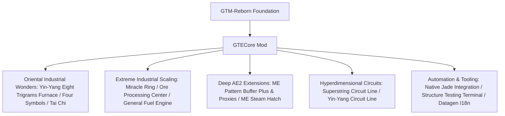

# GTECore Mod Overview

**GTECore** is the custom core Java mod of the GregTech Easy project. Directly depending on `gtm-reborn` source code, it introduces massive multiblock industrial complexes, esoteric Daoist oriental engineering, deep Applied Energistics 2 integration, and ultra-high-tier circuit systems.

---

## 🏛️ Architecture & Design Positioning

---

## 📦 Creative Mode Tabs & Organization

GTECore registers dedicated creative mode tabs:

1. **GregTech Easy Machines (`itemGroup.gtecore.gtecore_machines`)**:
   - Contains all GTE original multiblock controllers (Yin-Yang Blast Furnace, Miracle Ring, Ore Processing Center, Chemistry Terminator, etc.).
   - Contains tiered battery buffers (Max Super Battery Buffer), ME Steam Hatch, ME Pattern Buffer Plus, and Proxies.
2. **GregTech Easy Items (`itemGroup.gtecore.gtecore_items`)**:
   - Contains Superstring and Yin-Yang circuit items (Processors, Assemblies, Computers, Mainframes).
   - Contains Five Elements talismans, Eight Trigrams chips, God Nuggets, and Structure Testing Terminals.

---

## ⚙️ Global Configuration (`GTEConfig`)

GTECore provides rich in-game and config file options (`config/gtecore-common.toml` or in-game mod config menu):

| Config Option | Default | Description |
| :--- | :--- | :--- |
| `superPeace` (Super Peace Mode) | `false` | Completely disables hostile mob spawning to ensure an uninterrupted factory building experience |
| `durationMultiplier` (Recipe Duration Multiplier) | `1.0` | Globally adjusts recipe execution duration for GTECore recipes |

---

## 🔍 Jade / TOP Native Integration

GTECore includes native **`GTEJadePlugin`** support:
- **ME Pattern Buffer Plus Status**: Displays stored pattern count, item/fluid output mode, and active jobs.
- **ME Pattern Buffer Proxy Plus Link Info**: Hovering directly reveals the linked master buffer coordinates `(X, Y, Z)` and connection status.
- **Formation Array Readiness**: Displays real-time status of Azure Dragon, White Tiger, Vermilion Bird, and Black Tortoise modules on the Yin-Yang Eight Trigrams Furnace.

---

## 🛠️ Structure Testing Terminal (`Structure Testing Terminal`)

GTECore includes a dedicated handheld diagnostic tool — the **Structure Testing Terminal** (`item.gtecore.check_structure_terminal`):
- **Right-click Multiblock Controller**: Instantly audits the physical structure against the registered `FactoryBlockPattern`.
- **Accurate Error Localization**: If incomplete, precisely outputs the **mismatched block coordinates and incorrect block types** directly in chat/tooltip for rapid multiblock assembly.
