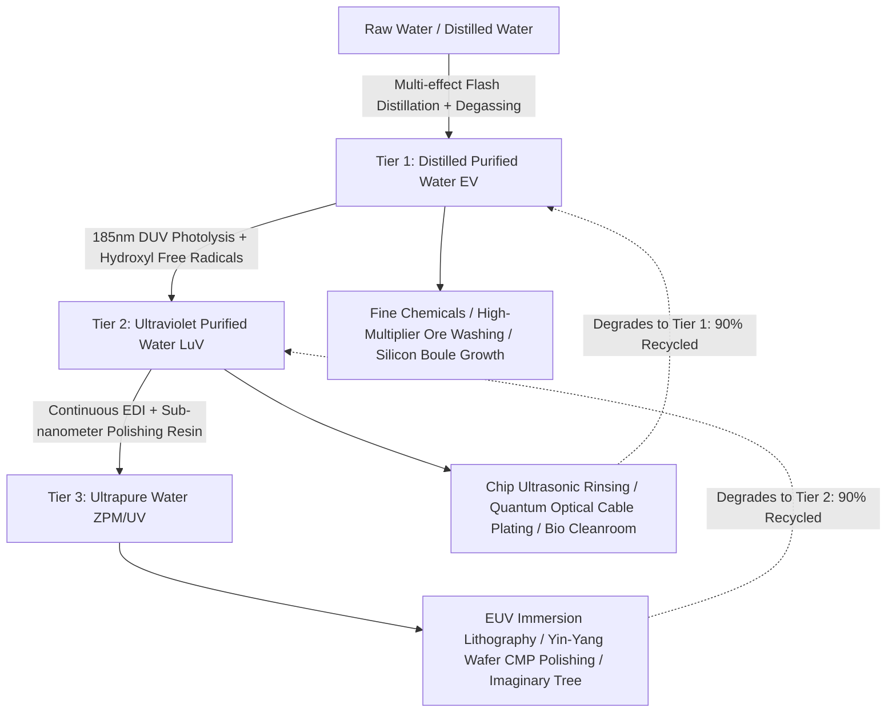

# Three-Tier Water Purification System & Industrial Water Loop

In advanced microelectronics fabrication, semiconductor wafer processing, and the production of end-game Superstring and Yin-Yang circuits, high-purity, ultra-low impurity water fluids serve as the foundational backbone for high production yields. GTECore introduces an integrated **Three-Tier Water Purification and Closed-Loop Industrial Water Recycling System**, spanning mid-tier electric industry (EV) to the ultimate hyper-dimensional tiers (UV/UHV+).

---

## 💧 Three-Tier Water Fluid Specifications

All three tiers of purified water have been registered in GTECore:

| Registered Fluid | Material Name (Lang) | Color & Visuals | Real-World Benchmark | Key Water Quality Metrics | Technology Tier |
| :--- | :--- | :--- | :--- | :--- | :---: |
| `distilled_purified_water` | **§3Distilled Purified Water** | `0x4A94FF` (Lake Blue) | Industrial Multi-Effect Distillation Water | Resistivity $> 1\ \text{M}\Omega\cdot\text{cm}$ $\text{TOC} < 50\ \text{ppb}$ | **EV Tier** |
| `uv_purified_water` | **§9Ultraviolet Purified Water** | `0x7B68EE` (Violet Blue) | 185nm DUV Photochemical Oxidized Ultra-Clean Water | Resistivity $> 10\ \text{M}\Omega\cdot\text{cm}$ $\text{TOC} < 1\ \text{ppb}$ | **LuV Tier** |
| `ultrapure_water` | **§bUltrapure Purified Water** | `0x80D8FF` (Fluorescent Pure Sky Blue) | SEMI E-1.1 Electronic Grade Ultrapure Water (UPW) | Resistivity $= 18.2\ \text{M}\Omega\cdot\text{cm}$ $\text{TOC} < 0.05\ \text{ppb}$ | **ZPM / UV Tier** |

---

## ⚙️ Tier-by-Tier Process Mechanics

### 1. Tier 1: Multi-Effect Vacuum Flash Distillation & Degassing (EV Tier)
- **Principle**:
  Applies differential vacuum flash evaporation to lower water's boiling point, flash-vaporizing pure steam away from heavy metal ions and mineral salts. High-efficiency demisters condense the pure phase while eliminating dissolved oxygen and carbon dioxide.
- **Process Flow**:
  - Input: Water (`gtceu:water`) or Distilled Water (`gtceu:distilled_water`)
  - Output: Distilled Purified Water (`distilled_purified_water`)
  - Byproduct: Concentrated industrial brine (for gypsum, industrial salt, or trace rare earth mineral sludge)
- **Performance**: High throughput and energy efficient; serves as the mid-tier universal industrial rinsing agent replacing regular water and basic distilled water.

### 2. Tier 2: 185nm Deep Ultraviolet Photolysis & Advanced Ozone Oxidation (LuV Tier)
- **Principle**:
  High-energy deep UV (DUV 185nm/254nm) irradiation breaks organic molecular carbon chains. Simultaneously, injected microbubble ozone ($\text{O}_3$) is photolyzed into hydroxyl radicals ($\cdot\text{OH}$, redox potential $2.80\ \text{V}$), rapidly mineralizing total organic carbon (TOC) and bacterial endotoxins into trace carbonic gas.
- **Process Flow**:
  - Input: Distilled Purified Water + Ozone (`gtceu:ozone`)
  - Output: Ultraviolet Purified Water (`uv_purified_water`) + Oxygen (`gtceu:oxygen`) tail-gas loop
- **Performance**: TOC plunges below $1\ \text{ppb}$, meeting cleanroom-grade semiconductor lithography standards.

### 3. Tier 3: Continuous Electrodeionization (EDI) & Sub-Nanometer Polishing (ZPM/UV Tier)
- **Principle**:
  Under a high-voltage direct-current electric field with alternating cation/anion permselective membranes and high-density ion exchange resin beds, trace weakly-dissociated ions ($\text{Na}^+, \text{Fe}^{3+}, \text{Cl}^-, \text{SiO}_3^{2-}$) are forcefully driven out. Water self-dissociation continuously regenerates the resin in situ without acid/base chemical addition.
- **Process Flow**:
  - Input: Ultraviolet Purified Water
  - Output: Ultrapure Purified Water (`ultrapure_water`) (100% theoretical yield, zero liquid solvent loss)
- **Performance**: Water resistivity achieves the theoretical limit of $18.2\ \text{M}\Omega\cdot\text{cm}$. Indispensable for superlattice chip processing and imaginary dimensional engineering.

---

## 🏛️ Multiblock Machine Concept: Ultrapure Water Refinery

In adherence to the `gte-multiblock-architecture` guidelines, the structure avoids monotonous cubic geometry and adopts a modern, transparent industrial tower matrix:

- **Machine Name**: **Ultrapure Water Refinery**
- **Block ID**: `gtecore:ultrapure_water_refinery`
- **Dimensions**: $5 \times 7 \times 5$ (Width 5 $\times$ Height 7 $\times$ Depth 5) Dual-tier Composite Tower
- **Material Palette**:
  - **Base & Crown (55%)**: Watertight Casing (`gtceu:watertight_casing`) - structural pressure-tight sealing.
  - **Structural Ribs / Columns (15%)**: Stainless Steel Frame (`gtceu:stainless_steel_frame`) - sturdy truss framework.
  - **Observation Windows (15%)**: Cleanroom Glass (`gtceu:cleanroom_glass`) / Laminated Glass - reveals fluid flow within.
  - **Axial UV Core (10%)**: Imaginary Glass (`gtecore:imaginary_glass`) or DUV lamps with dynamic bloom lighting.
  - **Central Pipe Trunk (5%)**: Steel Pipe Casing (`gtceu:casing_steel_pipe`).
- **Operational Features**:
  - Fully supports **1-tick Subtick Overclocking** (OC beyond 1 tick scales batch output).
  - Supports **Batch Mode** and up to **1024 Parallels**, effortlessly handling tens of thousands of mB/t.

---

## 🔄 Closed-Loop Water Recycling & Industrial Synergies

1. **Wet Microelectronics Loop**:
   - Ultrapure water used in the **Starblade Etching Machine** (`starblade_etching_machine`) and **Circuit Factory** (`circuit_factory`) degrades to UV Purified Water at a $90\%$ recovery rate.
   - UV Purified Water used in photoresist stripping degrades to Distilled Purified Water at a $90\%$ recovery rate.
   - Degraded water flows back to the Refinery, achieving Zero Liquid Discharge (ZLD).
2. **High-Tier Miracles & Formations**:
   - **Yin-Yang Eight Trigrams Blast Furnace**: Injected as the "Ultimate Kan Water" cooling medium, suppressing furnace turbulence and boosting divine pellet yields.
   - **Tree of Imaginary (`tree_of_imaginary`)**: Essential nutrient medium for growing Imaginary Leaf Matrices and condensing imaginary boules.
3. **Ore Processing Overhaul**:
   - In the **Ore Processing Center** (`ore_process_center`), upgrading rinsing fluid to Distilled Purified Water grants an extra $+15\%$ secondary precious metal dust yield.
