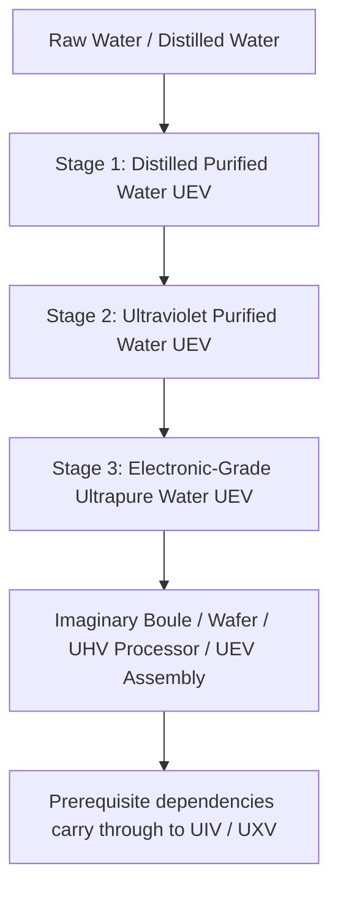

# Three-Tier Water Purification System & Industrial Water Loop

GTECore's **entire three-stage water purification system belongs to UEV**. The stages describe successive treatment processes and water quality, not separate voltage eras. The central plant, all three purification units, and their control hatches use UEV components, circuits, and assembly voltage. All three treatment stages and EDI regeneration operate at UEV.

The line consists of **one central plant and three purification units**. Units have no energy hatches: link them to the central plant with a data stick to receive power and a parallel limit.

## 💧 Three-Tier Water Fluid Specifications

| Registered Fluid | Material Name | Technology Tier |
| :--- | :--- | :---: |
| `distilled_purified_water` | Distilled Purified Water | UEV |
| `uv_purified_water` | Ultraviolet Purified Water | UEV |
| `ultrapure_water` | Electronic-Grade Ultrapure Water | UEV |

Industrial water-quality descriptions provide background; recipes, thermal stability, UV dose, and EDI load determine actual game behavior.

## 🏭 Four Multiblock Machines

| Machine | Registry ID | Technology Tier |
| :--- | :--- | :---: |
| Central Water Purification Plant | `central_water_purification_plant` | UEV |
| Tier 1 Clarifier Purification Unit | `t1_clarifier_purification_unit` | UEV |
| Tier 2 UV Oxidation Purification Unit | `t2_uv_oxidation_purification_unit` | UEV |
| Tier 3 EDI Ultrapure Purification Unit | `t3_edi_ultrapure_purification_unit` | UEV |

The old `ultrapure_water_refinery` remains registered for compatibility but is disabled. It cannot run the full purification chain; migrate to the central plant and three units.

### 1. Central Water Purification Plant

The plant does not process purification recipes. It stores connections, distributes power to formed linked units, displays actual power output in EU/s, and broadcasts its configured parallel limit. A unit cannot operate without a linked, formed central plant.

### 2. Tier 1: Clarification and Thermal Treatment (UEV)

The first stage separates impurities from the incoming water. Nominal recipes are:

- Water 1000 mB + Composite Flocculant 50 mB + 1 Modified Carbon Microsphere → Distilled Purified Water 900 mB / 60 ticks, with chances for Salt and Rare Earth dust.
- Distilled Water 1000 mB + Composite Flocculant 25 mB + 1 Modified Carbon Microsphere → Distilled Purified Water 1000 mB / 30 ticks, with a chance for Salt dust.

Actual water output also depends on thermal stability. This is the entry point to the UEV purification line.

### 3. Tier 2: Deep Ultraviolet Oxidation (UEV)

UV irradiation and oxidants break down organic impurities. Nominal recipes are:

- Distilled Purified Water 800 mB + Ozone 50 mB → Ultraviolet Purified Water 800 mB + Oxygen 25 mB / 40 ticks.
- Distilled Purified Water 800 mB + Hydrogen Peroxide 50 mB → Ultraviolet Purified Water 800 mB + Oxygen 25 mB / 20 ticks.

Both routes must also meet the UV dose requirement before completing.

### 4. Tier 3: Electrodeionization and Polishing (UEV)

The EDI stage removes residual ions. In-game operation requires reagent and resin, with a separate regeneration recipe to clear accumulated ion load:

- Ultraviolet Purified Water 800 mB + Electronic Acid-Base Reagent 20 mB + 1 Mixed Bed Resin Bead → Electronic-Grade Ultrapure Water 800 mB / 30 ticks.
- EDI regeneration: Ultraviolet Purified Water 100 mB + Electronic Acid-Base Reagent 1 mB / 2 ticks. This clears ion load and produces no water.

## 🔌 Linking and Operating the Line

1. Sneak-right-click the central plant with a GT data stick to copy its coordinates.
2. Right-click a purification unit with that stick to link it. The reverse sequence also works: copy the unit's coordinates, then right-click the plant.
3. Supply the central plant through energy hatches (1–4; laser input is supported). The plant forwards power to linked units.
4. Set the parallel limit in the plant GUI, from 1 to 65536.
5. Check each unit's GUI for its linked plant coordinates, parallel limit, and internal energy buffer.

Each unit draws recipe power multiplied by its actual parallel count. All three units have the same `UEV voltage × 256 A` power ceiling. Stages 1, 2, and 3 describe treatment processes, not different operating voltages or unlock tiers. Actual parallels also depend on available ingredients and output capacity, so raising the central limit alone does not guarantee throughput.

## 🔄 Imaginary Production and Startup Order

The following Tree of Imaginary recipes directly consume third-stage `ultrapure_water`. Amounts are per recipe batch:

| Product | Output per Batch | Electronic-Grade Water |
| :--- | ---: | ---: |
| Imaginary Boule | 4 | 4000 mB |
| Regular Imaginary Wafer | 16 | 1000 mB |
| UHV Imaginary Processor | 4 | 1000 mB |
| UEV Imaginary Processor Assembly | 2 | 2000 mB |

The UIV Imaginary Supercomputer and UXV Imaginary Mainframe do not consume additional water directly. They inherit the water dependency through prerequisite assemblies and computers. The circuit tier of an output and its recipe voltage do not change the purification system's UEV progression gate.

The startup order is **UHV components + Yin-Yang production → eight UEV components → UEV purification equipment → third-stage electronic-grade water → key Imaginary products**. The modpack adds recipes for the eight UEV components. Yin-Yang recipes and these component recipes do not directly require electronic-grade water, avoiding a dependency cycle in which purification equipment needs its own output to be built.

Imaginary construction materials, the first-tree route, and boule/regular-wafer production are connected; see [Imaginary Materials and the First Tree](circuits-and-materials.md). The Red Sun Tao Core consumes 4000 mB electronic-grade water per batch of 32 Growth Medium. Leaf matrices remain structural blocks, while boule production repeatedly consumes growth medium.

The **Imaginary Immersion Lithography Center** consumes third-stage electronic-grade water to process regular Imaginary Wafers through its dedicated recipes. CPU Wafers, Raw Chips, Engraved Chips, Circuit Chips, and CPU Chips now have connected production routes, all at UEV. Their direct water costs per batch are **2000, 1000, 500, 1000, and 500 mB**, respectively. Exposure and engraving use a reusable, non-consumed Yin-Yang Glass Lens. See the [Imaginary Immersion Lithography Center](circuits-and-materials.md#imaginary-immersion-lithography-center) for both branches and full ingredient amounts. Its controller can be built using Yin-Yang UIV circuits and regular Imaginary Wafers, without requiring its own chip products.

### Imaginary Circuit Fabricator

The [Imaginary Circuit Fabricator](circuits-and-materials.md#imaginary-circuit-fabricator) starts with CPU Chips and Circuit Chips from the lithography center, previous-generation UIV circuits, and UEV components. It does not require its own boards or SoCs to bootstrap. All three processes use UEV:

| Process Output | Output per Batch | Direct Electronic-Grade Water | Base Duration |
| :--- | ---: | ---: | ---: |
| Imaginary Tree Circuit Board | 4 | 2000 mB | 30 s |
| Imaginary Tree Printed Circuit Board | 1 | 1000 mB | 20 s |
| Imaginary Tree SoC | 2 | 2000 mB | 30 s |

The recipe chain now connects boards, printed boards, SoCs, and all four finished circuit grades. The Tree of Imaginary still produces the four finished circuits at **UEV manufacturing voltage**, with batch outputs of **4 / 2 / 1 / 1**. Their **UHV / UEV / UIV / UXV circuit tags** remain unchanged. UIV and UXV inherit water consumption through prerequisite products.

Downgraded-water recycling in the Starblade Etching Machine and Circuit Factory, additional ore-processing yields, and a 90% recovery loop remain unimplemented proposals, not available features.
