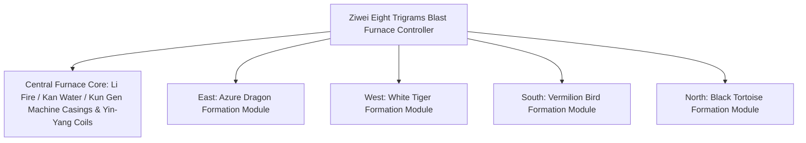

# Yin-Yang Eight Trigrams Blast Furnace and Four Symbols Formation System

GTECore has pioneered the **"Taiji Eight Trigrams and Four Symbols Formation System"**, combining Eastern Taoist philosophy with modern heavy industry engineering. This system forms the core hub for mid-to-late game metallurgy, superconducting material synthesis, and mystical technology ascension.

---

## 🌌 Yin-Yang Eight Trigrams Blast Furnace (`yin_yang_eight_trigmas_blast_furnace`)

The **Ziwei Eight Trigrams Blast Furnace** is one of the most massive and intricately mechanized multiblock structures in the tech modding community (occupying over 55×55 blocks):



### 🧭 Feng Shui Orientation Rules (Key Mechanic)
> [!IMPORTANT]
> **Feng Shui Orientation Law**: Due to feng shui and magnetic field constraints, the **blast furnace main controller must face south** to connect with the yin-yang energy of heaven and earth and form/operate correctly!

### Furnace Base Capabilities
- **Supported Recipe Library**: Natively compatible with standard blast furnace recipes (`blast_recipes`), furnace recipes (`furnace_recipes`), alloy smelter recipes (`alloy_smelter_recipes`), GCYM giant alloy blast furnace recipes (`alloy_blast_recipes`), and the exclusive **Yin-Yang Eight Trigrams recipes (`yin_yang_eight_trigmas_blast`)**.
- **Overclocking Features**: Perfectly supports **1T Subtick instant overclocking** and **Batch Mode**.

---

## 🐉 Four Symbols Formation Sub-Modules and Dynamic Condition Detection

Around the blast furnace, four formation wings can be extended: **East Azure Dragon, West White Tiger, South Vermilion Bird, North Black Tortoise**:

| Formation Module | Formation Direction | Formation Blocks | Recipe Condition | Benefits & Effects When Activated |
| :--- | :--- | :--- | :--- | :--- |
| **Azure Dragon Formation** (`Qing Long`) | **East** | `qinglong_module` | `QING_LONG_CONDITION` | Activates the Wood-generates-Fire momentum, greatly reducing energy consumption for ultra-high-temperature smelting, unlocking endless high-tier catalytic recipes |
| **White Tiger Formation** (`Bai Hu`) | **West** | `baihu_module` | `BAI_HU_CONDITION` | Metal Sha dominates destruction, unlocking high-hardness divine metals, ultra-dense heavy nucleus element fission, and quantum metal transmutation recipes |
| **Vermilion Bird Formation** (`Zhu Que`) | **South** | `zhuque_module` | `ZHU_QUE_CONDITION` | Southern Bright Li Fire, provides unlimited maximum furnace temperature, unlocking stellar-level plasma casting and divine pill refining recipes |
| **Black Tortoise Formation** (`Xuan Wu`) | **North** | `xuanwu_module` | `XUAN_WU_CONDITION` | Kan Water guards, ultra-fast cooling of ultra-high-temperature products, unlocking instant solidification and antimatter stabilization recipes |

### Dynamic Detection and Status Feedback
- The controller automatically calls `checkModule()` during each structure scan and recipe matching to calculate whether the formation blocks at the four directional offset coordinates are ready.
- Using **Jade** hover targeting the controller, you can visually inspect the activation status of all four formations (green indicates active, red indicates not ready).

---

## 🔮 Derived Taoist Cores and Star Matrix

Building upon the Eight Trigrams Blast Furnace, GTECore further extends a series of celestial Taoist multiblocks:

```
GTE High-Tier Array Industrial Group
├── Taiji Five Elements Separation Array
├── Kun Gen Star Hub
├── Qian Qiong Engine
├── Red Sun Tao Core
└── Ashing Star Fusion Array
```

1. **Taiji Five Elements Separation Array (`taichi_five_elements_separation_array`)**:
   - Separates and decomposes any mineral and chemical substance from reality and fantasy into pure **Metal, Wood, Water, Fire, Earth** Five Elements origin elements.
2. **Kun Gen Star Hub (`kun_gen_star_hub`)**:
   - Connects earth and stellar gravitational waves, used for converging microscopic gravitons and constructing miniature black holes.
3. **Qian Qiong Engine (`qian_qiong_engine`)**:
   - Void energy extraction engine, drawing boundless void energy from quantum fluctuations of nothingness.
4. **Red Sun Tao Core (`red_sun_tao_core`)**:
   - Artificial ultra-miniature stellar core, simulating trillion-degree extreme physical conditions of a stellar corona.
5. **Ashing Star Fusion Array (`ashing_star_fusion_array`)**:
   - Supernova remnant annihilation fusion matrix, used for reconstructing the equilibrium state of dark matter and antimatter.