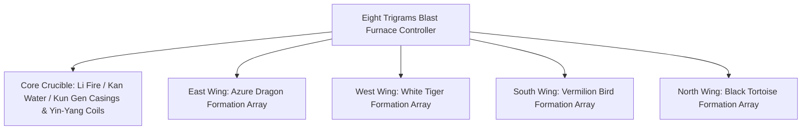

# Yin-Yang Eight Trigrams Furnace & Four Symbols System

GTECore introduces a unique synthesis of ancient Oriental Daoist cosmology and cutting-edge industrial technology known as the **"Tai Chi Eight Trigrams & Four Symbols Array System"**. This system serves as the pinnacle hub for endgame metallurgy, superconductor synthesis, and cosmic engineering.

---

## 🌌 Yin-Yang Eight Trigrams Blast Furnace (`yin_yang_eight_trigmas_blast_furnace`)

The **Crape Myrtle Eight Trigrams Immortal Forging Furnace** is one of the most massive and intricate multiblocks in tech modding history, spanning a footprint exceeding 55×55 blocks:



### 🧭 Feng Shui Orientation Rule (CRITICAL)
> [!IMPORTANT]
> **Orientation Law**: Due to geomantic and magnetic containment constraints, the **controller block must face directly South** to channel the cosmic Yin and Yang energies and form properly!

### Processing Capabilities
- **Supported Recipe Types**: Standard Blast Furnaces (`blast_recipes`), Standard Smelting (`furnace_recipes`), Alloy Smelting (`alloy_smelter_recipes`), GCYM Mega Alloy Blast (`alloy_blast_recipes`), and specialized **Yin-Yang Eight Trigrams Blast Recipes (`yin_yang_eight_trigmas_blast`)**.
- **Overclocking**: Fully supports **1T Subtick Instant Overclock** and **Batch Mode**.

---

## 🐉 Four Symbols Modular Formations & Recipe Conditions

Surrounding the core furnace, players can expand four auxiliary formation arrays:

| Formation Module | Direction | Module Block | Recipe Condition (`RecipeCondition`) | Effects & Benefits |
| :--- | :--- | :--- | :--- | :--- |
| **Azure Dragon** (`Qing Long`) | **East** | `qinglong_module` | `QING_LONG_CONDITION` | Harnesses wood-nurturing-fire energetics to drastically reduce EU consumption and unlock regenerative catalysts |
| **White Tiger** (`Bai Hu`) | **West** | `baihu_module` | `BAI_HU_CONDITION` | Manifests cutting-edge slaughter energies, unlocking super-dense heavy nuclei fission and quantum transmutation recipes |
| **Vermilion Bird** (`Zhu Que`) | **South** | `zhuque_module` | `ZHU_QUE_CONDITION` | Unleashes infinite furnace temperatures, unlocking celestial stellar plasma fusion and immortal pill forging |
| **Black Tortoise** (`Xuan Wu`) | **North** | `xuanwu_module` | `XUAN_WU_CONDITION` | Governs deep abyssal cooling, enabling instant thermal solidification and antimatter stabilization |

### Dynamic Verification & Status Display
- The controller invokes `checkModule()` dynamically to calculate whether formation blocks at fixed spatial offsets match the required configuration.
- Aiming at the controller with **Jade** provides real-time status indicators (Green = Enabled, Red = Disabled).

---

## 🔮 Daoist Star Arrays & Endgame Cores

Branching out from the Eight Trigrams furnace, GTECore offers a constellation of celestial Daoist infrastructure:

```
GTE Celestial Industrial Complex
├── Tai Chi Five Elements Separation Array
├── Kun Gen Star Hub
├── Qian Qiong Universal Engine
├── Red Sun Taoist Core
└── Ashing Star Fusion Array
```

1. **Tai Chi Five Elements Separation Array (`taichi_five_elements_separation_array`)**:
   - Strips down any compound or mineral into its pure elemental constituents: **Gold, Wood, Water, Fire, and Earth**.
2. **Kun Gen Star Hub (`kun_gen_star_hub`)**:
   - Interlinks planetary and stellar gravitational waves to focus gravitons and stabilize micro-singularities.
3. **Qian Qiong Universal Engine (`qian_qiong_engine`)**:
   - Taps into zero-point quantum fluctuations to draw vast quantities of void energy.
4. **Red Sun Taoist Core (`red_sun_tao_core`)**:
   - Creates a miniature artificial stellar core replicating multi-trillion Kelvin coronal physics.
5. **Ashing Star Fusion Array (`ashing_star_fusion_array`)**:
   - Supernova remnant annihilation matrix used to balance dark matter and antimatter states.
