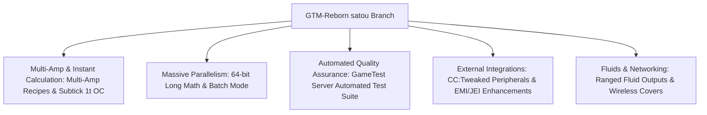

# GregTech Modern Reborn (GTM Reborn)

`modules/gtm-reborn` is a heavily customized fork of GregTech Modern maintained in the GTE-Multi ecosystem on branch `satou`.

---

## 🚀 Key Features in the `satou` Branch

Compared to upstream GT Modern, GTM-Reborn introduces several modern architectural upgrades on Minecraft 1.20.1:



### 1. 64-Bit Long Parallelism & Batch Mode
- **Beyond 32-Bit Limits**: Recipe parallel calculations utilize `long` primitives, preventing integer overflow during billion-scale parallel operations.
- **Smart Batch Mode**: Batches multiple iterations of identical recipes into a single consolidated compute tick when ingredients are abundant, drastically reducing server tick lag.

### 2. 1T Subtick Instant Overclock (`OC_PERFECT_SUBTICK`)
- Streamlines recipe execution pipelines, allowing designated high-tier machines to process multiple recipe batches in a single game tick.

### 3. Multi-Amp Recipe Engine
- Native support for recipes that consume or generate multiple Amperes of current, with clear EMI/JEI rendering and wire thickness tooltips.

### 4. Ranged Fluid Outputs
- Allows high-tier distillation towers and chemical reactors to output variable fluid quantities depending on internal temperature and pressure conditions.

### 5. ComputerCraft / CC:Tweaked Integration
- Exposes comprehensive peripheral methods to ComputerCraft computers:
  - Query recipe progress, time remaining, and current EU/t draw in real-time.
  - Dynamically enable, pause, or configure machine logic via Lua scripts.

---

## 🧪 Automated Testing with GameTest

GTM-Reborn comes with a native Minecraft GameTest suite (located under `src/test`):

```powershell
# Run the GameTest Server automated verification
$env:JAVA_HOME='C:\Users\Ex_Je\.jdks\ms-21.0.11'
.\gradlew.bat :modules:gtm-reborn:runGameTestServer
```

### Test Scope
- **Cover Mechanics**: Verifies fluid pump, item conveyor, and energy cover throughput and leak prevention.
- **Machine Logic**: Audits multi-amp calculations, batch processing, and recipe overclock accuracy.
- **Multiblock Formations**: Asserts pattern recognition across all 6 directional orientations.

---

## 🌿 Submodule Git Workflow

`modules/gtm-reborn` links to `takanashisatou/GregTech-Modern-Reborn` on branch `satou`:

```bash
# Develop and commit inside the submodule
cd modules/gtm-reborn
git checkout satou
git add .
git commit -m "feat: optimize multiblock recipe logic"
git push origin satou

# Return to root repository and update pointer
cd ../..
git add modules/gtm-reborn
git commit -m "chore: bump gtm-reborn submodule pointer"
```
