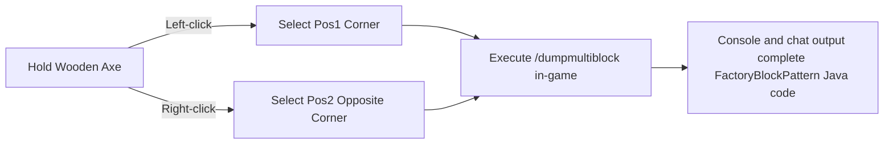

# KubeJS Toolset and Multiblock Exporter (`/dumpmultiblock`)

GTE includes developer-exclusive multiblock automated construction and structure extraction tools in the KubeJS server scripts, completely liberating the multiblock structure design process.

---

## 🪓 Multiblock Visual Exporter (`/dumpmultiblock`)

When developing custom multiblocks (whether in Java code or KubeJS scripts), manually writing `FactoryBlockPattern.aisle(...)` composed of dozens of layers of characters is extremely time-consuming and error-prone.

GTE includes the built-in **`/dumpmultiblock` wooden axe selection exporter** (`server_scripts/easymultiblock.js`):



### Usage Steps

1. Enter creative mode in-game and hold a **wooden axe (`minecraft:wooden_axe`)**.
2. Build the complete multiblock physical structure in the world according to your design (including casings, hatches, coils, main controller).
3. Use the wooden axe to **left-click** one bottom corner block of the structure (chat displays `Pos1 set: x, y, z`).
4. Use the wooden axe to **right-click** the diagonal top corner block of the structure (chat displays `Pos2 set: x, y, z`).
5. Enter the command in the chat:
   ```mcfunction
   /dumpmultiblock
   ```
6. The script automatically scans all block types within the 3D bounding box, assigns character mappings (`.` for air, `A-Z/a-z/0-9` for specific blocks), and generates the structure code directly in the backend log and client:

```java
// Auto-exported FactoryBlockPattern template
.pattern(definition -> FactoryBlockPattern.start()
    .aisle("BBB", "BBB", "BBB")
    .aisle("BBB", "BAB", "BBB")
    .aisle("BBB", "B#B", "BBB")
    .where('A', Predicates.blocks("minecraft:air"))
    .where('#', Predicates.controller(Predicates.blocks(definition.getBlock())))
    .where('B', Predicates.blocks("gtceu:steam_machine_casing").or(Predicates.autoAbilities(definition.getRecipeTypes())))
    .build()
)
```

---

## 🌌 Dimensional Gas and Fluid Ore Vein Configuration

GTE extends all-dimensional fluid and gas collection through KubeJS:

### 1. All-Dimensional Gas Extraction (`dimension_gas.js`)
Using the large gas collector (`gas_collector`) with different circuit numbers, you can extract dimension-exclusive atmospheres in any dimension:
- **Overworld Air**: `circuit(4)` ➜ outputs `gtceu:air 10000`
- **Nether Hellish Air**: `circuit(5)` ➜ outputs `gtceu:nether_air 10000`
- **End Void Air**: `circuit(6)` ➜ outputs `gtceu:ender_air 10000`

### 2. Universal Circuit Converter (`universal_circuit.js`)
To solve the complex recipe stacking across mods and various circuit board tiers, GTE introduces the **Universal Circuit (`universal_circuit`)** system:
- Allows converting any circuit of the same voltage tier (ULV to MAX) into a unified universal circuit item losslessly at **1 EU / 1 tick** in the packer (`packer`).