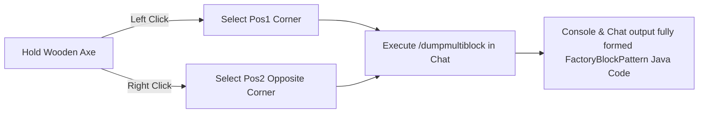

# KubeJS Utilities & Multiblock Pattern Exporter (`/dumpmultiblock`)

GTE provides developer utilities inside KubeJS server scripts to streamline multiblock design and dimension automation.

---

## 🪓 Visual Multiblock Pattern Exporter (`/dumpmultiblock`)

When developing custom multiblocks (in Java or KubeJS), manually transcribing multi-layered character arrays for `FactoryBlockPattern.aisle(...)` is tedious and error-prone.

GTE features a built-in **`/dumpmultiblock` wooden axe exporter** (`server_scripts/easymultiblock.js`):



### Usage Instructions

1. Enter Creative Mode and hold a **Wooden Axe (`minecraft:wooden_axe`)**.
2. Physically build your complete multiblock structure in the world (casings, hatches, coils, controller).
3. **Left-click** a bottom corner block of the structure (chat confirms `Pos1 set: x, y, z`).
4. **Right-click** the opposite top corner block of the structure (chat confirms `Pos2 set: x, y, z`).
5. Run the command:
   ```mcfunction
   /dumpmultiblock
   ```
6. The script scans the 3D bounding box, establishes a character mapping (`.` for air, `A-Z/a-z/0-9` for blocks), and generates ready-to-paste pattern code directly in logs:

```java
// Auto-generated FactoryBlockPattern boilerplate
.pattern(definition -> FactoryBlockPattern.start()
    .aisle("BBB", "BBB", "BBB")
    .aisle("BBB", "BAB", "BBB")
    .aisle("BBB", "B#B", "BBB")
    .where('A', Predicates.blocks("minecraft:air"))
    .where('#', Predicates.controller(Predicates.blocks(definition.getBlock())))
    .where('B', Predicates.blocks("gtceu:steam_machine_casing").or(Predicates.autoAbilities(definition.getRecipeTypes())))
    .build()
)
```

---

## 🌌 Dimensional Gases & Universal Circuits

### 1. Universal Atmospheric Extraction (`dimension_gas.js`)
Using the Gas Collector (`gas_collector`) with designated circuit numbers allows extracting dimension-specific atmospheres anywhere:
- **Overworld Air**: `circuit(4)` ➜ Outputs `gtceu:air 10000`
- **Nether Air**: `circuit(5)` ➜ Outputs `gtceu:nether_air 10000`
- **Ender Air**: `circuit(6)` ➜ Outputs `gtceu:ender_air 10000`

### 2. Universal Circuit Unification (`universal_circuit.js`)
To simplify cross-mod circuit juggling, GTE provides the **Universal Circuit** system:
- In a Packer machine (`packer`), convert any circuit of a given tier (ULV through MAX) into a standardized Universal Circuit item at **1 EU / 1 tick** cost.
