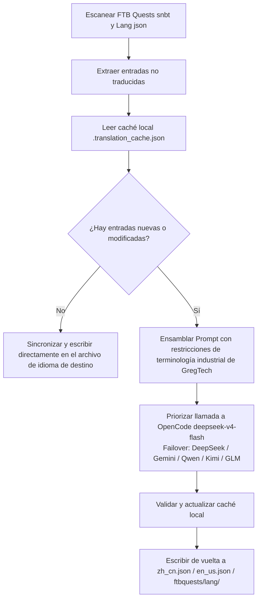

# Motor de traducción internacional con IA (`opencode_translate.py`)

El proyecto GTE implementa un sistema de traducción internacional multilingüe de nivel industrial impulsado por un script unificado, que cubre tres áreas: activos de mods, libros de misiones de FTB y documentación en Markdown.

---

## 🔒 Cinco reglas de hierro para la traducción

El trabajo de traducción de este proyecto sigue las siguientes **5 reglas inquebrantables**:

1. **Script único**: Toda la traducción es impulsada únicamente por `scripts/opencode_translate.py`, que se conecta al modelo `deepseek-v4-flash` de OpenCode Zen. Está prohibido introducir un segundo script de traducción o concatenar llamadas a la API manualmente.
2. **Ejecución en la nube**: Todas las traducciones completas deben ejecutarse en GitHub Actions CI (`translate.yml` / `docs-deploy.yml` / `sync-build.yml`). Está estrictamente prohibido ejecutar manualmente a gran escala localmente.
3. **Ubicación única**: Todo el sitio se despliega de manera unificada en `https://takanashisatou.github.io/GregtechEasy/` (rama `gh-pages`). No se crea un segundo sitio de documentación ni se despliega repetidamente.
4. **Regla de inglés**:
   - Sistema de documentación (`docs/en/`): El inglés debe ser traducido completamente por IA desde `docs/zh/`, está prohibida la sobrescritura manual;
   - Proyecto de mods: Solo el `en_us.json` de `gtecore` se mantiene manualmente, el script tiene lógica de protección incorporada y nunca sobrescribe con traducción automática.
5. **Localización profunda**: El menú de navegación (`nav_translations`), el texto de los diagramas de flujo de Mermaid, los comentarios de código y las etiquetas de tablas deben estar 100% localizados al idioma correspondiente.

---

## 🤖 Arquitectura del motor de traducción

La traducción comunitaria tradicional depende del mantenimiento manual de complejos textos JSON y SNBT, lo que provoca retrasos en las actualizaciones y es propenso a errores.

El motor de traducción con IA de GTE, mediante una API estándar compatible con OpenAI, logra la **extracción incremental automatizada, alineación de terminología y traducción concurrente** de los libros de misiones de FTB Quests y los archivos de idioma del mod principal:

---

## 🔑 Proveedores de LLM compatibles y variables de entorno

El script selecciona automáticamente la primera clave de API disponible según la siguiente prioridad, sin necesidad de especificar manualmente el proveedor:

| Prioridad | Nombre del proveedor | Variable de entorno de API Key | Variable de entorno de Base URL | Modelo predeterminado |
| :---: | :--- | :--- | :--- | :--- |
| **1 (preferido)** | **OpenCode Zen** | `OPENCODE_API_KEY` | `OPENCODE_BASE_URL` | **`deepseek-v4-flash`** |
| 2 | DeepSeek | `DEEPSEEK_API_KEY` | `DEEPSEEK_BASE_URL` | `deepseek-chat` |
| 3 | Google Gemini | `GEMINI_API_KEY` | `GEMINI_BASE_URL` | `gemini-3.6-flash` |
| 4 | Qwen (DashScope) | `DASHSCOPE_API_KEY` | `DASHSCOPE_BASE_URL` | `qwen-plus` |
| 5 | Moonshot | `MOONSHOT_API_KEY` | `MOONSHOT_BASE_URL` | `moonshot-v1-8k` |
| 6 | Zhipu GLM | `ZHIPU_API_KEY` | `ZHIPU_BASE_URL` | `glm-4-flash` |
| 7 | OpenAI | `OPENAI_API_KEY` | `OPENAI_BASE_URL` | `gpt-4o-mini` |
| 8 | Proxy agregado genérico | `LLM_API_KEY` | `LLM_BASE_URL` | `LLM_MODEL` (personalizado) |

> **Nota**: Solo se necesita configurar `OPENCODE_API_KEY` en los Secretos de GitHub para que el CI se ejecute por completo. El resto son respaldos de Failover.

---

## 🎯 Principios de restricción de Prompt a nivel industrial

Al llamar a la API para traducir, el sistema tiene reglas estrictas de terminología de Minecraft y GregTech:

1. **Preservación absoluta de códigos de formato**: Se conservan completamente los códigos de formato de color nativos de Minecraft (como `§a`, `§c`, `§6`) y los marcadores de posición (`%s`, `%d`, `{0}`).
2. **Unificación de terminología técnica**: Se fijan estrictamente las traducciones de términos técnicos propietarios (como `UHV`, `EU/t`, `Amps`, `Voltage`, `Overclock`, `Subtick`, etc.).
3. **Caché incremental por hash**: Todas las entradas traducidas se registran automáticamente de forma persistente en `.translation_cache.json`. Solo los textos nuevos o modificados generan solicitudes de red, lo que ahorra enormemente el consumo de tokens y el tiempo de CI.
4. **Localización del texto de diagramas Mermaid**: Las etiquetas de los nodos del diagrama de flujo (como `A[etiqueta]`) se traducen al idioma de destino, mientras que las palabras clave de sintaxis como `graph TD`, `-->`, `subgraph` permanecen sin cambios.
5. **Comentarios de código y etiquetas de tablas**: Los comentarios dentro de bloques de código (`//` / `#`) y los encabezados de columnas de tablas se localizan por completo.

---

## 🏗️ Archivos protegidos (no traducibles automáticamente)

| Ruta | Razón de protección | Mecanismo de protección |
| :--- | :--- | :--- |
| `modules/gtecore/src/main/resources/assets/gtecore/lang/en_us.json` | La traducción al inglés de gtecore es mantenida manualmente por el autor | El script detecta la bandera `is_gtecore` y omite la sobrescritura para el idioma `en_us` |

---

## 💻 Métodos de activación de CI (ejecución en la nube, regla 2)

| Escenario | Flujo de trabajo | Método de activación |
| :--- | :--- | :--- |
| Construcción completa automática + traducción tras el push | `sync-build.yml` | Push a `main`/`master` se activa automáticamente |
| Traducción automática + despliegue tras cambios en la documentación | `docs-deploy.yml` | Se activa cuando cambian `docs/` o `mkdocs.yml` |
| Traducción manual completa de activos de mods | `translate.yml` | Activación manual desde la página de Actions, con selección de proveedor e idioma |
| Traducción manual completa de documentación | `translate.yml` | Marcar la entrada `translate_docs` |

> [!CAUTION]
> Está prohibido ejecutar manualmente `python scripts/opencode_translate.py` localmente para traducciones completas a gran escala. La ejecución local solo se permite para depurar un solo archivo o verificar la conectividad de la clave de API.