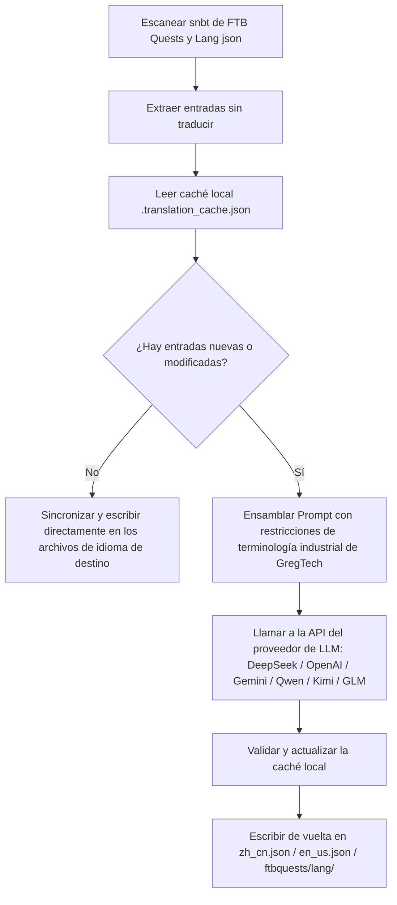

# Motor de traducción internacional con IA (`opencode_translate.py`)

GTE ha diseñado e implementado un sistema de traducción internacional totalmente automático entre mods basado en modelos de lenguaje modernos (LLM), ubicado en `scripts/opencode_translate.py`.

---

## 🤖 Arquitectura del motor de traducción

La traducción comunitaria tradicional depende del mantenimiento manual de complejos archivos JSON y SNBT, lo que provoca retrasos en las actualizaciones y una alta probabilidad de errores u omisiones.

El motor de traducción con IA de GTE utiliza una API estandarizada compatible con OpenAI para lograr la **extracción incremental automatizada, alineación de terminología y traducción concurrente** de los libros de misiones de FTB Quests y los archivos de idioma de los mods principales:



---

## 🔑 Proveedores de LLM compatibles y variables de entorno

El script admite el cambio fluido entre diferentes proveedores de modelos de IA mediante variables de entorno:

| Nombre del proveedor | Variable de entorno de API Key | Variable de entorno de Base URL | Modelo predeterminado |
| :--- | :--- | :--- | :--- |
| **DeepSeek** | `DEEPSEEK_API_KEY` | `DEEPSEEK_BASE_URL` | `deepseek-chat` |
| **OpenAI** | `OPENAI_API_KEY` | `OPENAI_BASE_URL` | `gpt-4o-mini` |
| **Google Gemini** | `GEMINI_API_KEY` | `GEMINI_BASE_URL` | `gemini-3.5-flash` |
| **Tongyi Qianwen (DashScope)** | `DASHSCOPE_API_KEY` | `DASHSCOPE_BASE_URL` | `qwen-plus` |
| **Moonshot AI** | `MOONSHOT_API_KEY` | `MOONSHOT_BASE_URL` | `moonshot-v1-8k` |
| **Zhipu Qingyan (Zhipu GLM)** | `ZHIPU_API_KEY` | `ZHIPU_BASE_URL` | `glm-4-flash` |
| **Plataforma OpenCode** | `OPENCODE_API_KEY` | `OPENCODE_BASE_URL` | `deepseek-v4-flash` |
| **Proxy agregado universal** | `LLM_API_KEY` | `LLM_BASE_URL` | `LLM_MODEL` (personalizado) |

---

## 🎯 Principios de restricción del Prompt de nivel industrial

Al llamar a la API para traducir, el sistema incorpora reglas estrictas de terminología de Minecraft y GregTech:
1. **Preservación absoluta de los códigos de formato**: Se conservan íntegramente los códigos de color nativos de Minecraft (como `§a`, `§c`, `§6`) y los marcadores de posición (`%s`, `%d`, `{0}`).
2. **Terminología técnica unificada y estandarizada**: Se fijan estrictamente las traducciones de los términos técnicos especializados (como `UHV`, `EU/t`, `Amps`, `Voltage`, `Overclock`, `Subtick`, etc.).
3. **Caché incremental por hash**: Todas las entradas traducidas se registran automáticamente de forma persistente en `.translation_cache.json`. Solo se realizan solicitudes de red para textos nuevos o modificados, lo que ahorra enormemente en costos de Token y tiempo de CI.

---

## 💻 Instrucciones de ejecución local

Ejecute la traducción completa con un solo comando en su entorno de desarrollo local:

```powershell
# Configure cualquier API Key válida y luego ejecute
$env:DEEPSEEK_API_KEY="sk-..."
python scripts/opencode_translate.py
```