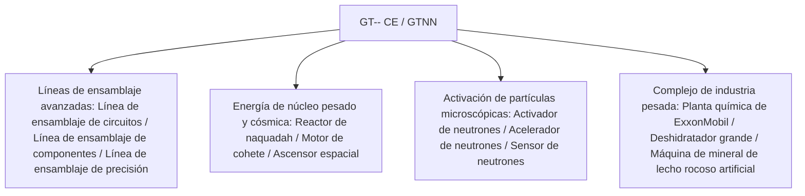

# GT-- Community Edition (GTNN)

`modules/gt--` (nombre del paquete `dev.arbor.gtnn`) es un mod oficial de la edición comunitaria de GT-- Community Edition construido sobre una arquitectura híbrida **Kotlin + Java** (la rama de desarrollo es `kotlin`).

---

## 🏗️ Arquitectura y pila tecnológica

- **Lenguaje de desarrollo**: Kotlin 2.0.21 + Java 21.
- **Posicionamiento**: introduce las líneas de ensamblaje masivas, reactores de núcleo pesado, sistemas de deshidratadores y la industria de exploración espacial, muy apreciados por los jugadores en el clásico GT 5.09 y las extensiones modernas.



---

## 🏭 Máquinas e instalaciones multibloque principales

### 1. Matriz de líneas de ensamblaje
- **Línea de ensamblaje de circuitos (`circuit_assembly_line`)**: diseñada específicamente para la producción en masa eficiente de chips de nivel medio-alto y circuitos compuestos, compatible con carcasas de precisión de múltiples niveles.
- **Línea de ensamblaje de componentes (`component_assembly_line`)**: utiliza carcasas de la clase correspondiente según el nivel de voltaje (de LV a MAX) para ensamblar en masa motores y sensores centrales.
- **Línea de ensamblaje de precisión (`precision_assembly_line`)**: produce máscaras de nanolitografía de máxima precisión y buses de supercomputación.

### 2. Sistema de aceleración de partículas y activación de neutrones
- **Activador de neutrones (`neutron_activator`)** y **Acelerador de neutrones (`neutron_accelerator`)**:
  - Simula colisionadores de alta energía y reacciones de captura de neutrones rápidos, activando isótopos estables comunes en materiales de núcleo pesado radiactivos o elementos superconductores superpesados.
- **Sensor de neutrones (`neutron_sensor`)**: detecta en tiempo real el flujo de energía cinética de neutrones dentro de la cámara de reacción, proporcionando retroalimentación de señal de redstone o computadora.

### 3. Energía de núcleo pesado e industria aeroespacial
- **Reactor de naquadah grande (`large_naquadah_reactor`)**: impulsado por aleación de naquadah y combustible enriquecido, proporciona una salida de energía EU estable y de alta densidad.
- **Motor de cohete (`rocket_engine`)**: consume combustible de cohete avanzado, proporciona potencia de pulso para equipos de alta carga.
- **Ascensor espacial (`space_elevator`)**: conecta la órbita terrestre baja, permitiendo la recolección de minerales desde el espacio y la fabricación industrial en microgravedad.

### 4. Instalaciones combinadas de química y minería
- **Planta química de ExxonMobil (`exxonmobil_chemical_plant`)**: una instalación combinada de procesamiento profundo de petróleo a gran escala que realiza craqueo, reformado, aromatización y polimerización en una sola máquina.
- **Deshidratador grande (`large_dehydrator`)**: elimina eficientemente el agua cristalina y el agua libre de fluidos o minerales químicos.
- **Máquina de mineral de lecho rocoso artificial (`homemade_bedrock_ore_machine`)**: despliega brocas artificiales en la capa de lecho rocoso para extraer continuamente vetas minerales infinitas en las profundidades.

---

## 🌿 Especificaciones del flujo de trabajo de Git para submódulos

`modules/gt--` corresponde al repositorio Git independiente `takanashisatou/GT---Community-Edition`, con la rama de desarrollo `kotlin`:

```bash
# Desarrollar y confirmar de forma independiente en el submódulo
cd modules/gt--
git checkout kotlin
git add .
git commit -m "feat: add precision assembly line recipes"
git push origin kotlin

# Volver al proyecto principal y actualizar el puntero del submódulo
cd ../..
git add modules/gt--
git commit -m "chore: bump gt-- submodule pointer"
```