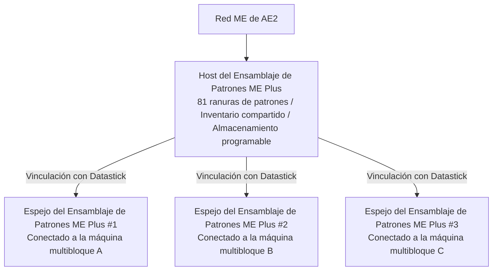

# Integración Profunda de AE2 y Sistema Plus de Ensamblaje de Patrones

GTECore establece un puente de datos extremadamente potente y directo entre Applied Energistics 2 (AE2) y las estructuras multibloque de GregTech.

---

## 🧩 Ensamblaje de Patrones ME Plus (`me_pattern_buffer_plus`)

En los mods tecnológicos tradicionales, conectar el Proveedor de Patrones de AE2 a máquinas multibloque suele enfrentar problemas como **espacio de ranuras insuficiente, imposibilidad de mezclar salidas de fluidos e ítems, y dificultad para compartir patrones entre múltiples máquinas**.

El **Ensamblaje de Patrones ME Plus** desarrollado por GTECore resuelve este problema por completo:

### Características principales
1. **Capacidad masiva de patrones**: Un solo host del ensamblaje tiene **81 ranuras de patrones** (equivalente a la suma de 9 Proveedores de Patrones estándar de AE2).
2. **Capacidad de compartimento universal**: Posee simultáneamente las capacidades `IMPORT_ITEMS`, `IMPORT_FLUIDS`, `EXPORT_ITEMS` y `EXPORT_FLUIDS`, lo que permite la interacción mixta de fluidos e ítems en el mismo compartimento.
3. **Soporte de almacenamiento programable**: Integra internamente el mecanismo de Almacenamiento Programable, lo que permite la dosificación precisa y el almacenamiento en caché de recetas complejas.

---

## 🪞 Espejo del Ensamblaje de Patrones ME Plus (`me_pattern_buffer_proxy_plus`)

El **Espejo del Ensamblaje de Patrones ME Plus** es un componente estructural revolucionario para la automatización distribuida:

### Principio de funcionamiento y compartición entre máquinas
- Instala el espejo del ensamblaje en la posición de compartimento de cualquier máquina multibloque.
- Sostén un **Datastick** y haz clic derecho en el **Ensamblaje de Patrones ME Plus** principal para leer las coordenadas, luego haz clic derecho en el **Espejo del Ensamblaje de Patrones ME Plus** para vincularlo.
- **¡Todos los espejos vinculados compartirán en tiempo real los 81 patrones colocados en el ensamblaje principal!**
- Cuando la red AE2 inicia una tarea de automatización de síntesis, la red distribuye automáticamente la carga entre todas las máquinas espejo inactivas para que trabajen en paralelo.

### Visualización de estado en Jade
Al apuntar al ensamblaje de patrones o al espejo, Jade mostrará automáticamente:
- Ensamblaje principal: `Número de espejos conectados: X`
- Componente espejo: `Vinculado a - X: ..., Y: ..., Z: ...`

---

## 💨 Compuerta de Vapor ME (`me_steam_hatch`)

- **Función**: Conecta directamente la red de fluidos de AE2 con las estructuras multibloque de vapor.
- **Efecto**: Las estructuras multibloque de vapor no necesitan tuberías de vapor de alta velocidad ni tanques de almacenamiento externos complejos; pueden extraer vapor directamente de la red ME a máxima capacidad de rendimiento, eliminando los cuellos de botella en la transmisión por tuberías.