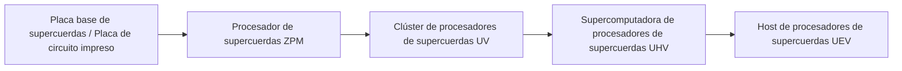
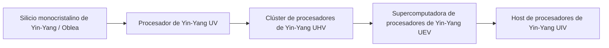

# Sistema de Circuitos Avanzados de Supercuerdas y Yin-Yang y Materiales

GTECore expande dos ramas principales de circuitos avanzados a lo largo de todo el ciclo de ZPM a MAX: el **Sistema de Circuitos de Supercuerdas** y el **Sistema de Circuitos de Yin-Yang Taiji**, junto con el Centro de Procesamiento Integral de Minerales para lograr un ciclo automático de materiales.

---

## 🌌 Sistema de Circuitos de Supercuerdas (Super String Circuitry)

El circuito de supercuerdas obtiene potencia de cómputo superlumínica a partir de cuerdas oscilantes de alta dimensión, cubriendo principalmente el gradiente de voltaje **ZPM ➜ UEV**:

### Materiales de supercuerdas y materia de cuerdas
- **Cuerda de origen (`item.gtecore.original_string`)**: Fuente de oscilación del universo de alta dimensión.
- **Cuerdas α / β / γ (`alpha_string`, `beta_string`, `gamma_string`)**: Polímeros de supercuerdas con diferentes niveles de energía y estados de polarización.
- **Mezclador de supercuerdas (`super_string_mixer`)**, **Cuerda de la creación (`string_of_creation`)** y **Matriz de oscilación de supercuerdas (`super_string_oscillator_array`)**: Se utilizan para la división, sintonización y solidificación avanzada de la materia de supercuerdas.

---

## ☯️ Sistema de Circuitos de Yin-Yang Taiji (Yin-Yang Circuitry)

El sistema de circuitos Yin-Yang sigue la filosofía cíclica de "el Yin genera el Yang, el Yang genera el Yin, y la vida es infinita", cubriendo **UV ➜ UIV** e incluso límites más altos:

### Talismanes exclusivos de los Ocho Trigramas y los Cinco Elementos
- **Elementos de los Cinco Elementos**: Elemento Metal (`jinyuansu`), Elemento Madera (`muyuansu`), Elemento Agua (`shuiyuansu`), Elemento Fuego (`huo`), Elemento Tierra (`tuyuansu`).
- **Talismanes de los Cinco Elementos**: Talismán de Metal, Talismán de Madera, Talismán de Agua, Talismán de Fuego, Talismán de Tierra.
- **Símbolos de los Ocho Trigramas y Chips**: Piedras de símbolos y chips centrales de los ocho trigramas: Qian, Kun, Zhen, Xun, Kan, Li, Gen, Dui.
- **Partícula de los Tres Puros (`god_nugget`)**: Medio de síntesis de nivel superior que condensa la energía del cielo y la tierra.

---

## 💎 Modo de Recetas del Centro de Procesamiento Integral de Minerales

**Centro de Procesamiento Integral de Minerales (`ore_process_center`)** tiene 7 modos de circuito estandarizados preestablecidos, que se pueden cambiar configurando el número de circuito programado en la máquina:

| Número de Circuito | Ruta de Proceso | Tipos de Minerales Aplicables y Características del Producto | Multiplicador de Producción |
| :---: | :--- | :--- | :---: |
| **Circuito 1** | Trituración ➜ Trituración ➜ Lavado | Producción rápida de minerales metálicos básicos (hierro, cobre, estaño, etc.) | 5x producto principal + subproductos |
| **Circuito 2** | Trituración ➜ Trituración ➜ Centrifugación | Minerales de metales ligeros raros de alto valor asociados | 5x producto principal + subproductos purificados por centrifugación |
| **Circuito 3** | Trituración ➜ Lavado ➜ Separación térmica ➜ Trituración | Minerales refractarios de alta temperatura, minerales de metales preciosos (platino, oro, plata, etc.) | 5-6x + polvo de metal puro |
| **Circuito 4** | Trituración ➜ Separación térmica ➜ Trituración | Sulfuros y minerales complejos de inclusión pesada | 5x + subproductos especiales de separación térmica |
| **Circuito 5** | Trituración ➜ Lavado ➜ Trituración ➜ Lavado | Minerales de tierras raras y minerales de sales solubles de múltiples etapas | 6x + subproductos de doble lavado |
| **Circuito 6** | Trituración ➜ Lavado ➜ Trituración ➜ Centrifugación | Minerales pesados radiactivos (uranio, torio, plutonio) y tierras raras | 6x + metales pesados finamente centrifugados |
| **Circuito 8** | Trituración ➜ Lavado ➜ Trituración ➜ Separación electromagnética | Minerales ferromagnéticos y paramagnéticos (magnetita, cromo, titanio, etc.) | 6-8x + polvo puro electromagnético |