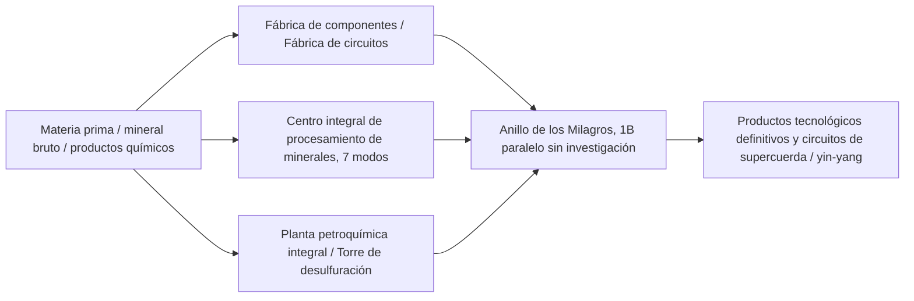

# GTECore Enciclopedia de Máquinas Multibloque

GTECore ha diseñado una gran cantidad de máquinas multibloque con **capacidad de paralelismo ultra alto** y **lógica de producción agregada** para abordar las tediosas cadenas de producción de las etapas media y tardía de la línea tecnológica.

---

## 🏭 Grandes multibloques de la era del vapor

Para resolver los problemas de baja producción y excesivo espacio ocupado por las máquinas individuales en la era del vapor, GTECore introduce una serie de grandes multibloques de vapor, todos ellos compatibles con paralelismo entre recetas y gran capacidad de flujo de vapor:

| Nombre de la máquina (ID de bloque) | Funciones principales y tipos de receta | Características y ventajas |
| :--- | :--- | :--- |
| **Gran horno de aleación de vapor** (`gtceu:big_alloy`) | Fundición de aleaciones (`alloy_smelter`) | Producción de aleaciones de alta multiplicación en etapas tempranas, compatible con vapor de alta presión |
| **Gran compresor de vapor** (`gtceu:big_compressor`) | Procesamiento de compresión (`compressor`) | Prensado en masa de placas y bloques de metal denso |
| **Gran martillo de forja de vapor** (`gtceu:big_forge_hammer`) | Martillado de forja para polvo/placas (`forge_hammer`) | Trituración rápida automatizada de placas y minerales gruesos |
| **Gran extractor de vapor** (`gtceu:big_steam_extractor`) | Extracción de caucho/fluidos (`extractor`) | Extracción a gran escala de resina y fluidos industriales |
| **Molino de mineral de vapor simple** (`gtceu:steam_grinder_easy`) | Molienda de minerales (`macerator`) | Procesamiento múltiple de minerales en etapas tempranas |
| **Horno de fundición de vapor simple** (`gtceu:steam_oven_easy`) | Fundición por pirólisis (`pyrochlore_oven`) | Producción industrial a gran escala de coque y carbón vegetal |
| **Planta de procesamiento de mineral de vapor** (`gtecore:steam_op`) | Trituración y refinado integral de minerales | **Paralelismo de 1 billón (1B)**, ¡todas las recetas se ejecutan en **1 tick**! Compatible con cualquier compartimento de entrada/salida |

---

## ⚡ Multibloques de la industria eléctrica super

Al entrar en la era eléctrica, GTECore ofrece centros de procesamiento integrados y de alta gama:

### 1. Fábricas de producción principales

- **§6 Fábrica de componentes (`gtceu:component_factory`)**:
  - **Función**: Produce en un solo paso motores, bombas, pistones, brazos mecánicos, cintas transportadoras, diodos emisores de luz y otros componentes básicos comunes.
  - **Características**: Omite directamente los tediosos subprocesos intermedios, produciendo rápidamente accesorios industriales estándar del nivel de voltaje especificado.
- **§6 Fábrica de circuitos (`gtceu:circuit_factory`)**:
  - **Función**: Integra sustratos de circuitos integrados, grabado de chips y encapsulado integrado.
  - **Características**: Compatible con compartimentos de paralelismo entre recetas, acelera integralmente la producción de placas de circuito en todo el gradiente de voltaje de ULV a MAX.
- **§6 Anillo de los Milagros (`gtceu:miracle_ring`)**:
  - **Función**: Instalación de ensamblaje definitivo de milagros industriales.
  - **Características**: Posee **paralelismo de 1 billón (1B)** y **overclocking de 1t Subtick**, ¡puede ejecutar recetas de línea de ensamblaje directamente **sin necesidad de realizar ninguna investigación de ciencia/línea de ensamblaje**!
- **Terminador de química (`gtecore:chemistry_terminator`)**:
  - **Función**: "Subvierte la existencia de la química y la física, representando el fin de la química".
  - **Características**: Agrega en un solo clic las complejas reacciones químicas de múltiples pasos, sintetizando rápidamente diversos polímeros definitivos y medios ácidos.
- **Planta de procesamiento universal diez en uno (`gtecore:ten_in_one`)**:
  - **Función**: Caja integrada universal que fusiona 10 procesos básicos: centrifugado, electrólisis, lixiviación química de minerales, polimerización, reacción de alta presión, etc.

### 2. Sistema de refinado de minerales y fluidos

- **§6 Centro integral de procesamiento de minerales (`gtecore:ore_process_center`)**:
  - Compatible con **7 modos de circuito programado**, logrando un refinado de minerales de 5 a 8 veces orientado a diferentes productos (trituración, lavado de mineral, separación térmica, centrifugado, separación electromagnética totalmente integrados), compatible con overclocking de 1t Subtick.
- **Planta petroquímica integral (`gtecore:integrated_petrochemical_plant`)**:
  - Integra toda la cadena de destilación de petróleo crudo, craqueo catalítico, reformado y desulfuración, produciendo en una sola máquina todos los gases ligeros de hidrocarburos y aromáticos.
- **Máquina de desulfuración (`gtceu:desulfurization`)**:
  - Purifica rápidamente diversos combustibles pesados con azufre, recuperando subproductos de polvo de azufre de alta pureza.
- **Plataforma de perforación de fluidos simple/avanzada (`gtecore:easy_fluid_drilling_rig` / `not_hard_fluid_drilling_rig`)**:
  - Extrae automáticamente vetas de fluido del lecho rocoso, nunca se agota, sin necesidad de complejas tuberías de exploración.

### 3. Procesamiento de alta gama y cables superconductores

- **§6 Fábrica de cables (`gtecore:wiremill_factory`)**: Produce en un solo clic todos los cables metálicos de un solo hilo, doble, cuádruple, óctuple, dieciseisavo y cables superconductores.
- **§6 Centro de cristales (`gtecore:crystal_center`)**: Cultiva automáticamente a gran escala columnas de silicio monocristalino, esmeraldas, zafiros y cristales de sextel cargado.
- **§6 Ensamblador de cables cuánticos (`gtecore:quantum_cable_assembler`)**: Especializado en la fabricación de alta velocidad de fibra óptica cuántica y cables de transmisión de energía de dimensiones superiores.
- **§3 Máquina de grabado de hoja estelar (`gtecore:starblade_etching_machine`)**: Utiliza haces de alta energía en el rango de ultravioleta extremo/rayos X para grabar chips micro-nano a escala galáctica.

---

## 🔋 Sistemas de energía y generadores

| Nombre de la máquina | Salida de energía / nivel | Mecanismo y características principales |
| :--- | :--- | :--- |
| **§6 Motor de combustible universal** (`gtceu:general_fuel_engine`) | Adaptativo dinámico (máximo MAX) | **Compatible con todos los tipos de combustible del mundo** (diésel, biomasa, gas natural, combustible de cohetes, etc.), con **paralelismo de 2 mil millones (2B)**, ¡liberando una cantidad colosal de energía en un instante! |
| **Gran generador universal** (`gtecore:large_general_generator`) | Voltaje multinivel seleccionable | Adaptable a rotores de turbina de gas, vapor y plasma convencionales |
| **Super reactor de fusión** (`gtecore:super_fusion_reactor`) | Salida de plasma de fusión | Elimina por completo la larga espera de calentamiento de la fusión convencional, **compatible perfectamente con overclocking de 1T Subtick**, produciendo instantáneamente productos de fusión a alta temperatura |
| **Batería super de voltaje máximo** (`gtecore:max_super_battery_buffer_1x`) | **MAX (2,147,483,647 V)** | Almacena una cantidad masiva de EU, compatible con interfaz de carga inalámbrica inter-dimensional sin pérdidas |