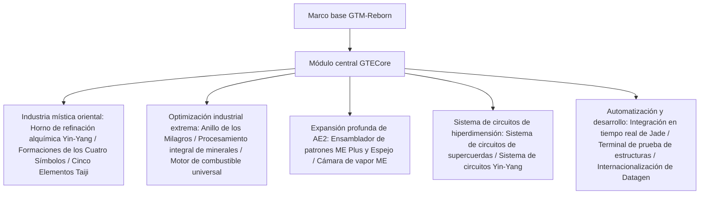

# Visión General del Núcleo GTECore

**GTECore** es el módulo central de Java personalizado del proyecto GregTech Easy. Depende directamente del código fuente de `gtm-reborn`, expandiendo estructuras industriales multibloque a gran escala, tecnología de formaciones de alto nivel, interacción profunda con AE2 y sistemas de fabricación de circuitos superiores.

---

## 🏛️ Arquitectura del Módulo y Posicionamiento de Diseño

---

## 📦 Pestañas de Modo Creativo y Clasificación

GTECore registra pestañas independientes de modo creativo dentro del juego:

1. **Máquinas GregTech Easy (`itemGroup.gtecore.gtecore_machines`)**:
   - Incluye todos los bloques principales multibloque originales de GTE (Alto Horno Yin-Yang Bagua, Anillo de los Milagros, Centro de Procesamiento de Minerales, Terminador Químico, etc.).
   - Incluye Búferes de Batería Súper de múltiples niveles (Max Super Battery Buffer), Cámaras de Vapor ME, Ensambladores de Patrones ME Plus y Espejos.
2. **Objetos GregTech Easy (`itemGroup.gtecore.gtecore_items`)**:
   - Incluye la serie de circuitos de supercuerdas y Yin-Yang (procesadores, clústeres, supercomputadoras, hosts).
   - Incluye talismanes de los Cinco Elementos, chips Bagua, partículas de los Tres Puros, terminales de prueba de estructuras y otros objetos especiales.

---

## ⚙️ Configuración Global del Módulo (`GTEConfig`)

GTECore proporciona opciones de configuración en el juego y en archivos (ubicadas en `config/gtecore-common.toml` o en el menú de configuración del juego):

| Opción de configuración | Valor predeterminado | Descripción detallada |
| :--- | :--- | :--- |
| `superPeace` (Modo Súper Paz) | `false` | Al activarse, deshabilita completamente la generación de mobs hostiles, proporcionando un entorno absolutamente puro para la construcción tecnológica |
| `durationMultiplier` (Multiplicador de duración de recetas) | `1.0` | Ajusta globalmente el multiplicador de tiempo de las recetas personalizadas de GTECore |

---

## 🔍 Integración nativa con Jade / TOP

GTECore incluye soporte integrado para el plugin **`GTEJadePlugin`**:
- **Estado del Ensamblador de Patrones ME Plus**: muestra en tiempo real el número de patrones vinculados al ensamblador actual, así como los modos de salida de fluidos y objetos.
- **Información de vinculación del Espejo del Ensamblador de Patrones ME Plus**: al pasar el cursor, muestra directamente las coordenadas `(X, Y, Z)` del ensamblador principal vinculado y el estado de conexión de la red.
- **Indicador de activación de formaciones**: muestra en tiempo real el estado de preparación de las formaciones de los Cuatro Símbolos (Dragón Azul, Tigre Blanco, Pájaro Bermellón y Tortuga Negra) en el Horno de Refinación Alquímica Yin-Yang.

---

## 🛠️ Terminal de Prueba de Estructuras (`Structure Testing Terminal`)

GTECore proporciona una herramienta manual exclusiva: la **Terminal de Prueba de Estructuras** (`item.gtecore.check_structure_terminal`):
- **Clic derecho en el controlador multibloque**: escanea la integridad de la estructura en tiempo real.
- **Mensajes de diagnóstico de errores**: si la estructura no está formada, la terminal señala con precisión en el chat y en la información flotante las **coordenadas de los bloques incorrectos y las posiciones que no deberían estar ocupadas**, acelerando enormemente la construcción y depuración de multibloques grandes.