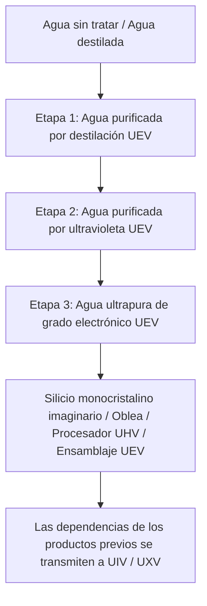

# Sistema de purificación de agua de tres etapas y circuito de agua industrial

**Todo el sistema de purificación de agua de tres etapas de GTECore pertenece a UEV**. Las etapas describen tratamientos sucesivos y la calidad del agua, no eras de voltaje distintas. La planta central, las tres unidades de purificación y sus escotillas de control utilizan componentes, circuitos y voltaje de ensamblaje UEV. Las tres etapas de tratamiento y la regeneración EDI funcionan a UEV.

La línea consta de **una planta central y tres unidades de purificación**. Las unidades no tienen escotillas de energía: conéctalas a la planta central con una memoria de datos para recibir energía y un límite de procesamiento en paralelo.

## 💧 Especificaciones de los fluidos de agua de las tres etapas

| Fluido registrado | Nombre del material | Nivel tecnológico |
| :--- | :--- | :---: |
| `distilled_purified_water` | Agua purificada por destilación | UEV |
| `uv_purified_water` | Agua purificada por ultravioleta | UEV |
| `ultrapure_water` | Agua ultrapura de grado electrónico | UEV |

Las descripciones de calidad del agua industrial aportan contexto; las recetas, la estabilidad térmica, la dosis UV y la carga EDI determinan el comportamiento real en el juego.

## 🏭 Cuatro máquinas multibloque

| Máquina | ID de registro | Nivel tecnológico |
| :--- | :--- | :---: |
| Planta central de purificación de agua | `central_water_purification_plant` | UEV |
| Unidad de purificación por clarificación de nivel 1 | `t1_clarifier_purification_unit` | UEV |
| Unidad de purificación por oxidación UV de nivel 2 | `t2_uv_oxidation_purification_unit` | UEV |
| Unidad de purificación ultrapura por EDI de nivel 3 | `t3_edi_ultrapure_purification_unit` | UEV |

La antigua `ultrapure_water_refinery` sigue registrada por compatibilidad, pero está deshabilitada. No puede ejecutar toda la cadena de purificación; utiliza la planta central y las tres unidades.

### 1. Planta central de purificación de agua

La planta no procesa recetas de purificación. Guarda las conexiones, distribuye energía a las unidades conectadas y correctamente formadas, muestra la potencia de salida real en EU/s y transmite el límite de procesamiento en paralelo configurado. Una unidad no puede funcionar sin una planta central conectada y correctamente formada.

### 2. Nivel 1: clarificación y tratamiento térmico (UEV)

La primera etapa separa las impurezas del agua entrante. Las recetas nominales son:

- Agua 1000 mB + Floculante compuesto 50 mB + 1 Microesfera de carbono modificada → Agua purificada por destilación 900 mB / 60 ticks, con posibilidades de obtener polvo de sal y de tierras raras.
- Agua destilada 1000 mB + Floculante compuesto 25 mB + 1 Microesfera de carbono modificada → Agua purificada por destilación 1000 mB / 30 ticks, con posibilidad de obtener polvo de sal.

La cantidad real de agua producida también depende de la estabilidad térmica. Este es el punto de entrada a la línea de purificación UEV.

### 3. Nivel 2: oxidación por ultravioleta profundo (UEV)

La radiación UV y los oxidantes descomponen las impurezas orgánicas. Las recetas nominales son:

- Agua purificada por destilación 800 mB + Ozono 50 mB → Agua purificada por ultravioleta 800 mB + Oxígeno 25 mB / 40 ticks.
- Agua purificada por destilación 800 mB + Peróxido de hidrógeno 50 mB → Agua purificada por ultravioleta 800 mB + Oxígeno 25 mB / 20 ticks.

Ambas rutas deben cumplir también el requisito de dosis UV antes de finalizar.

### 4. Nivel 3: electrodeionización y pulido (UEV)

La etapa EDI elimina los iones residuales. En el juego requiere reactivo y resina, además de una receta de regeneración independiente para eliminar la carga iónica acumulada:

- Agua purificada por ultravioleta 800 mB + Reactivo ácido-base de grado electrónico 20 mB + 1 Perla de resina de lecho mixto → Agua ultrapura de grado electrónico 800 mB / 30 ticks.
- Regeneración EDI: Agua purificada por ultravioleta 100 mB + Reactivo ácido-base de grado electrónico 1 mB / 2 ticks. Elimina la carga iónica y no produce agua.

## 🔌 Conexión y funcionamiento de la línea

1. Agáchate y haz clic derecho en la planta central con una memoria de datos de GT para copiar sus coordenadas.
2. Haz clic derecho en una unidad de purificación con esa memoria para conectarla. El orden inverso también funciona: copia las coordenadas de la unidad y después haz clic derecho en la planta.
3. Suministra energía a la planta central mediante escotillas de energía (1–4; se admite entrada láser). La planta transfiere la energía a las unidades conectadas.
4. Configura el límite de procesamiento en paralelo en la interfaz de la planta, de 1 a 65536.
5. Comprueba en la interfaz de cada unidad las coordenadas de la planta conectada, el límite de procesamiento en paralelo y la reserva interna de energía.

Cada unidad consume la potencia de la receta multiplicada por el número real de operaciones en paralelo. Las tres unidades tienen el mismo límite de potencia de `UEV voltage × 256 A`. Las etapas 1, 2 y 3 describen procesos de tratamiento, no voltajes de funcionamiento ni niveles de desbloqueo distintos. El paralelismo real también depende de los ingredientes disponibles y de la capacidad de salida, por lo que aumentar únicamente el límite central no garantiza una mayor producción.

## 🔄 Producción imaginaria y orden de puesta en marcha

Las siguientes recetas del Árbol de lo Imaginario consumen directamente `ultrapure_water` de la tercera etapa. Las cantidades corresponden a cada lote de la receta:

| Producto | Producción por lote | Agua de grado electrónico |
| :--- | ---: | ---: |
| Silicio monocristalino imaginario | 4 | 4000 mB |
| Oblea imaginaria normal | 16 | 1000 mB |
| Procesador imaginario UHV | 4 | 1000 mB |
| Ensamblaje de procesadores imaginarios UEV | 2 | 2000 mB |

La Supercomputadora imaginaria UIV y el Host imaginario UXV no consumen agua adicional directamente. Heredan la dependencia del agua a través de los ensamblajes y las computadoras necesarios para fabricarlos. El nivel de circuito del producto y el voltaje de su receta no cambian el requisito de progresión UEV del sistema de purificación.

El orden de puesta en marcha es **componentes UHV + producción Yin-Yang → ocho componentes UEV → equipos de purificación UEV → agua de grado electrónico de la tercera etapa → productos imaginarios esenciales**. El modpack añade recetas para los ocho componentes UEV. Las recetas Yin-Yang y las de estos componentes no requieren directamente agua de grado electrónico, lo que evita un ciclo de dependencias en el que los equipos de purificación necesiten su propio producto para construirse.

Los materiales de construcción imaginarios, la ruta del primer árbol y la producción de silicio monocristalino y obleas normales están conectados; consulta [Materiales imaginarios y el primer árbol](circuits-and-materials.md). El Núcleo del Tao del Sol Rojo consume 4000 mB de agua de grado electrónico por lote de 32 Medios de crecimiento. Las matrices de hojas siguen siendo bloques estructurales, mientras que la producción de silicio monocristalino consume medios de crecimiento de forma recurrente.

El **Centro de litografía imaginaria por inmersión** consume agua de grado electrónico de la tercera etapa para procesar obleas imaginarias normales mediante sus recetas específicas. Las obleas de CPU, los chips en bruto, los chips grabados, los chips de circuito y los chips de CPU ahora cuentan con rutas de producción conectadas, todas a UEV. Su consumo directo de agua por lote es de **2000, 1000, 500, 1000 y 500 mB**, respectivamente. La exposición y el grabado utilizan una lente de vidrio Yin-Yang reutilizable que no se consume. Consulta el [Centro de litografía imaginaria por inmersión](circuits-and-materials.md) para conocer ambas ramas y las cantidades completas de ingredientes. Su controlador se puede fabricar con circuitos Yin-Yang UIV y obleas imaginarias normales, sin necesitar los chips que produce.

### Fabricador de circuitos imaginarios

El [Fabricador de circuitos imaginarios](circuits-and-materials.md) utiliza inicialmente chips de CPU y chips de circuito del centro de litografía, circuitos UIV de la generación anterior y componentes UEV. No necesita sus propias placas ni SoC para ponerse en marcha. Los tres procesos funcionan a UEV:

| Producto del proceso | Producción por lote | Consumo directo de agua de grado electrónico | Duración base |
| :--- | ---: | ---: | ---: |
| Placa de circuito del Árbol de lo Imaginario | 4 | 2000 mB | 30 s |
| Placa de circuito impreso del Árbol de lo Imaginario | 1 | 1000 mB | 20 s |
| SoC del Árbol de lo Imaginario | 2 | 2000 mB | 30 s |

La cadena de recetas ahora conecta las placas, las placas impresas, los SoC y los cuatro niveles de circuitos terminados. El Árbol de lo Imaginario sigue produciendo los cuatro circuitos terminados a **voltaje de fabricación UEV**, con una producción por lote de **4 / 2 / 1 / 1**. Sus **etiquetas de circuito UHV / UEV / UIV / UXV** no cambian. UIV y UXV heredan el consumo de agua a través de los productos previos necesarios.

El reciclaje del agua degradada en la Máquina de grabado Starblade y la Fábrica de circuitos, los rendimientos adicionales del procesamiento de minerales y un circuito de recuperación del 90% siguen siendo propuestas sin implementar, no funciones disponibles.
