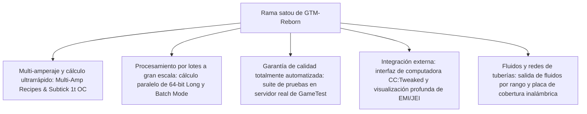

# GregTech Modern Reborn (GTM Reborn)

`modules/gtm-reborn` es una rama independiente de GregTech Modern profundamente personalizada por GTE-Multi (nombre de rama: `satou`).

---

## 🚀 Características principales de la rama `satou`

En comparación con la versión original aguas arriba, GTM-Reborn ha logrado múltiples avances tecnológicos revolucionarios y mejoras en la experiencia industrial en la versión moderna de Minecraft 1.20.1:



### 1. Modo de procesamiento paralelo y por lotes de enteros de 64 bits (Batch Mode)
- **Superación del límite de enteros de 32 bits**: el cálculo paralelo utiliza completamente el tipo de datos `long`, resolviendo por completo los problemas de desbordamiento numérico o truncamiento de cálculo en grupos industriales extremadamente grandes con paralelismo muy alto.
- **Modo de procesamiento por lotes inteligente**: cuando las materias primas son extremadamente abundantes, la máquina puede empaquetar cientos o miles de recetas diminutas en un solo ciclo de ejecución, reduciendo enormemente la carga de ticks del servidor.

### 2. Overclocking instantáneo de 1T Subtick (OC_PERFECT_SUBTICK)
- Se optimizó la canalización de ejecución de la lógica de recetas de la máquina, permitiendo que máquinas avanzadas específicas completen múltiples iteraciones de recetas en 1 tick, liberando el límite puro de la producción industrial.

### 3. Soporte de entrada y recetas de múltiples amperios (Multi-Amp)
- Las recetas de máquinas admiten el consumo/salida de corriente de múltiples amperios (Amperes) en una sola receta, y admiten la representación intuitiva de valores de múltiples amperios y sugerencias de especificaciones de cables en la interfaz EMI/JEI.

### 4. Salida de fluidos por rango (Ranged Fluid Outputs)
- Permite que las torres de destilación de alto nivel y los reactores químicos produzcan fluidos con fluctuaciones de rango según diferentes condiciones de temperatura y presión.

### 5. Integración moderna de periféricos CC:Tweaked (ComputerCraft)
- Todas las máquinas estándar abren interfaces periféricas a ComputerCraft:
  - Consulta en tiempo real del progreso de la receta, tiempo restante y consumo actual de EU/t.
  - Iniciar, pausar o cambiar el modo de funcionamiento de la máquina dinámicamente mediante scripts Lua.

---

## 🧪 Pruebas automatizadas y verificación con GameTest

GTM-Reborn incluye un conjunto completo de pruebas automatizadas nativas de Minecraft GameTest (ubicado en `src/test`):

```powershell
# Ejecutar pruebas automatizadas del servidor GameTest
$env:JAVA_HOME='C:\Users\Ex_Je\.jdks\ms-21.0.11'
.\gradlew.bat :modules:gtm-reborn:runGameTestServer
```

### Alcance de las pruebas
- **Sistema de coberturas**: prueba el rendimiento y la lógica de prevención de fugas de las placas de bombeo de fluidos, placas de transporte de ítems y placas de conducción de energía.
- **Lógica de recetas de máquinas**: prueba el cálculo de múltiples amperios, procesamiento por lotes, paralelismo entre recetas y overclocking.
- **Formación y rotación de bloques multibloque**: prueba la validación estructural de varios tipos de carcasas y compartimentos en diferentes orientaciones.

---

## 🌿 Especificaciones del flujo de trabajo de Git para submódulos

`modules/gtm-reborn` corresponde al repositorio Git independiente `takanashisatou/GregTech-Modern-Reborn`, con la rama de desarrollo predeterminada `satou`:

```bash
# Desarrollar y confirmar de forma independiente en el submódulo
cd modules/gtm-reborn
git checkout satou
git add .
git commit -m "feat: optimize multiblock recipe logic"
git push origin satou

# Volver al proyecto principal y actualizar el puntero del submódulo
cd ../..
git add modules/gtm-reborn
git commit -m "chore: bump gtm-reborn submodule pointer"
```